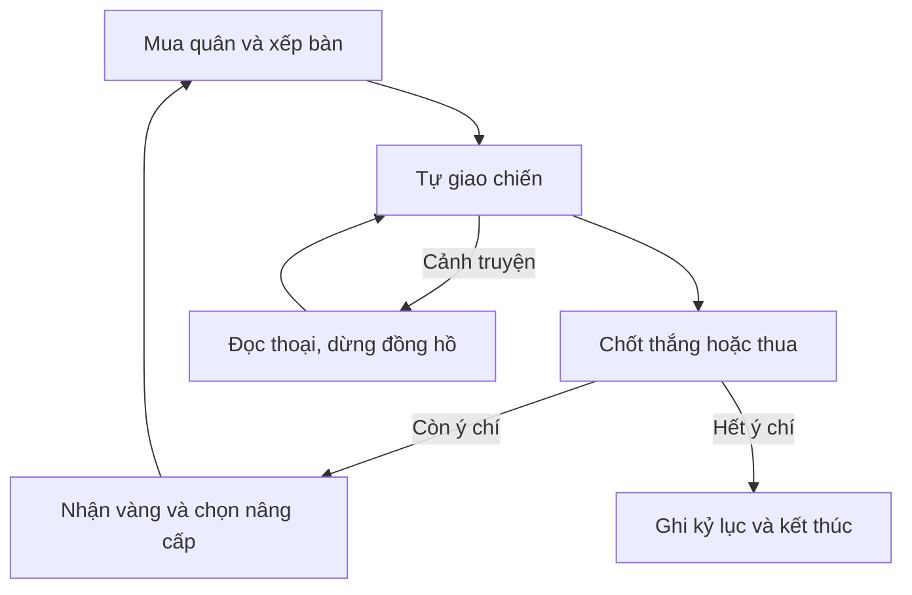

> Đã triển khai mode đầy đủ ở bản 3.0: xem [implementation](autochess/IMPLEMENTATION.md). Tài liệu bên dưới giữ nguyên nghiên cứu 2.9.2, một số số cân bằng/kiến trúc đã đổi khi playtest.

# MealGacha: Chợ Đêm Vị Linh

Thiết kế đề xuất ngày 08/10/2026, dựa trên mã và tài nguyên bản 2.9.2. **Đây là bản nghiên cứu để triển khai mode mới; auto chess và survival chưa có trong app.** Các con số combat bên dưới là điểm khởi đầu để thử nghiệm, chưa phải cân bằng đã được playtest.

## 1. Hướng nên làm

Một autobattler PvE: mua Vị Linh, ghép sao, xếp đội hình, chọn di vật rồi xem đội tự chiến đấu. Hai nhánh dùng cùng engine: chiến dịch mới có đoạn kết, và survival vô tận để vượt kỷ lục cá nhân. Không cần tài khoản. Đầu trận, mọi người được tiếp cận cùng pool đơn vị; bộ sưu tập TCG không quyết định sức mạnh trong lượt chơi auto chess.

Điểm hấp dẫn riêng: **món ăn giữ một ký ức, ký ức gọi Vị Linh, những ký ức khác nhau bổ trợ nhau trên bàn ăn.** Người chơi thấy đĩa món ăn trong cửa hàng và xem linh thể tương ứng bước ra khi đặt quân. Mỗi trận kể một tình huống của phiên chợ Việt: giữ bếp, đưa khách qua sương, che người lạc đường, truyền lại một công thức.

### Bài học từ game tham khảo

| Nguồn chính thức | Điều rút ra | Áp dụng đề xuất |
| --- | --- | --- |
| Riot: [What is Teamfight Tactics?](https://teamfighttactics.leagueoflegends.com/en-gb/news/game-updates/what-is-teamfight-tactics/) | Xây đội, kinh tế, trang bị và vị trí tạo quyết định trước giao chiến tự động | Chuẩn bị có chiều sâu; chiến đấu tự chạy, kỹ năng phải nhìn ra tác dụng |
| Riot: [Tocker’s Trials, công bố 2024](https://teamfighttactics.leagueoflegends.com/en-gb/news/game-updates/new-tft-workshop-mode-tockers-trials/) | Tiền lệ PvE solo gồm nhiều vòng/boss, chủ động bắt đầu vòng, tính điểm | Làm PvE trước, chuẩn bị không áp lực thời gian; survival có bảng kỷ lục riêng. Đây là tham khảo thiết kế lịch sử, không khẳng định mode này hiện còn mở |
| Riot: [Hextech Augments, thiết kế 2021](https://teamfighttactics.leagueoflegends.com/en-us/news/game-updates/gizmos-gadgets-set-mechanic-overview-hextech-augments/) | Một trong ba lựa chọn có thể đổi cách dùng kinh tế, đội hình hoặc vị trí | Các “Lời hẹn bên bếp” giúp đổi hướng giữa lượt chơi, có điều kiện rõ thay vì cộng chỉ số chung chung |

Các luật, tên, cốt truyện, đơn vị và công thức bên dưới là đề xuất riêng cho MealGacha, không phải luật TFT hiện tại.

## 2. Tài nguyên thực tế và phần còn thiếu

| Đã có trong repo | Có thể dùng lại | Phần phải làm thêm |
| --- | --- | --- |
| 152 thẻ: 112 món ăn, 25 bí thuật, 5 người giữ vị, 10 người lữ hành | ID, ảnh món, lore, icon hệ, trình xem chi tiết | Catalog auto chess riêng: tầm đánh, tốc đánh, mana, sao, nghề, AI; không lấy thẳng chỉ số TCG |
| 35 ảnh bí thuật/lữ hành, chân dung anime, 5 Vị Linh | Thẻ cửa hàng, lời thoại, tư thế gọi quân, bảng chọn đội | Vị Linh có động tác đi/đánh/cast/trúng đòn; phân biệt hình dáng và kỹ năng từng quân |
| 3 nền bàn home/street/tet, 9 tranh truyện | Prototype, cảnh nghỉ và cutscene | Bàn có ô, vị trí bóng chân, vật cản trang trí; 4 bối cảnh truyện mới |
| 4 ảnh FX fire-impact/water-impact/shield/recipe-burst | Vật liệu màu và hiệu ứng ban đầu | Atlas đạn/impact, báo vùng nguy hiểm, nhiều loại skill và hiệu ứng ghép sao |
| 8 bản nhạc: 4 gốc + 4 biến thể 8-bit | Hai phong cách nhạc và bộ điều khiển âm thanh | Nhạc chuẩn bị, áp lực survival, boss nhiều pha; phối mới, chuyển lớp nhạc không giật |
| PixiJS 8, GSAP, reducer combat, save/transfer mã hóa | Renderer/FX, nguyên tắc state tách presentation, thiết lập âm thanh/chuyển động | Engine thời gian thực, đường đi, chọn mục tiêu, lịch sự kiện và checkpoint riêng |

`public/assets/tcg` hiện có 90 file, 10,863,786 byte. Đây chủ yếu là ảnh/render 2D và audio, **không có bộ model 3D rigged hay animation di chuyển hoàn chỉnh**. Năm ảnh Vị Linh tĩnh chỉ đủ cho prototype. Việc kéo ảnh qua lại hoặc cho ảnh thở không đáp ứng yêu cầu cử động đầy đủ của mode mới.

Những điểm nên giữ: giao diện vừa màn hình; thư viện cuộn nội bộ; hai phong cách nhạc; chữ giữ đủ lâu; dữ liệu cũ và transfer MGC1. Tài nguyên mới tải theo scene, không buộc tải toàn bộ roster khi mở app.

## 3. Cốt truyện mới: phiên chợ không có sáng mai

### Nhân vật

**An**, người học nghề làm đèn và chép công thức, đi tìm những món ăn không còn ai nhớ tên. An là nhân vật mới, không thay thế Mai hay hồi sinh tiếng vọng của phần cũ. **Ông Lộc** sửa đèn, **Bà Sen** nấu phần ăn cho khách lạ, **Tịnh** điều hành hội quán và giữ Sổ Công Thức. Nhiên, Mộc, Hải, Liên và Bách có thể xuất hiện trong các ký ức được ghi lại.

Tịnh muốn mỗi món chỉ có một công thức “đúng” để không ai tranh cãi hoặc quên truyền thống. Những phiên bản khác bị xóa khỏi sổ; ký ức người từng nấu chúng trở thành **Vô Danh**. Ban đầu An tưởng Vô Danh là quái ăn cắp ký ức. Trên thực tế, chúng đang cố tìm lại người chịu gọi tên mình.

### Bốn hồi, 12 vòng chiến dịch

| Hồi | Tình huống và twist | Quyết định chiến đấu | Boss |
| --- | --- | --- | --- |
| 1. Chợ còn sáng | Đèn tắt ở những sạp không có tên trong sổ. An học rằng món ăn gọi linh thể bảo vệ bàn, không phải đĩa thức ăn lao vào nhau | Giữ hàng trước, bảo vệ quân tầm xa, học ghép sao | Rối Đèn Rỗng: đánh dấu một ô trước khi phóng lửa |
| 2. Bữa cơm không có tên | Bà Sen nhận ra món “sai công thức” do chính người thân từng nấu. Quái chỉ xuất hiện khi món bị sửa tên | Hồi phục đúng tuyến, thay vị trí để tránh hút mana | Mực Trắng: sao chép kỹ năng gần nhất, có báo trước |
| 3. Người giữ sổ | Tịnh là người dựng phong ấn. Ông từng quên một lời dạy của mẹ và nghĩ chuẩn hóa mọi món sẽ cứu những người khác khỏi mất mát | Ghép các hệ khác nhau, chọn di vật khắc chế boss; lời thoại được mở khi đổi pha | Người Chép Một Màu: khóa tạm một hệ, buộc đội có cách đánh thứ hai |
| 4. Ghế dành cho người đến sau | An không tìm được “công thức đầu tiên”: truyền thống sống qua người tiếp nối và biến đổi. Vô Danh mang cả những lời mời chưa từng được nói | Chọn cứu sạp/giữ đội qua ba pha, thắng bằng combat rõ ràng | Trang Cuối Chưa Viết: tăng áp lực theo thời gian và gọi linh ảnh |

Twist cuối: An không phải người đi tìm một cuốn sách thất lạc; gia đình An từng góp một công thức vào sổ rồi tự nguyện gạch tên để được “chấp nhận”. Nhiệm vụ cuối là trả quyền kể chuyện cho người sống. Lựa chọn epilogue là giữ các chú giải cạnh công thức hay dựng hội quán truyền nghề. **Hội thoại không tự cho thắng, không bỏ qua điều kiện thất bại.**

Nếu save cũ có ending `remember`, mở đầu nhắc chiếc ghế dành cho câu chuyện của tiếng vọng; nếu `release`, nhắc một người học buộc lạt và tự chọn tên. Hai nhánh gặp cùng chiến dịch An; không phủ nhận đoạn kết cũ. Người chưa hoàn thành TCG được mở đầu không spoil.

### Gắn văn hóa bằng con người và hành động

Trọng tâm là chợ, sự hiếu khách, bữa cơm, nghề làm đèn, chuyện kể và cách truyền nghề. Mỗi chương mở một trang Việt/Anh ngắn kèm liên kết tìm hiểu; không bắt người chơi đọc để được tiếp tục.

Nguồn nền: [UNESCO về Bài Chòi](https://ich.unesco.org/en/RL/the-art-of-bai-choi-in-central-viet-nam-01222) mô tả một nghệ thuật kết hợp âm nhạc, thơ, diễn, hội họa và văn học, được truyền trong gia đình/cộng đồng. Có thể học cách sân khấu và nhịp hô tạo tương tác, nhưng trò chơi auto chess không tự nhận là Bài Chòi truyền thống. [Vietnam Tourism về Tết](https://vietnam.travel/vi/things-to-do/tet-tradition-reunion-taste) làm nền cho cảnh đoàn tụ và đồ ăn; bài giới thiệu món theo vùng cần kiểm tra riêng trước phát hành. Vị Linh, quái và phép là sáng tạo hư cấu, không gọi nhân vật tưởng tượng là thần linh truyền thống.

## 4. Luật chơi cụ thể

### Một vòng chơi

1. Thấy đội địch và nguy cơ vòng tới. Cửa hàng có 5 đơn vị, đổi cửa hàng 2 vàng, khóa cửa hàng miễn phí. Chuẩn bị đến khi nhấn “Xuất trận”.
2. Mua quân giá 1–5 vàng trong lượt chơi. Bàn 6 cột × 6 hàng vuông, mỗi bên có 3 hàng xuất phát; tối đa 7 quân người chơi, ghế dự bị 6 chỗ. Chọn quân rồi chọn ô cũng làm được, không chỉ kéo thả.
3. Ba bản 1 sao ghép thành 2 sao; ba bản 2 sao ghép thành 3 sao. Hàng dự bị tự ghép trước khi báo đầy. Tái dùng cùng ID không kích thêm trait; sức mạnh tính theo quân khác nhau.
4. Quân tự tìm mục tiêu, đi vào tầm, đánh thường, nhận mana rồi dùng kỹ năng. Sau vòng, quân bị hạ trở lại đội chuẩn bị; chỉ ý chí chủ tướng mất nếu thua.
5. Nhận 5 vàng/vòng, 1 vàng nếu thắng, lợi tức 1/2/3 vàng khi giữ 10/20/30 vàng; chưa dùng chuỗi thắng/thua ở bản đầu. Không có lãi trong lúc chờ hoặc paused.
6. Cấp bàn mở 3 → 4 → 5 → 6 → 7 ô quân với chi phí tích lũy thử nghiệm 0/8/20/38/62 XP; 4 vàng mua 4 XP, mỗi vòng hoàn tất cho 2 XP. Bán quân trả 1 sao bằng giá mua, 2 sao bằng 3×giá, 3 sao bằng 9×giá; ghép sao không tạo vàng.
7. Một quân đeo tối đa 2 di vật. Sau boss, chọn một trong 3 “Lời hẹn bên bếp”; thay đổi cách đánh hoặc xếp bàn và được xem trước tác dụng.

### Chọn quân và đọc chiến đấu

Thông tin chính trên quân: máu, mana, sao, biểu tượng trạng thái. Chạm xem tầm đánh, tốc đánh, kỹ năng, nghề và hệ. Shop hiện tên/giá/trait và dấu “Bạn đang có 2/3 bản”; đừng buộc người chơi thuộc 152 lá TCG mới chơi được.

Đánh thường: tầm 1 ô cho cận chiến, 3 ô cho tầm xa; ưu tiên mục tiêu gần nhất có đường đi, cùng khoảng cách thì dùng ID ổn định để không rung đổi mục tiêu. Tiếp cận mục tiêu đã chết phải hủy đòn nếu chưa đến mốc hit; đạn đã phóng tuân theo luật ghi trong skill. Không dịch chuyển xuyên ô đang bị chiếm. Có kế hoạch đường đi lại khi bị chặn.

Chỉ số thử nghiệm 1 sao: máu 450–900; sát thương đánh 40–75; tốc 0,7–1,1 đòn/giây; mana khởi đầu 0–30/100. Sao nhân máu 1/1,7/2,9 và sát thương 1/1,5/2,25; kỹ năng có bảng riêng. Tốc tối đa 2,5 đòn/giây, hiệu ứng khống chế nối tiếp có giảm hiệu lực để tránh khóa vô tận.

Sát thương vật lý áp dụng `damage × 100/(100+armor)` với armor không âm. Phép dùng kháng phép tương tự. Lá chắn trừ trước máu; hồi phục không vượt máu tối đa; bỏ qua đòn từ quân đã chết. Các con số được hiển thị ở nhật ký/debug để cân bằng, không bắt người chơi đọc công thức.

### Hệ và nghề: chỉ 2 lớp trait

| Trait | Mốc ban đầu | Vai trò và cách đọc |
| --- | --- | --- |
| Hỏa vị | 2 / 4 | Đốt; dấu lửa có thời lượng, không chồng vô hạn |
| Hải vị | 2 / 4 | Mana và nhịp tung skill; aura xanh hiện khi đủ mốc |
| Thanh vị | 2 / 4 | Hồi phục và chống khống chế; vòng lá tại mục tiêu được chữa |
| Gia vị | 2 / 4 | Lá chắn cho tuyến trước; khiên có độ bền nhìn được |
| Ngọt vị | 2 / 4 | Bảo vệ carry, kích hoạt sau cast; phá khiên có âm riêng |
| Người giữ bếp / Lữ khách / Người kể | 2 / 3 | Lần lượt giữ tuyến, đổi vị trí, hỗ trợ nhịp skill; mỗi quân tối đa 1 nghề |

Ba hệ khác nhau có “Mâm chung” hồi 2% máu tối đa mỗi 5 giây, không cộng thêm vào nhiều lần do trùng ID. Đội chuyên 4 cùng hệ và đội đa hệ đều phải có đường thắng; chạy đối đầu hàng trăm seed trước khi chốt các buff. Không dùng tỉnh/vùng miền làm trait mạnh/yếu hơn vùng khác.

## 5. Roster mới đủ để có chiến thuật

Đề xuất bản đầy đủ **32 đơn vị**, pool hữu hạn theo lượt chơi, bản 1 sao có 18/16/12/10/8 bản theo giá 1–5. Quân từ shop chuyển sang đội; bán trả lại đúng số bản vào pool. Pool tồn tại riêng trong run, không lấy thẻ đang sở hữu ở TCG. UI cho xem cơ hội từng bậc và quân còn trong pool.

18 đơn vị tái dùng: 12 món (phở bò, bánh mì, cơm tấm, bún chả, bún riêu, bánh xèo, bánh cuốn, gỏi cuốn, xôi mặn, cơm gà, bánh chưng, bánh tét), 5 người giữ vị và Lái đò sương bạc. Phải viết kỹ năng auto mới cho từng đơn vị; ảnh và lore cũ dùng làm điểm nhận diện.

**14 đơn vị/thẻ auto mới**, không phải đổi tên lá TCG đã tồn tại:

| Đơn vị đề xuất | Giá / hệ | Kỹ năng đặc trưng | Hình ảnh cần có |
| --- | --- | --- | --- |
| Bánh đậu xanh · Tiểu Tượng Ngọc | 1 / Ngọt | Khiên nhỏ cho đồng minh thấp máu, có hồi chiêu | Linh thể hình voi ngọc, đĩa bánh trên badge |
| Bánh khúc Hà Nội · Mầm Áo Lá | 1 / Thanh | Quấn lá giảm đòn đầu sau mỗi lần cast | Dáng nhỏ trong áo lá, chuyển động mở/khép lá |
| Bánh căn · Chim Than Tròn | 2 / Hỏa | Nhảy tới ô bên cạnh mục tiêu rồi đánh hình nón | Chân/đuôi và các viên than có chuyển động |
| Bánh tôm Hồ Tây · Tôm Lửa Hồ | 2 / Hải | Lướt một hàng, chỉ trúng mỗi mục tiêu một lần | Linh tôm màu đồng, vệt nước và đường dự báo |
| Cơm hến · Linh Trai Sông | 2 / Gia | Khép vỏ chống sát thương, mở vỏ phản đòn | Hai pha đóng/mở vỏ rõ, không che số máu |
| Chè lam · Hươu Mật Gừng | 2 / Ngọt | Rải vùng gừng giảm hiệu lực khống chế | Linh hươu có đường gừng, vòng vùng buff |
| Cháo lươn · Long Tuyến Ấm | 3 / Hải | Luồng hơi xuyên tuyến, tích mana theo số địch trúng | Long thể mảnh, đầu luồng và impact riêng |
| Bánh ít lá gai · Dơi Lá Tím | 3 / Thanh | Bay né một đòn, hồi quân ở ô cũ; không spam né | Sải cánh và bóng/ô đáp báo trước |
| Bánh ram ít · Song Linh Giòn Mềm | 4 / Gia | Hai linh thể một đơn vị: phần giòn giữ chân, phần mềm che carry | Hai hình dáng cùng một hitbox, một thanh máu |
| Kẹo cu đơ · Ngưu Lạc Vàng | 4 / Hỏa | Dồn lực rồi húc, gây choáng ngắn theo hàng | Wind-up, lao, dừng chân, khung đất va chạm |
| Ông Lộc · Người thắp đèn | 2 / Gia | Đèn cho một hàng khiên, buff chỉ khi còn sống | Người thật, đèn cầm tay, động tác đặt đèn |
| Tịnh · Người giữ nhịp | 3 / Hải | Gõ nhịp tăng mana đồng đội trong vùng | Tư thế gõ, nhịp sóng, không dùng biểu tượng tín ngưỡng |
| Bà Sen · Bếp cho khách lạ | 3 / Thanh | Nấu một vùng hồi phục, cast dài có thể bị ngắt | Động tác nêm/nấu, hơi nóng và bát được trao |
| Người chép chuyện phiên chợ | 5 / Ngọt | Ghi lại một skill đồng đội, dùng bản giảm sức mạnh một lần | Thư quyển và dấu skill được sao chép |

Tên gọi Vị Linh là thiết kế hư cấu. Món mới cần ảnh món thật phù hợp, thẻ minh họa linh thể, lore và dữ liệu riêng. Nếu bổ sung các món này vào catalog chung sau này, Rương dùng cùng ID/ảnh/thông tin món; không tự đồng bộ số bản quân trong run sang thẻ TCG.

### Di vật và Lời hẹn mới

Sáu di vật đầu: Đèn Dầu Giữ Chỗ (khiên khi thấp máu), Muôi Đồng (mana sau cast, có cooldown), Túi Lá Thơm (giảm khống chế), Chuông Chợ (buff khi đứng cạnh một đồng minh), Giỏ Tre (máu/tốc đi), Sổ Công Thức Trống (tăng skill lần đầu). Các bonus và cooldown được viết trên thẻ, không kích theo FPS.

Sáu Lời hẹn: “Bếp có khách” thưởng đội đa hệ; “Giữ một chỗ” buff quân cô lập; “Nấu cùng nhau” buff cặp đứng cạnh; “Đổi phiên” một lần đổi cửa hàng miễn phí/vòng; “Đèn cuối phố” thêm khiên khi ý chí thấp; “Kể thêm một chuyện” một lần đổi lựa chọn di vật. Không có lựa chọn đổi thời gian chờ thành điểm/vàng.

## 6. Quái và boss mới

| Quái | Vai trò | Cách khắc chế / dấu hiệu |
| --- | --- | --- |
| Hạt Sương Lạc | Mêlée cơ bản | Dùng để dạy tank/carry, đòn có động tác lấy đà |
| Chuột Tro | Lao tuyến sau | Dấu chân/tuyến lao; đảo vị trí carry hoặc đặt hộ vệ cuối bàn |
| Bọ Mực Nhạt | Hút mana | Đường nối hiện rõ, hạ nó trước thay vì mất mana vô cớ |
| Bóng Rơm | Khiên ở phía trước | Phép hoặc tấn công sườn; khiên có góc hướng và độ bền |
| Nấm Quên | Hồi vùng | Đánh dấu vòng hồi, kéo mục tiêu ra khỏi vùng |
| Cá Hơi Lạnh | Tầm xa | Đạn chậm nhìn được; tank ở đường bắn |
| Rối Muôi Gãy | Choáng ngắn | Báo ô trước 0,8 giây; khống chế cast hoặc giữ đội tản |
| Dơi Chữ Rơi | Né và di chuyển | Nhịp né có cooldown, không teleport liên tục |
| Trâu Giấy Nhạt | Tank hút đòn | Phá giáp/skill xuyên; tiếng nứt báo mất giáp |
| Người Không Tên | Mini-boss phản chiếu | Copy vai trò carry, không copy toàn bộ chỉ số/trang bị |

Bốn boss dùng trong chiến dịch và chu kỳ survival: Rối Đèn Rỗng, Mực Trắng, Người Chép Một Màu, Trang Cuối Chưa Viết. Mỗi boss 2–3 pha, có báo trước vùng đánh và một cơ chế có thể xử lý bằng vị trí. Không chỉ tăng thanh máu rồi kéo dài trận. Quái là hư cấu, không biến người vùng miền hay thực hành văn hóa Việt thành phe xấu.

## 7. Survival: càng giao chiến lâu, áp lực càng tăng

Chế độ **Đêm Không Tắt Bếp** diễn ra trong sân luyện của hội quán sau câu chuyện, không bắt Tịnh trở lại làm phản diện mỗi lượt. Mục tiêu là giữ được nhiều đợt nhất rồi vượt kỷ lục bản thân. Tối đa 7 quân người chơi và 12 quân địch sống đồng thời; lượt khó tăng chỉ số/hành vi, không sinh hàng trăm unit làm lag.

### Hai loại áp lực, phải nhìn được trên HUD

- `S` là tổng giây **mô phỏng đang giao chiến**, không gồm mua quân, pause, cutscene hoặc tab ẩn. Tốc ×2 làm S chạy ×2 cùng simulation, không chạy theo thời gian ngoài đời.
- `w` là số đợt hiện tại, bắt đầu 1. Mỗi 30 giây giao chiến, Sương lên một bậc. Thanh “Sương cấp n · Địch +x% máu/+y% công” báo trước khi tăng.
- Hệ số máu: `H = (1 + 0.08 × (w−1)) × (1 + 0.05 × floor(S/30))`.
- Hệ số công: `A = (1 + 0.06 × (w−1)) × (1 + 0.04 × floor(S/30))`.
- Chỉ số mới cho máu tối đa; giữ tỷ lệ máu hiện có khi bậc áp lực đổi, không vô tình chữa quái từ 1% lên đầy. Quái mới của cùng đợt dùng cùng hệ số; buff vùng có hạn và không cộng nhân nhiều lần.

| Ví dụ (không phải thời gian bắt buộc tới đợt đó) | Máu quái | Công quái |
| --- | --- | --- |
| Đợt 1, S=0 | ×1,00 | ×1,00 |
| Đợt 5, S=120 giây | ×1,58 | ×1,44 |
| Đợt 10, S=300 giây | ×2,58 | ×2,16 |
| Đợt 20, S=600 giây | ×5,04 | ×3,85 |

Đây là curve thử nghiệm, cần playtest với sao/trang bị và nhiều đội hình; không khẳng định đã cân bằng. Địch tăng sức mạnh theo cả tiến độ và thời gian đánh đúng yêu cầu, còn thời gian đọc/mua không khiến người chơi yếu đi.

### Chống đội hồi vô tận và farm điểm

Mỗi vòng đánh có giới hạn 55 giây. Từ giây 25, cứ 5 giây địch nhận thêm 15% công theo hệ số cộng, đồng thời hiệu lực hồi phục giảm dần tới tối đa 75%. Rõ trên HUD trước khi kích hoạt. Tới 55 giây, nếu địch chưa hết thì vòng thua; hai đội cùng bị hạ trong cùng tick cũng tính thua. Mất ý chí `5 + 2×số địch còn sống`, tối đa 25/vòng; với đội chết đồng thời lấy mức nền 5. Khởi đầu 100 ý chí, không hồi theo thời gian chờ. Boss mỗi 5 vòng, di vật mỗi 3 vòng, lựa chọn lớn tại vòng 5/10/15.

Điểm một vòng thắng:

`100 + 12×w + 3×số quân còn sống + max(0, 60−2×ceil(giây của vòng)) + 300 nếu là boss`.

Chỉ trả điểm cho vòng thắng một lần bằng `runId + waveIndex`; không trả điểm/XP theo mỗi tick, mỗi lần pause hoặc quái triệu hồi. Kéo dài vòng làm mất bonus nhanh và địch mạnh hơn. Quái được gọi lại không làm phát sinh thưởng ngoài ngân sách vòng. Round thua không mở chương và không ghi là hoàn thành, nhưng giữ điểm các vòng thực sự đã thắng.

Kỷ lục hiển thị điểm, đợt cao nhất, thời gian giao chiến, đội cuối, seed, `rulesVersion`, kiểu chơi thường/thử thách ngày. Có ảnh kết quả để chia sẻ. Đây là kỷ lục local; mã hóa transfer giúp chuyển tiến trình, không biến dữ liệu client thành bảng xếp hạng chống gian lận. Nếu làm bảng xếp hạng công khai sau này, phải kiểm tra replay bằng server; không yêu cầu tài khoản để chơi local.

## 8. Đồ họa, hiệu ứng, âm thanh và nhịp chuyển động

### Cách làm phù hợp tài nguyên web

Khuyến nghị **anime RPG 2.5D dùng animation được dựng/render từ model có rig**, đưa spritesheet vào PixiJS. Tạo model/rig hoặc bộ pose nhất quán rồi render hướng nhìn cố định; ảnh gen là concept hoặc texture/portrait, không mặc nhiên là animation dùng được. Hướng này giữ được chất anime 3D trên bàn, dùng renderer sẵn có và giảm chi phí realtime so với thêm hệ 3D đầy đủ.

Nếu cần xoay camera/zoom toàn thân hoặc ánh sáng 3D thật, phải thêm renderer 3D, GLB/skinning/animation mixer, vật liệu và pipeline LOD; đó là một phạm vi lớn hơn. Không gọi ảnh WebP hiện tại là nhân vật 3D runtime.

Mỗi nhân vật cần idle, walk, attack, cast, hit, fall, celebrate; 4 hướng ở bản thử, 8 hướng ở bản đầy đủ. Phần chân bám mặt bàn, bóng giữ đúng ground anchor, tay/vũ khí xoay cùng thân; đổi động tác có blend 80–120 ms hoặc frame chuyển riêng. Không giật về frame idle mỗi lần nhận buff. Đi 1 ô trong khoảng 300–450 ms, quay hướng trước khi đánh, không trượt chân trên toàn hành trình.

### Nhịp một đòn tiêu chuẩn

| Pha | Khoảng thử nghiệm | Đọc được gì |
| --- | --- | --- |
| Lấy đà | 150–220 ms | Vai/tay/vũ khí chuẩn bị, vị trí mục tiêu rõ |
| Phóng/đưa đòn | 80–150 ms | Đạn hoặc cung quét đi đúng hướng |
| Va chạm | Event hit cụ thể | Số sát thương, trúng đòn, âm thanh cùng mốc; hit-stop thị giác 35–50 ms chỉ ở đòn lớn |
| Thu đòn | 180–280 ms | Trở về tư thế sẵn sàng, không teleport |
| Cast lớn | 650–950 ms tổng | Vòng niệm, vùng tác dụng báo trước, kết quả và thu tay |

Nhân vật có nhịp riêng, không dùng một chuyển động cho mọi skill. Sát thương do simulation phát tại mốc hit, không do `animationend`, `setTimeout` trong React hoặc số frame đã vẽ. Hiệu ứng gắn event ID, phát một lần, pause giữ phase hiện tại.

### Danh mục sản xuất asset

| Nhóm | Bản thử chơi hoàn chỉnh | Mục tiêu đầy đủ |
| --- | --- | --- |
| Bộ chuyển động đồng minh | 8 quân có rig/pose hoàn chỉnh | 32 quân, có thể chia rig nhưng silhouette/skill phân biệt được |
| Quái và boss | 3 quái + 1 boss có animation | 10 quái + 4 boss, mỗi boss 2–3 pha |
| Nội dung mới | An, 1 NPC mới, 2 tranh thoại | An + 4 NPC/lore portraits, 8 tranh cutscene, 4 nền bàn |
| FX | 8 effect: triệu hồi, hit, khiên, lửa, nước, hồi, cast, ghép sao | Thêm sương, hút mana, lao, húc, phản chiếu, chữ bay, vùng nguy hiểm, các ultimate đặc trưng |
| Audio | Nhạc prepare/battle/boss/defeat và 12 SFX chọn/mua/cast/hit | Bản original + 8-bit; các lớp pressure, thắng/thua/ghép 2/3 sao riêng |

Tài nguyên mới: `public/assets/autochess/{units,monsters,bosses,fx,boards,story,audio}`. Manifest ghi hướng/animation/frame duration/ground anchor/hit marker, kích thước, fallback và phiên bản. Fullbody sprite nền trong suốt; portrait và ảnh món là file riêng. Giữ source rig/pose và quyền sử dụng trong tài liệu production.

### Mượt trên điện thoại

Định hướng 60 FPS ở thiết bị tầm trung, chế độ tiết kiệm 30 FPS; đây là tiêu chí cần đo, chưa phải kết quả. [PixiJS v8 performance tips](https://pixijs.com/8.x/guides/concepts/performance-tips) khuyến nghị spritesheet và batching. Dùng object pool cho projectile/particles, giới hạn FX đang sống, không tạo React component từng particle. Loại bỏ blur/filter toàn bàn trong lúc đánh, giảm DPR theo mức đồ họa.

Budget thử nghiệm: asset tải lạnh tới trận hướng dẫn ≤8 MiB, ảnh tiếp theo lazy-load; bộ nhớ texture giải mã ≤128 MiB bình thường/64 MiB thấp. Atlas phải được đo cả kích thước nén và GPU, không chỉ dung lượng file. Evict tài nguyên scene cũ khi không còn dùng. Check FPS với 7 đồng minh + 12 địch và nhiều cast đồng thời, không chỉ một nhân vật.

Đồng hồ simulation cố định 20 tick/giây, renderer nội suy theo frame. [Glenn Fiedler](https://gafferongames.com/post/fix_your_timestep/) giải thích lý do tách bước mô phỏng khỏi render và dùng nội suy; [PixiJS render loop](https://pixijs.com/8.x/guides/concepts/render-loop) mô tả ticker/scene/render. Không dùng giới hạn delta của renderer để âm thầm làm địch yếu đi khi máy chậm. Nếu backlog quá lớn, pause và báo tiếp tục, không xóa tick combat. Tab ẩn pause cả đồng hồ, nhạc và FX.

Giảm chuyển động giữ telegraph/đạn đơn giản/trạng thái quan trọng, tắt rung/flash dày và cut-in lớn. Nhạc đổi bằng crossfade; biến thể 8-bit là sáng tác riêng cùng motif, không dùng bản ghi Pokémon. SFX ưu tiên cast/hit/khiên, gộp âm đòn thường quá gần nhau; tránh 20 âm chồng cùng lúc.

## 9. Giao diện không phải cuộn khi đánh

Ba mục chuyển chế độ: TCG / Rương / Hội quán. Trong auto chess, thanh trên có An, ý chí, vàng, wave, điểm, mức sương và pause. Bàn chiếm trung tâm; chuẩn bị hiện shop 5 ô và ghế dự bị; giao chiến thu shop và bench để bàn rộng hơn. Hệ/di vật xem trong sheet, không làm trang dài.

Portrait: chọn quân hiện tên/skill cạnh bàn; khi An ra lệnh mở trận, chân dung có câu ngắn giữ khoảng 2 giây. Cutscene giữa boss pause simulation cho đến khi bấm tiếp, ảnh nhân vật đổi đúng người nói. Survival dùng lời ngắn không che carry/mana; lời dài để nhật ký sau vòng.

320×568 phải vẫn chạm được ô và nút “Xuất trận”; portrait 390×844 ưu tiên board + shop, landscape đổi HUD sang cạnh bàn. Tất cả có khu vực safe-area. Chi tiết thẻ/shop, lore và thống kê có thể cuộn nội bộ; **bàn/điều khiển chiến đấu không cần cuộn trang**. Tương tác bằng bàn phím/nhấn chọn ô được kiểm tra cùng kéo thả.

## 10. Engine, lưu và giới hạn phạm vi

Mô-đun mới `src/game/autochess`: catalog, traits, shop/pool, economy, targeting/pathfinding, skills, simulation, encounter, survival, scoring, storage. `src/components/autochess` phụ trách HUD/bàn/shop/tooltip/story; Pixi chịu animation, React chịu UI. Có thể dùng worker sau khi đo nghẽn, không bắt buộc ngay bản đầu.

Flow: input chuẩn bị → reducer run → snapshot battle → fixed ticks → event có ID/timestamp → renderer/audio → chốt kết quả → commit checkpoint. Mọi luật win/loss, ghép, vàng và score có unit test, renderer không trả thưởng. Địch và người chơi chết cùng tick: thua được ưu tiên. Objective không thắng khi An hết ý chí.

Save `autoChess` thêm như trường tùy chọn có default, chứa `version/rulesVersion/runId/seed/rngState/phase/wave/activeCombatTicks/score/paidWaveIds/gold/level/board/bench/items/shop/pool/health/highScores`. Mã hóa transfer phải đóng gói cả auto chess cùng TCG/Rương. Nâng schema có migration và bản dự phòng; thiếu trường mới không được reset save cũ. Không sửa ý nghĩa `clearedStages` của TCG. Nếu tải lại giữa combat, phục hồi checkpoint/event cursor; seed/RNG không được đổi để reroll kết quả.

Bản đầu hỗ trợ save khi chuẩn bị và pause; trước khi quảng bá survival dài, cần resume giữa trận đã kiểm tra chính xác. Rule update có `rulesVersion`, kỷ lục khác luật tách nhau, run đang chơi dùng luật đã pin hoặc migration rõ ràng.

Survival kiếm **Ấn Chợ** cho lore, cosmetic, bàn/nhân vật và kỷ niệm; không đổ xu/vé TCG vô hạn. Có thể thêm thưởng TCG theo mốc một lần sau khi đo kinh tế, không ngay lập tức. Tăng giá TCG và thêm mode farm xu vô hạn đồng thời sẽ triệt tiêu mục đích làm bộ sưu tập khó hoàn thành hơn.

## 11. Thứ tự triển khai và tiêu chí “đáng chơi”

| Mốc | Deliverable review được | Điều kiện xong |
| --- | --- | --- |
| A. Trận mẫu | 8 quân, 3 quái, 1 boss, shop/xếp bàn/ghép sao, 1 nền; animation đầy đủ cho các quân trong bản thử | Cùng seed/input cho cùng kết quả ở 30/60/120 FPS; mua/ghép/bán không sinh tài nguyên; người mới hiểu vì sao thắng/thua |
| B. Một đêm survival | Áp lực/timeout, score, game over, đội cuối, high score, pause/resume/transfer | Không farm pause, timeout hoặc summon để tăng điểm; vòng thua không hoàn thành; checkpoint tải lại không trả thưởng lặp |
| C. Chiến dịch | 4 hồi/12 vòng, An/NPC, 8 tranh thoại, 4 boss có phase | Story không phá ending cũ; thoại đủ thời gian, portrait đúng người; boss mỗi loại buộc một quyết định khác |
| D. Roster và polish | 32 quân, 14 mới, 10 quái, traits/di vật/Lời hẹn, nhạc hai kiểu, asset manifest | Ít nhất 3 hướng build có thể vượt hồi 1; không có một đội tối ưu mọi seed; đạt budget/FPS/layout sau đo trên máy thực |

Nên review A trước khi sản xuất mọi asset D: nếu việc chọn quân/xếp bàn chưa cuốn, thêm 100 lá sẽ không giải quyết. Không hẹn ngày làm xong dựa trên số ảnh cần gen; rig, animation, AI, cân bằng và QA là phần lớn công việc.

KPI thử nghiệm, không phải số đã đạt: hiểu loop sau ≤3 phút, thấy quyết định có tác dụng ở vòng đầu, một lượt survival điển hình 15–25 phút, lượt tiếp theo có cách build khác. Nhật ký thất bại phải nói được một nguyên nhân: tank bị phá, carry bị lao, thiếu mana, hoặc kéo trận vào cuồng nộ. Ngẫu nhiên đổi đội hình khả dụng; không tự quyết định thắng/thua mà người chơi không đọc được.

Khuyến nghị bắt đầu từ **A + B** để có một mode thực sự chơi được và kiểm chứng score/nhịp chiến đấu, sau đó đưa truyện và roster lớn vào. Bản 2.9.2 chỉ triển khai sửa tiến trình và kinh tế TCG; tài liệu này là đặc tả cho bước phát triển tiếp theo.
