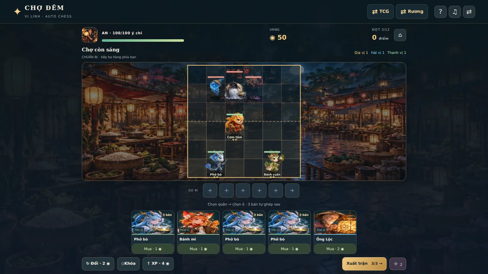
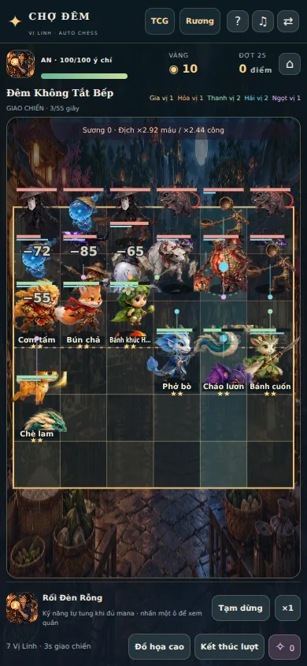
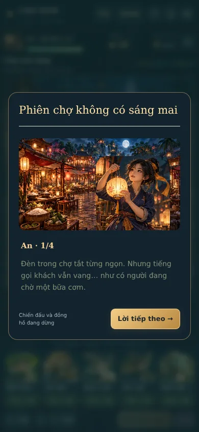
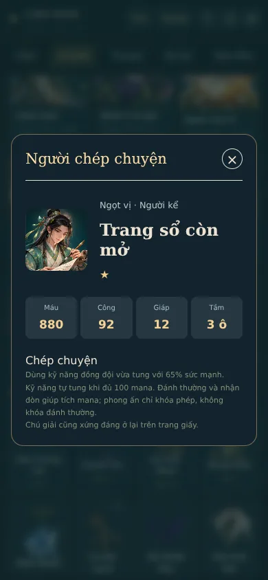

# MealGacha 3.0 — kiểm tra trước khi bàn giao

## Kiểm tra mã và dữ liệu

- `pnpm typecheck`, `pnpm test`, `pnpm build`, `pnpm validate:catalog`, `git diff --check` đều qua.
- 206 test / 17 file, gồm 61 regression Auto chess: pool hữu hạn, ghép sao/bench/slot, di vật, windup/hit, đồng thời hết máu ưu tiên thua, determinism, 32 quân tung kỹ năng, pressure/timeout, boss đổi pha, thưởng một lần, thua không mở màn, save cũ và save hỏng, chuyển ba mode và rollback khi storage lỗi.
- Catalog chung: 123 món, 35 tag, 9 sự kiện; TCG: 163 thẻ.
- `pnpm benchmark:autochess`: 3 chính sách đội hình × 3 seed × campaign/survival, không cấp vàng/sao ngoài luật. Mọi checkpoint được kiểm tra schema. Mỗi chính sách có ít nhất một seed qua đủ 12 màn; tất cả lượt survival kết thúc khi hết ý chí. Số liệu trong [balance-results.json](balance-results.json).

## Browser production build

Dữ liệu chi tiết: [browser-results.json](browser-results.json). Không có lỗi JavaScript hoặc request asset local thất bại trong các luồng đã kiểm tra.

1. Lần đầu chỉ có một hướng dẫn; thoại minh họa đổi chân dung theo người nói và chờ người chơi tiếp tục.
2. Mua trừ vàng thật; chạm quân dự bị để đổi vị trí khi đầy đội; vùng chọn ô và xem chỉ số hoạt động.
3. Trận thật chạy bằng RAF: thắng mới mở đợt hai; pause dừng tick; ×2 tăng tốc; điểm không trả lặp.
4. Trận thua thật không cộng điểm hoặc mở màn; campaign thử lại chính màn đó.
5. Trang bị di vật, boss đổi pha tạm dừng để đọc thoại; thắng dẫn qua chọn di vật → Lời hẹn → thoại hồi tiếp theo.
6. Chuẩn bị và chiến đấu vừa màn hình tại 320×568, 360×640, 390×844, 430×932, 768×1024, 1366×768, 1920×1080, 667×375, 844×390. Scroll trang không vượt viewport; shop/nút điều khiển hiện đầy đủ. Lobby và hộp thoại có vùng cuộn riêng.
7. Tạo mã MGC1 giữa trận, nhập vào browser context sạch: tick được giữ và trận dừng; tài nguyên Rương cũng phục hồi (fixture 731 chìa). Reload giữ đúng tick.
8. Chiến thắng cuối chiến dịch và lựa chọn kết truyện được lưu; xem 32 quân/14 địch, tải postcard PNG, đổi nền bằng đúng chi phí. Chuyển TCG → Rương → Auto chess giữ tiến trình.
9. Nhạc original và 8-bit phát qua audio controls thật; tùy chọn giảm chuyển động được lưu.
10. Bàn stress 19 actor: ghi 180 khoảng RAF, trung vị/p95 khoảng 16,7 ms trên Chromium headless bằng software rendering. Đây là mẫu của môi trường kiểm tra, không phải cam kết FPS cho mọi điện thoại. Đồ họa thấp hoạt động; sự kiện tab ẩn dừng simulation và yêu cầu tiếp tục thủ công.

## Giới hạn thực tế

Đồ họa anime là sprite 2.5D. 18 quân đầu dùng chung một số bộ chuyển động; 14 quân mới có hàng riêng, tất cả có chân dung riêng. Kỷ lục nằm trên thiết bị, không có PvP hoặc leaderboard server. Cân bằng hiện tại là vòng đầu dựa trên mô phỏng và kiểm tra luồng; vẫn cần phản hồi chơi thực tế. Thời gian benchmark chỉ tính giao chiến, không tính mua quân/xếp đội/đọc truyện. Mã text không chuyển ảnh bài đăng trong IndexedDB.

## Kiểm tra hình ảnh cuối

[render-results.json](render-results.json) ghi lần kiểm tra production cuối sau khi bổ sung tên Vị Linh trên bàn và câu chỉ huy phù hợp trait thực tế. Bàn 19 actor, thư viện 32 chân dung, inspector quân mới và cutscene đều render không lỗi; desktop chuẩn bị vẫn vừa viewport.

| Chuẩn bị desktop | Chiến đấu mobile |
|---|---|
|  |  |

| Cutscene theo nhân vật | Chi tiết quân mới |
|---|---|
|  |  |
