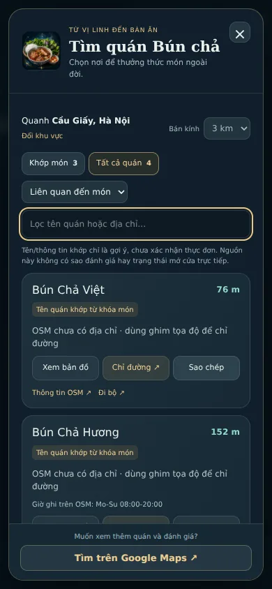
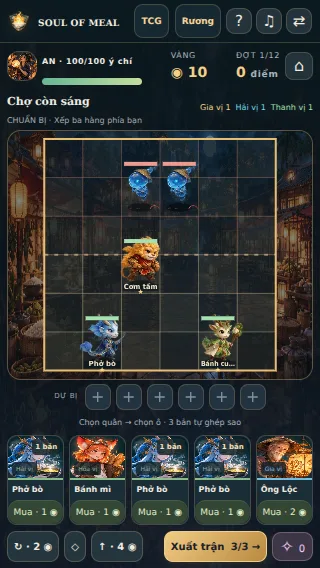
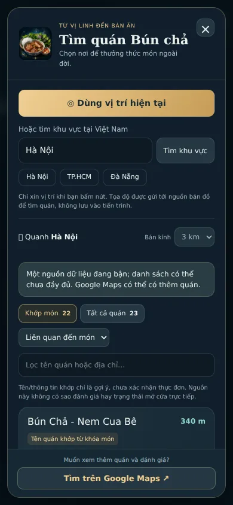
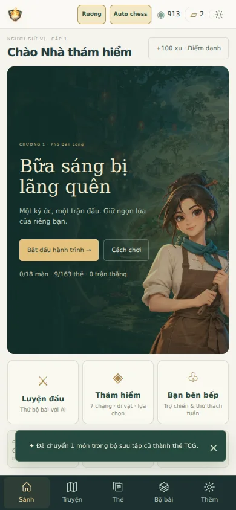

# Soul of Meal 3.1 — kiểm tra thương hiệu và tìm quán

**Luồng:** mở món trong Bộ sưu tập Rương → Tìm quán → GPS hoặc chọn khu vực Photon → truy vấn OSM/Photon → lọc và hiển thị → bản đồ/chỉ đường/copy. Không có backend hoặc API key cho luồng này.

- `pnpm typecheck`, `pnpm test` (**221 tests / 17 file**, 17 regression tìm quán), `pnpm build`, `pnpm validate:catalog` (123 món/35 tag/9 event), `git diff --check`: qua.
- Regression: geocode VN/không ép lang=vi, alias/ràng buộc từ/đ, không suy món từ Vietnamese/Asian, thứ tự relevance/distance, radius trước top-N, cache dùng lại giữa món và hết hạn 10 phút, dedupe, nguồn lỗi một phần/toàn bộ, response hỏng, cooldown 429, abort, timeout, tọa độ sai, safe phone/website và Maps URL.
- Browser production build kiểm tra chủ động từ chối GPS → nhập khu vực → chọn rõ một trong hai kết quả; không tự xin GPS hoặc gửi search theo keystroke. Khớp món/quán lân cận phân biệt, không rating/open-now giả.
- Radius/sort/lọc tên không phát sinh request; chỉ đường và embed/copy giữ tọa độ khi địa chỉ thiếu. Form khu vực thu gọn/mở lại được. Đóng dialog hủy search cũ; lỗi hai nguồn có thông báo và Maps fallback.
- Dialog vừa 320×568, 390×844, 844×390, 1366×768; footer Maps luôn hiện, danh sách cuộn nội bộ, Escape khôi phục focus. Branding TCG/Rương/Auto chess + browser title/logo được kiểm tra. Auto chess 320px không tràn ngang.
- Save fixture trên namespace cũ giữ 731 chìa/Rương + món Bún chả, 913 xu TCG, Auto chess seed 42 qua navigation/reload. Không sửa schema/namespace để đổi tên.

[Browser JSON](browser-results.json) dùng fixture có chủ đích cho lỗi, race, radius và clipboard. Iframe map trong kiểm tra dùng fixture; URL/marker được kiểm tra riêng.

[Live JSON](live-results.json): các request không khóa tới Photon/Private.coffee trả dữ liệu thật; chọn Hà Nội và render 22 quán bún chả. HTTP live được chuyển qua proxy outbound của executor vào request Playwright; Chromium gọi trực tiếp từ môi trường kiểm tra bị timeout. Đây là kiểm tra dữ liệu/contract/render live, không tuyên bố direct browser networking đã qua. Request HTTP với Origin của app trả 200 và CORS `*`; `lang=vi` trả 400, đã loại bỏ tham số này. Dịch vụ public có thể chậm hoặc thiếu quán; fallback Maps là phần của chức năng, không dữ liệu giả.

| Tìm quán mobile | Branding Auto chess |
|---|---|
|  |  |

| Dữ liệu quán thật | Branding TCG |
|---|---|
|  |  |
