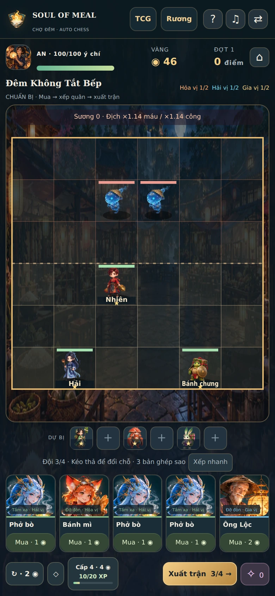
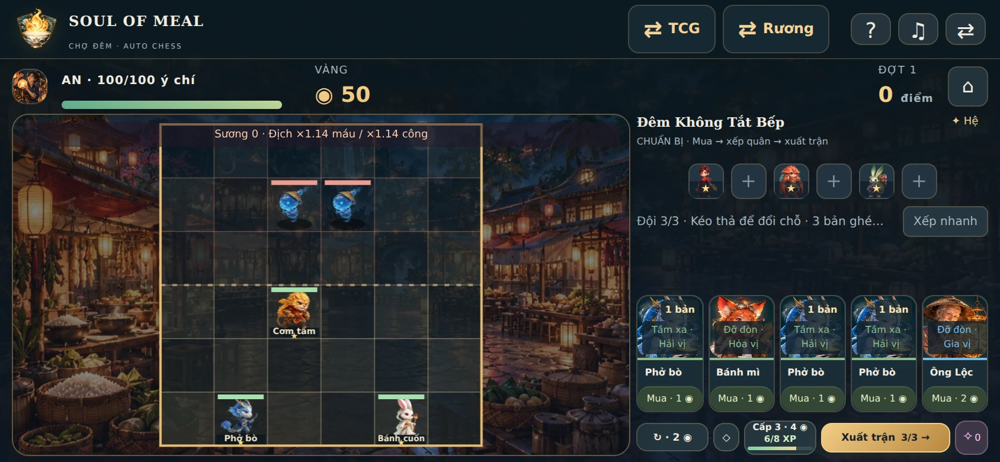
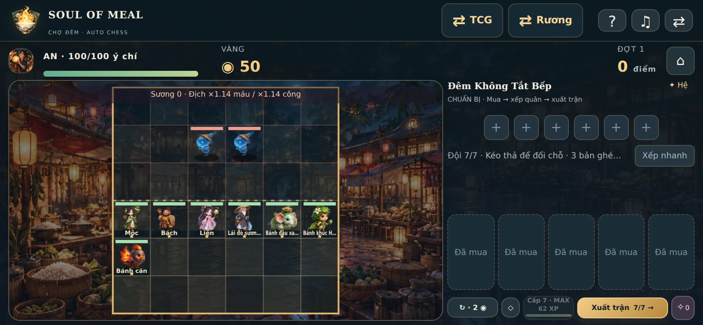
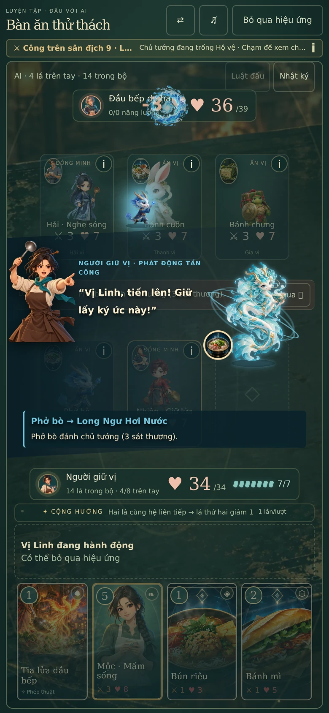
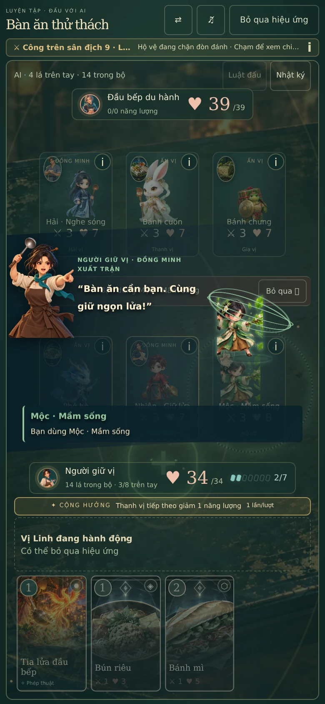

# Soul of Meal 3.2.2 — đội hình, độ khó và độ nét

## Hành vi mới

- TCG: cảnh chỉ huy dùng canvas theo kích thước layout × DPR (tối đa 2), không đo kích thước đang bị animation thu nhỏ. Các Vị Linh cũ dùng tranh alpha 480×720 trong cut-in; quân mới dùng frame lớn hơn từ atlas. Giảm glow để giữ đường viền. Trên sân và khi lao tới mục tiêu vẫn dùng bộ tư thế chuyển động chung.
- Auto chess: kéo thả bằng chuột/cảm ứng/pen trong giai đoạn chuẩn bị, đổi quân trên bàn, giữa bàn và dự bị, đổi thứ tự dự bị, thả đúng một ghế trống. Bàn đầy vẫn đổi quân với dự bị. Drop phía địch/ngoài bàn, pointercancel hoặc trận đang diễn ra không thay đổi đội hình. Chạm/chọn ô và bàn phím vẫn hoạt động.
- Sáu ghế có vị trí bền vững: lỗ trống không bị tự dồn sau khi di chuyển; reload và mã MGC1 giữ đúng vị trí. Save cũ thiếu `benchSlot` được hiển thị theo thứ tự cũ.
- Nút XP hiện cấp, tổng XP/ngưỡng cấp tiếp theo và thanh tiến độ; tooltip/accessible label cho biết XP còn thiếu. Mỗi vòng nhận 2 XP; mua 4 XP giá 4 vàng. Các mốc giữ nguyên: 8 / 20 / 38 / 62. Cấp 7 hiện MAX.
- Sprite fit theo cả chiều rộng và chiều cao của ô, dùng biên của tất cả các tư thế và điểm neo chân đã đo. Khi quay trái, tâm bất đối xứng được phản chiếu cùng model, không lệch ngang. Bố cục ngang 667×375 có nút XP riêng đủ thấp.

## +30% được áp dụng như thế nào

**TCG:** ý chí tối đa của chủ tướng địch ×1.3, làm tròn số nguyên, ở chiến dịch, luyện tập, thám hiểm, truyện phụ và thử thách tuần. Ví dụ luyện tập 30 → 39; màn cơ bản 25 → 33. Không tăng lại vào máu quân, phép, năng lượng hoặc phe người chơi. Đây là tăng độ bền của trận, không phải phép đo tỉ lệ thua của người chơi.

**Auto chess:** ngân sách độ bền × sát thương tăng khoảng 30%. Máu, công và sức mạnh kỹ năng địch ×sqrt(1.3) = 1.140175…; máu làm tròn. Vì máu × công = 1.3, cách chia này tránh tăng cả hai 30% rồi cộng dồn thành 69%. Áp dụng chiến dịch, Survival, Daily và quái được triệu hồi. Scaling theo đợt/thời gian, cuồng nộ và sao phe người chơi giữ nguyên; đội 3 sao vẫn là thành quả có giá trị, nhưng cần hệ/nghề, hỗ trợ và vị trí.

Trận TCG đang lưu giữ nguyên chỉ số. Run Auto rules v1 đang đánh giữ nguyên actors; khi xuất trận tiếp theo nâng rules v2. Save và kỷ lục v1 vẫn được đọc. Không đặt lại tài nguyên, bộ sưu tập hoặc tiến trình truyện.

## Model chung

Tạo 4 atlas alpha nguyên gốc bằng **image_gen.imagegen, built-in mode**, không dùng CLI/API key. Mỗi atlas có 4 nhân vật × 7 tư thế: đứng, bước trái, bước phải, chuẩn bị đánh, tung kỹ năng, ăn mừng, ngã. Tổng **16 model / 112 tư thế mới**, nhận diện bằng trang phục, silhouette, loài linh thú và màu hệ, không chỉ bằng tên.

| Atlas | Model |
| --- | --- |
| `rosterA.webp` | Nhiên, Hải, Mộc, Bách |
| `rosterB.webp` | Liên, người lái đò, Bún chả (cáo than), Bún riêu (cua đỏ) |
| `rosterC.webp` | Bánh xèo (phượng vàng), Bánh cuốn (thỏ trắng), Xôi mặn (gấu nếp), Cơm gà (gà vàng) |
| `rosterD.webp` | Bánh chưng (rùa lá), Bánh tét (thỏ xanh), người hái thuốc, người gieo vườn |

14 model thay các hàng atlas bị dùng chung trong Auto chess; 2 model bổ sung cho lữ hành TCG. **Cả 32 quân Auto chess nay có hàng atlas riêng**, được kiểm tra bằng source rectangle thật trong canvas và mapping. Lá TCG tương ứng dùng chính model đó. Những món TCG khác vẫn dùng fallback theo hệ; không tuyên bố 163 lá đã có model riêng.

Đây là **sprite anime 2.5D**, không phải model GLB/rig 3D chạy trực tiếp. Tranh 480×720 của Vị Linh cũ trong cut-in có chuyển động canvas (thở/lao/recoil), không có tư thế raster mới cho mỗi hành động.

Asset runtime ở `public/assets/characters/roster{A,B,C,D}.webp`: kích thước native 1254×1254, quality 94, không resize. Tổng 4,087,404 byte. Alpha của WebP giống hệt PNG sinh ban đầu. Atlas tải theo nhân vật đang dùng và cache chung giữa hai chế độ. Crop/neo được đo theo alpha và chân; `scripts/register-character-atlases.py` ghi metadata, không chỉnh lại tranh. [Prompt đầy đủ và đường dẫn từng asset](prompts.json).

## Kiểm chứng

- `pnpm test`: **240/240 test, 20 file**. Gồm mốc XP, swap bàn/dự bị/ghế trống, atomic invalid move, load/save/encrypted transfer, tương thích rules cũ, thông số 30%, tất cả pose/chiều quay, mapping model chung, TCG/Auto combat và kết quả/cutscene sẵn có.
- `pnpm typecheck`, `pnpm validate:catalog`, `pnpm build`: đạt. Catalog giữ 123 món, 35 tag, 9 event; build 970 module.
- [18 mô phỏng Auto chess](balance-results.json): 3 hướng build × 3 seed × 2 mode, mua/roll/XP theo tài nguyên thật. 4/9 chiến dịch hoàn thành, mỗi hướng có ít nhất một seed thắng; 9/9 Survival kết thúc với HP 0, vượt 8–13 đợt. Heuristic benchmark được bổ sung healer/support; đây là kiểm tra khả năng chơi và kết thúc, không phải so sánh win-rate A/B với policy cũ.
- Smoke test 20 thám hiểm TCG bằng greedy deck có sẵn đạt 4/20 lượt hoàn thành. Ngưỡng cũ ≥5 được chỉnh thành ≥3 để phản ánh địch bền hơn; không nerf gameplay để đạt test. Test bộ bài trưởng thành thắng cả 18 màn chiến dịch vẫn đạt.
- [Browser QA](browser-results.json): 10 nhóm flow; chuột và touch event native Chromium; XP 6/8 → 10/20/cấp 3 → 4; bàn đầy đổi dự bị, giữ ghế trống, cancel/drop cấm, reload giữ mọi tiền và vị trí; trận đang đánh không nhận drag.
- TCG và Auto chess fit 320×568, 375×667, 390×844, 667×375, 844×390, 1024×768, 1440×900: không cuộn trang/che nút. 15 đo geometry (14 mode×size và một baseline).
- Render tất cả 32 quân thành 5 nhóm, ở cả 390×844 và 844×390: 10 batch, kiểm tra drawImage/atlas rectangle thật, không chỉ ảnh nền. Tất cả model ở trong bàn. Một action đi ngang thật kiểm tra model mới quay trái quanh chân.
- Cut-in TCG thực sự dùng source 480×720 và backing canvas bằng layout × DPR, ngay cả khi parent đang scale vào sân. Triệu hồi Mộc dùng atlas mới, giữ stat trận. Giảm chuyển động tắt cinematic nhưng gây đúng 3 sát thương (39 → 36).
- Không có page error hoặc asset HTTP error trong QA local. Đã nhìn ảnh dọc, ngang, model và cut-in. Browser là Chromium giả lập mobile/touch; chưa kiểm tra Safari trên iPhone thật.

## Ảnh kiểm chứng

