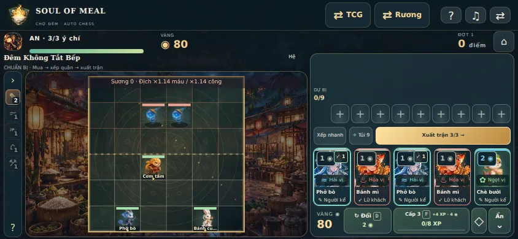
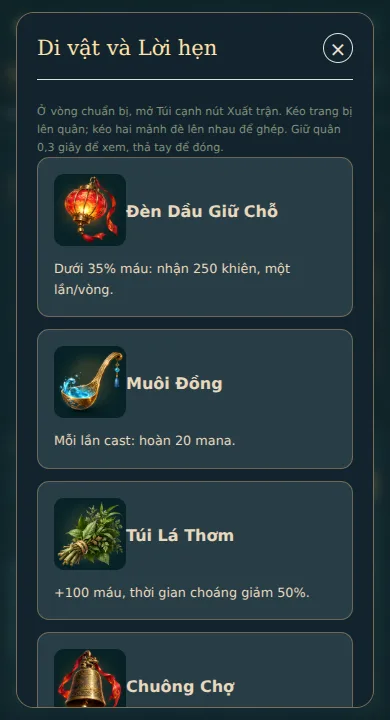

# Soul of Meal 3.5.0 · Ký ức trở lại

## TCG

Giữ 163 thẻ và tiến trình sở hữu hiện có. Phân hóa thẻ món theo vai trò: 11 nội tại gồm phục kích quân đã bị thương, tăng công sau phép, rút khi ít bài, giảm công địch, hồi đồng minh, tăng công khi hồi chủ tướng, trao khiên, hồi/rút khi bị hạ, dệt khiên sau phép và thưởng bàn đa hệ. Bộ khởi đầu giữ đường cong quen thuộc.

18 phép hiện có được đổi thành quyết định khác nhau: Hỏa Long xuyên chắn nhưng giữ chắn; Thủy Triều xóa chắn; Sao băng mạnh theo số phép trước đó; Ngọn lửa cuối thưởng ít ý chí; cường hóa tập trung quân yếu; Bàn gia đình thưởng phối hệ; Giấc mơ ngọt đóng băng bỏ một đòn. Hy sinh quân ít máu kích ký ức khi bị hạ; Ký ức đại dương/Nở lại đưa đồng minh giá tối đa 4 trở lại với 2 máu, chưa được đánh, không kích hiệu ứng vào sân. Có cửa sổ **Ký ức đã mất** cạnh chủ tướng.

Nội tại tăng công/dệt chắn tối đa 2 lần giữa hai lượt của chủ nhân. Hồi khi đầy máu không kích nở công. Mỗi công thức tối đa một lần/lượt; ra món rồi phép liên tiếp, tấn công không ngắt chuỗi.

| Công thức | Món mở → phép kết | Phần thưởng |
| --- | --- | --- |
| Bữa cơm nhà | Phở/Cơm tấm/Bánh cuốn… → hồi | Hồi 3 ý chí, toàn đội 1 chắn |
| Quà phố | Bánh mì/Bún chả/Bánh xèo… → sát thương | Địch mất 1 ý chí, rút 1 lá |
| Bếp Tết sum vầy | Bánh chưng/Bánh tét… → cường hóa/khiên | Toàn đội +1 công, 1 chắn |
| Bến nước ký ức | Phở/Bún cá/Bún thang… → rút/tái triệu hồi | Đóng băng quân công cao nhất; không có địch thì rút 1 lá |
| Vườn sau cơn mưa | Gỏi cuốn tôm thịt/Nộm sứa/Dưa hành… → hồi | Hồi đồng minh 2 máu, quân ít máu nhất +1 công |
| Đêm rước đèn | Xôi/Chè lam/Chè bưởi… → khiên | Toàn đội 1 chắn, rút 1 lá |

Hai mẫu deck **Ký ức trở lại** và **Dệt phép dưới trăng** nâng tổng gợi ý lên 7. Phân tích deck phát hiện thiếu quân để hy sinh/tái triệu hồi, thiếu phép rẻ hoặc thiếu hồi cho nở công. Coach mô phỏng nước đi thật, xử lý quân bị hy sinh, hồi đơn vị, đóng băng và gọi lại; AI hiểu phép xuyên/phá chắn và sát thương tăng theo điều kiện.

## Auto chess: ý chí và vòng thua

| Chế độ | Bắt đầu | Khi thua | Khi thắng |
| --- | --- | --- | --- |
| Survival | 3 ý chí | Mất đúng 1, còn thì chuẩn bị lại **cùng đợt**; về 0 kết thúc và ghi kỷ lục | Qua đợt, nhận điểm/thưởng; không hồi ý chí |
| Chiến dịch | 100 ý chí | Trừ như cũ: min(25, 5 + 2 × địch còn sống). Còn thì chơi lại **cùng đợt** | Qua màn, mở truyện/thưởng theo luật cũ |
| Thử thách ngày | 100 ý chí, một lượt | Giữ hành vi 3.4.1: thua kết thúc lượt, lưu kỷ lục ngày | Qua đợt |

Ý chí là sức bền của An qua phiên, khác máu từng quân. Vòng thua giữ đội hình và nhận vàng/2 XP để cải thiện trước khi thử lại; không cho điểm/Ấn Chợ, không mở chương, không trả thưởng vòng thắng. Chốt lại checkpoint không trả vàng/XP hai lần. Kỷ lục chỉ ghi một lần khi phiên kết thúc; vòng thắng cao nhất giữ riêng với vòng đang chơi lại.

Giữ tăng tốc ×3 sau 55 giây, không xử thua vì hết giờ. Survival tăng áp lực theo thời gian **giao chiến thực**; chuẩn bị/thoại/tạm dừng không tính thời gian. Xếp lại quân, ghép sao và mua XP trước khi thử lại đều hữu ích.

Save Survival cũ **đang chơi** chuyển theo tỷ lệ ý chí sang tối đa 3; kết quả thua cũ chưa xác nhận tính mất 1. Marker khiến lưu/nhập lại không tiếp tục chia ý chí. Phiên đã kết thúc và kỷ lục cũ giữ nguyên. Save nhập với 0 ý chí không mở lại được. MGC1/local save giữ các trường mới của hai game. Bonus/nhạc ít ý chí dùng tỷ lệ để 3/3 không bị hiểu nhầm là sắp thua.

## Hình ảnh và âm thanh

Cửa hàng hiện **hệ và nghề**, kể cả mobile ngang; xem nhanh/chi tiết quân cũng hiện nghề. Cả 9 trang bị có ảnh anime RPG gốc dùng chung một atlas WebP: kho, khay, kéo thả, ghép đồ, thưởng và đồ đang đeo. Ảnh vẫn rõ khi chưa thể trao/tháo.

Sàn có họa tiết khắc lấy cảm hứng trống đồng và màu theo đội; quá giờ viền đổi sắc. Thêm cột sáng/rune niệm phép, vòng đòn diện rộng, sóng nước, mảnh băng/lá, khiên chuyển động, tan biến và vệt máu giảm. Kỹ năng sao chép dùng loại phép đã giải quyết thật. Giới hạn 4 nhãn kỹ năng mới nhất và số sát thương mới nhất mỗi mục tiêu để dễ đọc.

Renderer nội suy 20 tick/giây lên tối đa 60 FPS; preset nhẹ/giảm chuyển động 30 FPS, tạm dừng 15 FPS; không vẽ khi tab ẩn, không blur trên cả atlas. Mobile ngang có cột điều khiển bên phải, giữ bàn lớn hơn. Nhảy ăn mừng vẫn diễn ra trước kết quả/thưởng.

SFX riêng cho chém, bắn, chạm đòn, niệm phép, tan biến, boss chuyển pha, quá giờ, thắng/thua; stereo nhẹ theo vị trí, nhịp theo thời gian thật ở ×3, tối đa 48 voice, dọn panner khi tắt. Nhạc battle/boss mới có 32 ô nhịp, pressure có 16; cả phong cách gốc và 8-bit. Composer chỉ thay nhạc Auto chess. Giai điệu/âm tổng hợp không dùng sample hay giai điệu trò chơi khác; provenance ảnh/nhạc được ghi vào hồ sơ release.

## Kiểm chứng

Luồng: hành động UI → reducer/engine trong trình duyệt → local save/schema → kết quả. Game chạy client; preview phục vụ file tĩnh, không có API/backend ở luồng này.

- Typecheck ứng dụng và dev; **315 kiểm thử / 28 file**. Catalog hợp lệ: 123 món; Auto chess giữ 44 quân. Release verify: 246 asset có hồ sơ, 3 chính sách tĩnh.
- Browser trên **build production cục bộ**, 390×720, 844×390, 1366×768: chuẩn bị/đánh không tràn viewport; nghề và nút đều thấy. TCG tái triệu hồi chạy qua chọn thẻ/thi triển, ký ức mất quân cập nhật, không tràn màn hình.
- Combat thật xác nhận Survival/Campaign thua rồi trở về cùng vòng; hết ý chí ghi 432 điểm một lần; thắng giữ ý chí và ăn mừng trước kết quả.
- Atlas kho/công thức/quân đeo tải thành công; không lỗi JS/asset 4xx. Hai phong cách nhạc tải/giải mã/phát qua AudioContext; giảm chuyển động lưu được.
- Mẫu 18 actor trong Chromium headless: **60,2 FPS** vẽ Canvas trong 3 giây. Đây là mẫu trên máy kiểm tra, không bảo đảm FPS trên mọi điện thoại.
- 6 MP3 mới giải mã bằng ffmpeg: RMS > .03, peak < .95, không mẫu clipping. Chưa đánh giá bằng loa/tai nghe và chưa kiểm tra Safari trên thiết bị thật.
- Sau browser QA, bổ sung kiểm thử import 0 ý chí và mục tiêu AI xuyên chắn; các thay đổi này đã qua bộ 315 kiểm thử.

Dữ liệu: [browser](browser-results.json), [âm thanh giải mã](audio-decoded.json), [manifest nhạc](audio-manifest.json), [prompt/provenance ảnh](item-prompts.json). Harness [verify-depth.mjs](../../tools/verify-depth.mjs) cần Playwright, Chromium/@sparticuz/chromium ngoài runtime sản phẩm; có thể truyền `PLAYWRIGHT_MODULE`, `CHROMIUM_MODULE`, `CHROMIUM_PATH`, `CHROMIUM_LIB_DIR`. Chạy sau `pnpm build`.

Web build khoảng **39,18 MB**, JS gzip **508,4 kB**, dưới budget 45 MB/650 kB. Đây là toàn bộ file tĩnh, không phải lượng tải một lần của trang đầu. `dist` không có test, prompt, screenshot, archive hay source map. Tài liệu, generator, kiểm thử và ảnh kiểm chứng nằm trong `dev/` để bỏ khi đóng gói release.

