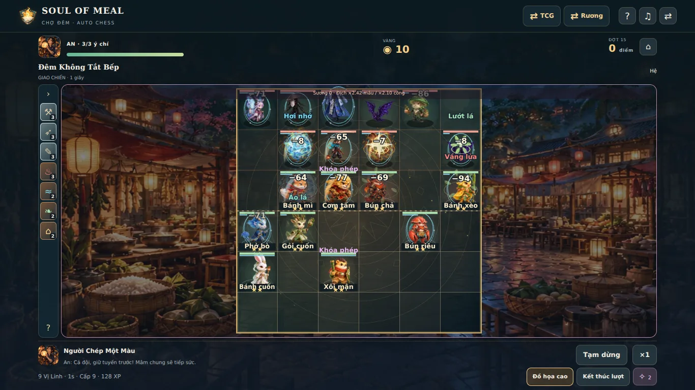
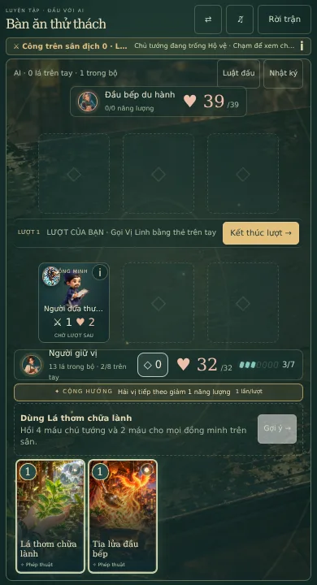

# Soul of Meal 4.0 — Chợ Ký Ức Sống

**Đề xuất nghiên cứu ngày 10/10/2026. Chưa phải bản 4.0 đã triển khai.**

Nâng cảm giác chơi của ba chế độ hiện có bằng nhân vật chuyển động rõ hơn, sân đấu có chiều sâu, quyết định xây bài có đánh đổi và nhạc phản ứng theo trận. Ưu tiên TCG và Chợ Đêm Auto chess; Rương nhận cùng ngôn ngữ hình ảnh và âm thanh. Tiến trình 3.5.0 phải tiếp tục được đọc, xuất/nhập và chơi tiếp.

## Nền đã xác minh

| Hạng mục | Trạng thái tại thời điểm kiểm tra |
| --- | --- |
| Repository | [minhutc359-ship-it/MealGacha](https://github.com/minhutc359-ship-it/MealGacha), public, nhánh mặc định `master` |
| PR #22 | Đã merge lúc **07:08:25 ngày 10/10/2026, giờ Việt Nam** |
| `master` | `79d3aeb3ae40ce846df31910d6c40de9b8efb938` |
| Nhánh 3.5 | `feat/deeper-decks-and-willpower`, head `b55bc1b729e6faf9a8b1e55bfeb124b4b0e213ce` |
| PR đang mở | 0 trước khi tạo PR nghiên cứu này |
| Kiểm tra GitHub | Vercel commit status `success`; không có Actions workflow run hay check-run được trả về. Status hosting không chứng minh đã chạy bộ test |
| Runtime | React 19, Vite 8, TypeScript; Canvas 2D cho trận; PixiJS 8 đã dùng ở Rương; Web Audio; local save/MGC1 |
| Nội dung | 163 thẻ TCG, 123 món, 44 quân Auto chess; 18 màn TCG và 12 đợt chiến dịch Auto chess |

Đã đọc [UPDATE 3.5.0](../depth-v350/UPDATE.md), `dev/AGENTS.md` và source liên quan trước mọi chỉnh sửa. Các số đo và nguồn nằm trong [AUDIT.json](AUDIT.json). Đây là PR tài liệu; phiên bản sản phẩm vẫn là **3.5.0**.

## Vì sao cần bước nâng cấp này

3.5 đã có hy sinh, tái triệu hồi, đóng băng, 6 công thức, 7 mẫu deck; Auto chess đã có nghề/hệ, augment, ghép đồ, boss chuyển pha, VFX theo event và hai phong cách nhạc. Thêm tiếp các biến thể tăng công/hồi máu sẽ khó tạo cảm giác khác biệt.

Các khoảng trống quan sát từ code và ảnh QA hiện có:

| Quan sát | Tác động đến người chơi | Hướng 4.0 |
| --- | --- | --- |
| Nhiều model mới dùng ít pose; `actorFrame` chọn các pose cách nhau tương đối lớn | Chuyển động còn giống đổi hình hơn là một hành động có sức nặng | Làm clip rõ chuẩn bị → tiếp xúc → hồi động tác; thống nhất neo chân |
| Bàn Auto chess là hình vuông ở giữa nền rất rộng | Tranh đẹp nhưng quân nhỏ; VFX, tên và sát thương tranh cùng vùng | Tăng diện tích có ích, giảm tương phản nền, tách tầng nhãn khỏi VFX |
| Phân hóa thẻ món phần lớn theo `foodProfile(card, hash)` | Các món khác tên vẫn có cùng nhịp vận hành | Biên tập nhóm thẻ chủ lực bằng hồ sơ vai trò tường minh; thêm ít thẻ thay đổi quyết định |
| 6 augment hiện có chủ yếu cộng chỉ số, kinh tế hoặc điều kiện xuất trận | Lựa chọn chưa tạo nhiều lối đánh khác nhau trong trận | Thêm augment có trigger, giới hạn và điểm yếu riêng |
| Mixer đã crossfade/duck; nhạc chuyển giữa bài đầy đủ | Có phản hồi theo cảnh nhưng ít chuyển sắc ngay trong cùng trận | Bổ sung lớp nhạc theo áp lực/pha boss, cùng một đồng hồ âm thanh |
| Image cache chung chưa có trần byte; loader save lỗi trả hồ sơ mới | Tăng asset/rules dễ gây vấn đề bộ nhớ hoặc mất đường phục hồi save | Xử lý cache và bảo vệ save trước khi mở nội dung mới |

Đây là đánh giá kỹ thuật/thiết kế, chưa phải kết quả khảo sát người chơi. Các cơ chế mới cần được chơi thử trước khi coi là hấp dẫn hoặc cân bằng.

## 1. Đồ họa: anime 2.5D và bản sắc bếp Việt

Chọn hình minh họa anime có ánh sáng ấm, viền nét rõ và chất liệu tre, gốm, giấy, đồng. Giữ thiết kế món ăn/Vị Linh và logo đang dùng; phát triển nét riêng qua hình dáng nhân vật, dụng cụ bếp và nhịp sinh hoạt ở Chợ Đêm.

### Sân đấu có chiều sâu và quân dễ đọc

Ba sân ưu tiên: **Chợ Đêm**, **Bến Ký Ức**, **Bếp Đoàn Viên**. Mỗi sân có nền xa, mặt sàn, nhân vật, ánh sáng/FX và tiền cảnh. Đèn đung đưa, hơi nước, bóng mềm và mặt nước tạo chuyển động nhẹ; tiền cảnh luôn nằm ngoài vùng tương tác.

Quân giữ vị trí trên lưới logic 6×6. Đợt đầu dùng góc nhìn ổn định, phóng phần sàn có ích thay vì thêm khoảng nền. Góc nghiêng nhẹ chỉ là thử nghiệm ở desktop/ngang; mobile dọc ưu tiên ô vuông dễ chạm. Nếu dùng phép chiếu, đường chọn ô, kéo thả và telegraph phải dùng cùng phép chiếu/nghịch đảo. Đồ họa không thay khoảng cách, đường đi hay tầm kỹ năng.

| Thành phần | Cách nâng cấp | Điều kiện đọc được |
| --- | --- | --- |
| Model | 12 nhân vật ưu tiên + 2 boss được làm clip trước; các model khác tiếp tục hoạt động | Nhận ra hệ/vai trò từ silhouette ở kích thước thật trên mobile |
| Idle | Thở, tóc/vạt áo, dụng cụ bếp; biên độ nhỏ | Neo chân không trượt, nhân vật không nhấp nháy theo tick |
| Di chuyển | Bước và bóng dịch cùng nhân vật; hướng nhìn đi theo mục tiêu | Không giấu ô hoặc đường đi; chỉ nội suy presentation |
| Attack/cast | Chuẩn bị → tiếp xúc/niệm → hồi động tác | Pose chạm, SFX và sát thương đồng bộ với event thật |
| Chịu đòn/hạ gục | Lùi nhẹ, nháy sáng cục bộ, tan thành ký ức | Quân đã bị hạ không còn nhận thao tác hoặc giả vờ sống |
| Thức tỉnh sao | Áo/dụng cụ/viền sáng có khác biệt, giữ silhouette | 1/2/3 sao nhận ra cả khi giảm chuyển động |
| Sân | Nền xa bớt chi tiết/độ sáng; mặt sàn rõ tương phản | Tên, HP, trạng thái và ô chọn nằm trên lớp dễ đọc |

Mục tiêu clip thử nghiệm: **24 frame/nhân vật ưu tiên**: idle 2, walk 6, attack 4, cast 4, hurt 2, death 4, victory 2. Đây là brief sản xuất, cần kiểm chứng độ nét/dung lượng trước khi làm đủ 12 nhân vật. Dùng hướng trái/phải và mirror ở đợt đầu; bộ 4–8 hướng đầy đủ để sau khi mẫu clip đạt chất lượng.

### Giao diện theo nhịp quyết định

Desktop: bàn ở giữa; hệ/nghề bên trái; shop, dự bị và lựa chọn phía dưới hoặc bên phải theo chiều cao thật. Mobile dọc: bàn → trạng thái lượt → tay bài/shop; cửa sổ chi tiết mở có chủ đích. Mobile ngang: giữ cột điều khiển riêng như 3.5, mở rộng phần quân và sân.

Trạng thái mới cần hiện bằng **icon + từ khóa + số lượt còn lại**. Combo có chuỗi thẻ nối bằng một đường sáng ngắn và lời giải thích cụ thể: “Phép thứ 2: Đường sao rơi gây 6”. Chỉ làm nổi vùng đang chọn; nhãn tổn thương không che mặt/HP. Đọc được thao tác xác nhận ở 320×568 và 844×390 là điều kiện bắt buộc.

| Token màu đề xuất | Màu | Dùng cho |
| --- | --- | --- |
| Mực đêm | `#10242D` | Nền UI |
| Giấy ấm | `#F1E5C8` | Chữ chính, panel sáng |
| Đồng bếp | `#DAB675` | Viền/chọn, thương hiệu |
| Hỏa vị | `#F29B79` | Đánh/đốt |
| Hải vị | `#83D8ED` | Mana/nhịp phép |
| Thanh vị | `#A7D797` | Hồi/sinh trưởng |
| Gia vị | `#E4C682` | Hộ vệ/khiên |
| Ngọt vị | `#D7AFE8` | Phép/ký ức |

Màu cần đi cùng biểu tượng và văn bản; bảng này chưa phải chứng nhận tương phản. Kiểm tra chữ thường, nút bị khóa và overlay trực tiếp trên từng nền.

## 2. TCG: combo có lựa chọn và thời điểm

Giữ bộ bài **18 lá**, tối đa 2 bản/thẻ, tay tối đa 8, sân tối đa 3 quân, năng lượng tối đa 7. Hai keyword mới đủ cho đợt đầu; mỗi keyword chỉ xuất hiện trên một số thẻ hỗ trợ mới.

| Cơ chế | Luật đề xuất để prototype | Quyết định tạo ra |
| --- | --- | --- |
| **Nêm vị** | Chọn một trong hai nhánh ghi trên thẻ trước khi xác nhận; tiêu năng lượng và tính là một phép đúng một lần | Dùng cùng lá để giữ sân hoặc tìm combo tùy tình huống |
| **Ủ vị** | Đặt hiệu ứng chờ; giải quyết ở đầu lượt kế tiếp của chủ nhân nếu nguồn/mục tiêu còn hợp lệ; tối đa 2 hiệu ứng chờ mỗi phe | Đánh đổi lợi ích tức thời lấy nhịp bùng nổ ở lượt sau; đối thủ có một lượt phản ứng |

Không sửa ngầm luật 6 công thức của 3.5. Các nhánh mới ghi rõ **loại hiệu ứng sau khi chọn**, để một thẻ hai lựa chọn không đồng thời hoàn tất hai công thức. Giữ một công thức tối đa một lần/lượt và cap nội tại hiện có.

### Gói thẻ đầu: 8 thẻ hỗ trợ, từng lá có việc riêng

| Nhóm | Số lá | Ví dụ/brief |
| --- | ---: | --- |
| Nêm vị | 3 | **Ấm trà ngã rẽ**, cost thử nghiệm 2: hồi 3 máu một đồng minh **hoặc** rút 1 lá. Nhánh hồi cần đồng minh bị thương; nhánh rút tôn trọng tay đầy và kiệt sức |
| Ủ vị | 2 | **Nồi than ủ**, cost thử nghiệm 2: đầu lượt sau, đồng minh được đánh dấu còn sống nhận +2 công/+2 máu tối đa; **Chậu mầm bên bếp**: hồi đội ở đầu lượt sau, có thể bị gỡ trước khi nở |
| Đối sách | 2 | Một phép gỡ đúng một hiệu ứng Ủ vị của địch; một phép giải đóng băng/hồi cho đồng minh. Không tạo cơ chế phản ứng thời gian thực |
| Động cơ bộ bài | 1 | Một quân có thưởng khi bạn hoàn tất nhánh Nêm vị; giới hạn một lần/lượt, có stat và điểm yếu để đổi quân được |

Tên/cost/stat trên là thông số alpha để mô phỏng, chưa đưa vào catalog hay pool. ID mới có prefix/namespacing riêng; gói Rương vẫn chỉ có món hợp lệ. Quyết định nguồn nhận thẻ, giá chế tạo và ảnh sẽ nằm trong PR cân bằng; không thêm tiền tệ.

Ba lá Nêm vị phải khác nhau về mục đích: chữa/đào bài, giữ carry/tấn công, tái triệu hồi/khống chế. AI và coach chỉ dùng thông tin được phép, chọn nhánh và mục tiêu cùng reducer với người chơi. Preview cũng chạy reducer này trên bản sao: hủy chọn không mất tài nguyên, RNG hoặc bài.

### Làm rõ 4 bộ bài đã có nền để phát triển

| Bộ bài | Quyết định chính | Điểm yếu/cách đối phó |
| --- | --- | --- |
| Ký ức trở lại | Giữ ô trống, chọn quân hy sinh; đổi lợi ích khi bị hạ lấy tái triệu hồi | Ép dùng hết sân, dồn sát thương chủ tướng; quân gọi lại chưa được đánh và không kích vào sân |
| Dệt phép dưới trăng | Phép rẻ → dệt chắn/tăng công → phép kết thúc; Ủ vị tạo nhịp chuẩn bị | Phá chắn, gỡ hiệu ứng chờ, áp lực trước khi động cơ ổn định |
| Vườn sau cơn mưa | Hồi đúng quân/chủ tướng đang thiếu máu; quyết định giữ sân hay dùng nhánh rút | Burst và đổi quân; hồi khi đầy không tạo trigger |
| Quà phố | Giữ nhịp gây áp lực, rút vừa đủ, chuyển Nêm vị sang phòng thủ khi cần | Hộ vệ, hồi có giới hạn và kiểm soát số lá còn trong deck |

Ví dụ **đã đúng với 3.5**, có thể đưa vào tutorial/preview 4.0: khi một quân `weaver` còn sống, dùng `spark` (1) → `sugar-veil` (1) → `starlight` (3). Hai phép đầu giúp chạm cap hai trigger dệt chắn; `sugar-veil` rút thêm vì đã dùng phép; `starlight` gây 6 trước chắn vì đã có hai phép. Tổng cost gốc 5, chưa tính giảm từ Cộng hưởng. Preview phải hiển thị cả chắn địch, tay đầy và kiệt sức; combo không mặc nhiên luôn có lợi.

Deck Builder nâng phân tích hiện có thành bản đồ vai trò: quân mở bài, động cơ, phép nối, kết thúc, đối sách. Tìm theo ability/recipe, giải thích lá còn thiếu và thử tay mở đầu với seed tái lập. Các hồ sơ món chủ lực được biên tập tường minh để giảm trùng nhịp; nếu đổi hành vi thẻ cũ, resolver theo phiên bản phải giữ trận đang chơi.

### Thám hiểm nâng từ hệ thống đang có

Đã có 7 chặng, chọn điểm dừng, 10 di vật và thay bài trong chuyến. 4.0 mở các lựa chọn **đường an toàn/đường thử thách**, sự kiện tương tác với recipe/deck và boss báo trước quy luật. Thẻ/di vật tạm trong chuyến vẫn độc lập bộ sưu tập; phần thưởng có thể bỏ qua nếu làm hỏng combo.

Đợt đầu thêm 4 biến thể encounter/sự kiện, 2 cơ chế boss và 4 di vật đổi cách chơi. Hiện hành trình cho phép tối đa 2 node/chặng; mở nhiều node hoặc nhiều chặng là thay đổi schema riêng, không lẫn vào PR hình ảnh. Seed và lựa chọn được lưu; reload không đổi đề nghị.

## 3. Auto chess: quyết định xây đội, đọc trận và thử lại

Giữ **44 quân, 5 hệ/3 nghề, bàn 9 quân, 9 ô dự bị, 2 trang bị/quân** trong mốc đầu. Roster lớn hơn chỉ có ích sau khi các carry hiện tại có đường xây đội và điểm yếu rõ.

### Sáu augment mới tạo hành vi

Sáu augment hiện có được giữ. Thêm sáu mẫu dưới đây để thử tổng 12; chỉ phiên rules mới được nhận augment mới.

| Brief augment | Đổi cách xây/chơi | Giới hạn cần prototype |
| --- | --- | --- |
| **Đội chuyền bếp** | Sau cast, truyền một lượng mana nhỏ sang một đồng minh khác | Cooldown theo tick; không chọn chính nguồn; truyền mana không kích lại cùng sự kiện |
| **Bếp sau cơn mưa** | Hồi máu thực cho đồng minh tạo thưởng cho đòn kế tiếp của quân được hồi | Cap một lần/quân trong cửa sổ; hồi đầy không kích; bonus bị mất nếu quân chết |
| **Hộ vệ bàn trống** | Khi một đồng minh bị hạ, hộ vệ còn sống được khiên để giữ tuyến | Tối đa một lần/hộ vệ/trận, không dùng để hồi ý chí chủ tướng |
| **Chợ chớp đèn** | Lựa chọn kinh tế cho reroll build: đổi lợi tức lấy một ưu đãi shop đã công bố | Công thức vàng tường minh; chỉ làm mới ở prepare, không nhân thưởng bằng retry/checkpoint |
| **Đêm kể chuyện** | Carry dựa vào cast thứ ba của chính nó để kích bùng nổ ngắn | Chỉ đếm cast đã giải quyết, cap/trần duration, không đếm pose niệm |
| **Mâm nhiều vị** | Thưởng phối hệ dựa trên vai trò bổ sung, giảm lợi ích dồn một carry | Đếm ID khác nhau như trait hiện có; không tạo hệ/nghề thứ ba |

Offer cần ít nhất một lựa chọn phổ quát, tránh cả ba phương án không dùng được. Các cặp tạo vòng lặp mana/hồi/khiên phải có cap hoặc bị loại khỏi cùng offer. Reroll di vật hiện có giữ quyền và giới hạn hiện có; không giả định game đã có reroll augment chung.

Boss tiếp tục dùng state/pha đang có, nhưng telegraph nói được: **đánh hàng nào, tác dụng gì, vào nhịp nào**. Bảng kết quả thêm damage/heal/shield và lý do thất bại từ event thật; khi thử lại, đưa 1–2 gợi ý vị trí hoặc trang bị, người chơi tự xác nhận. Gợi ý không dùng kết quả ngẫu nhiên chưa xảy ra.

| Chế độ | Hợp đồng phải giữ trong 4.0 |
| --- | --- |
| Survival | 3 ý chí; thua đúng 1; thắng không hồi; còn ý chí thì chuẩn bị lại cùng đợt; hết ý chí chốt kỷ lục một lần |
| Chiến dịch | 100 ý chí; thua `min(25, 5 + 2 × địch còn sống)`; còn ý chí thử lại cùng đợt |
| Daily | Giữ hành vi một lượt, lần thua đầu kết thúc; phiên và bảng ghi có rulesVersion |
| Toàn bộ | Giữ ×3 sau 55 giây, thời gian active, pool hữu hạn và RNG; thua không trả thưởng vòng thắng/điểm/Ấn Chợ |

Vàng/2 XP giúp xây lại sau thua vẫn theo 3.5. Các đồ họa, stat recap và nhạc mới không được quyết toán lại vòng hay hồi ý chí. Bảng kỷ lục ghi rõ phiên bản luật; không gộp trực tiếp điểm rules 5 và rules mới để so sánh sức mạnh.

## 4. Âm thanh: nghe được quyết định và áp lực

Nâng `GameAudioEngine` hiện có thay vì tạo nhiều AudioContext. Giữ Original và 8-bit; hai phong cách có cùng cue và nhịp trạng thái, hình thức phối khí khác nhau.

| Lớp | Khi nghe | Thiết kế |
| --- | --- | --- |
| Không gian | Chuẩn bị/truyện | Tiếng bếp, nước, chuông xa ở mức thấp; slider riêng, tắt độc lập |
| Nhạc nền | Trong trận | Theme cảnh, vòng lặp có mốc nhịp và loop point xác minh |
| Lớp áp lực | Ít ý chí theo tỷ lệ, boss chuyển pha, overtime | Thêm nhịp/lớp hòa âm ở đầu ô nhịp, không tăng playbackRate theo ×3 |
| Combo | Recipe/Nêm vị/Ủ vị giải quyết | Motif ngắn chỉ sau khi hành động hợp lệ; ưu tiên hơn hit thường |
| Tiếp xúc | Chém, bắn, heal, vỡ chắn, hạ gục | 2–3 biến thể/cue bằng presentation RNG riêng; pan theo vị trí |
| Kết quả | Win/loss/ghép sao | Stinger ngắn, duck nhạc; thắng dẫn vào pose và phần thưởng |

Một event có ID chỉ phát một lần trong đời presentation đang mở. Mute, tab ẩn, bỏ qua và restore không phát bù cả buffer event. Khóa màn hình/cuộc gọi trên Safari phải khôi phục bằng thao tác nếu cần. Cấu hình mute/volume của người chơi được giữ.

Ưu tiên một sân với ba lớp nhạc đồng bộ để nghe thử trên loa điện thoại/tai nghe. Mixer hiện giới hạn **48 source SFX** và cache 2 bài; 4.0 cần thêm trần byte cho AudioBuffer, hạn tải và bỏ request lỗi thời. Không suy từ file MP3 nhỏ rằng audio dùng ít RAM.

## 5. Hiệu ứng: sức nặng và thông tin

Giữ tuyến **chuẩn bị → phóng/niệm → tiếp xúc → dư âm** đã có, làm khác biệt theo trường phái thay vì tăng hạt trên tất cả đòn.

| Tình huống | Hiệu ứng chủ đạo | Giảm chuyển động |
| --- | --- | --- |
| Đánh thường | Vệt dụng cụ + flash tại điểm chạm; rung cục bộ rất ngắn | Icon/nháy màu nhẹ tại mục tiêu |
| Hỏa | Than/lửa dọc hướng đánh | Vòng cam + số/từ khóa đốt |
| Hải | Dải nước/ripple, nhịp mana | Viền xanh + mana thay đổi |
| Thanh | Lá/mầm hướng về người được hồi | Icon lá + số hồi thực |
| Gia | Khiên có độ bền, mảnh vỡ khi phá | Viền khiên, chữ “Vỡ chắn” |
| Ngọt | Đường tinh thể/tinh quang | Dấu phép và số lần trigger |
| Ủ vị | Ô chờ nhỏ gắn nguồn, đếm 1 lượt, nở/gỡ đúng event | Icon + chữ, vẫn thấy thời điểm và đối sách |
| Recipe | Nối hai lá/nguồn, dấu mâm và lời thưởng | Banner ngắn, không zoom camera |
| Boss pha | Chuyển ánh sáng sàn, telegraph trên vùng thực | Dấu vùng + label giữ ổn định |

Không dừng simulation để tạo hit-stop trong Auto chess. Nếu thử hit-stop, chỉ hold pose/camera 40–60 ms trên đòn quan trọng và kiểm tra không lệch HP/mốc chạm. ×3 giảm số hiệu ứng trang trí, giữ telegraph/trạng thái; screenshot/headless FPS không thay cho kiểm tra 15 phút trên máy thật.

## 6. Lộ trình và phạm vi chốt

Thứ tự triển khai: **bảo vệ save → mẫu sân/nhân vật/VFX → gameplay → adaptive audio → mở rộng asset → QA thiết bị**. [ROADMAP.md](ROADMAP.md) chia thành PR có điều kiện đạt; [TECHNICAL_PLAN.md](TECHNICAL_PLAN.md) quy định resolver, cache, migration và rollback.

Mẫu đầu khoảng 2–3 tuần làm một sân, 4 nhân vật, 1 boss, 2 keyword thử nghiệm và một theme âm thanh; có thể dùng lại model 3.5 để test adapter trước khi clip hoàn chỉnh. Chỉ mở rộng nếu khác biệt dễ thấy/nghe và không phá save. Bản hoàn chỉnh ước lượng **6–10 tuần cho một developer toàn thời gian với asset được chuẩn bị/duyệt đúng tiến độ**; đây là ước lượng, cần hiệu chỉnh sau mẫu đầu, không phải deadline đã cam kết.

Đợt này chưa đưa PvP, backend/account, IAP, full 3D hoặc IPA/AAB vào lộ trình 4.0. Các phần đó có chi phí kiến trúc và QA riêng; [kế hoạch mobile](../release/MOBILE_PLAN.md) tiếp tục là tài liệu độc lập. Bộ giấy phép/provenance asset mới dùng cùng hồ sơ release sẵn có.

## Nguồn và cách áp dụng

Các con số/thay đổi sản phẩm ở trên là đề xuất riêng từ audit repo. Nguồn ngoài hỗ trợ lựa chọn công nghệ và phương pháp thiết kế, không chứng minh gameplay Soul of Meal đã cân bằng.

| Nguồn chính thức, kiểm tra 10/10/2026 | Điểm dùng trong đề xuất |
| --- | --- |
| [PixiJS 8 Renderers](https://pixijs.com/8.x/guides/components/renderers) | WebGL được khuyến nghị cho production; WebGPU vẫn có khác biệt trình duyệt; Canvas fallback giữ renderer hiện tại |
| [PixiJS Render Layers](https://pixijs.com/8.x/guides/concepts/render-layers) | Nhãn/HP tách thứ tự vẽ khỏi cây nhân vật; cần quản lý attach/detach rõ |
| [PixiJS Performance Tips](https://pixijs.com/8.x/guides/concepts/performance-tips) | Atlas/batching, texture cleanup và giới hạn filter; quyết định nâng renderer phải dựa trên profile |
| [MDN Web Audio best practices](https://developer.mozilla.org/en-US/docs/Web/API/Web_Audio_API/Best_practices) | Audio unlock theo thao tác người dùng và điều khiển âm thanh rõ ràng |
| [MDN prefers-reduced-motion](https://developer.mozilla.org/en-US/docs/Web/CSS/Reference/At-rules/@media/prefers-reduced-motion) | Tôn trọng cài đặt hệ thống; thông tin chiến đấu vẫn đọc được |
| [Riot: Game Analysis Team](https://teamfighttactics.leagueoflegends.com/en-us/news/dev/talking-tactics-game-analysis-team-gat/) | Kiểm tra đường xây carry, phối đội, cặp augment lỗi và mô phỏng matchup; chỉ áp dụng phương pháp, không lấy roster/asset |
| [Riot: Gizmos & Gadgets learnings](https://teamfighttactics.leagueoflegends.com/en-au/news/dev/dev-teamfight-tactics-gizmos-gadgets-learnings/) | Tăng biến thiên qua lựa chọn dễ hiểu; kiểm soát số hệ thống mới |
| [Mega Crit: Slay the Spire press kit](https://www.megacrit.com/press-kits/slay-the-spire/) | Tham khảo cách phối deck, encounter và relic; nội dung/boss/món Việt được thiết kế riêng |
