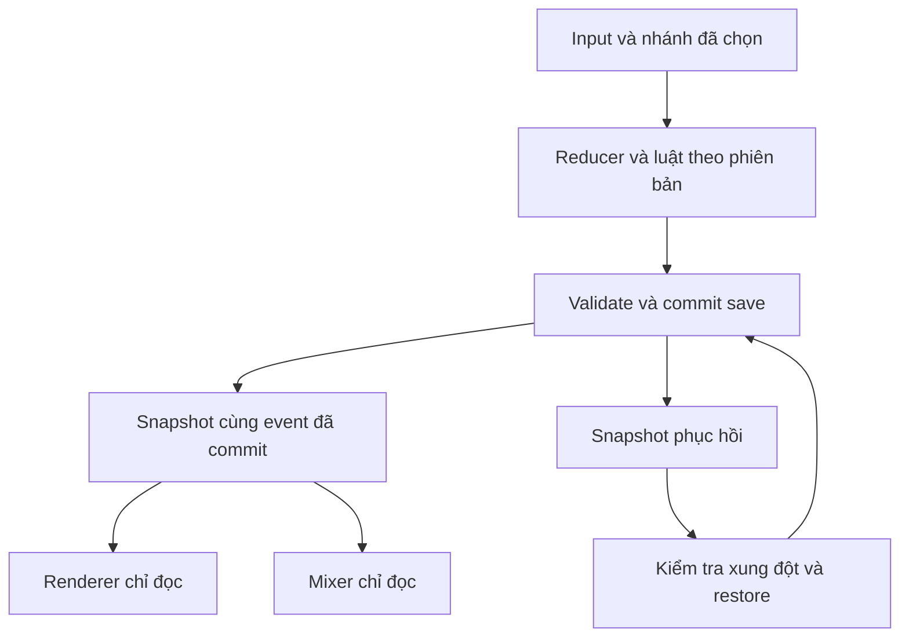

# Kế hoạch kỹ thuật 4.0

**Trạng thái: thiết kế, chưa triển khai.** Đọc cùng [PROPOSAL.md](PROPOSAL.md), [ROADMAP.md](ROADMAP.md) và [AUDIT.json](AUDIT.json). Baseline là `master@79d3aeb`, sản phẩm 3.5.0.

## 1. Chọn renderer dựa trên mẫu có số đo

| Phương án | Lợi ích cho repo này | Chi phí/rủi ro | Quyết định |
| --- | --- | --- | --- |
| Canvas 2D hiện tại | Đã dùng chung sprite/VFX; hoạt động khi không có WebGL; giữ code gameplay | Phải quản lý tầng, cache sàn, pool particle và label trong code | Giữ làm baseline và fallback |
| PixiJS 8/WebGL | Dependency đã có, Rương đã dùng; sprite batching, layer và texture lifecycle thích hợp sân nhiều lớp | Thêm renderer, context loss, shader/texture memory, hitbox phải thống nhất | Làm một adapter/mẫu có feature flag; chỉ thành mặc định khi QA đạt |
| Three.js/full 3D | Camera/rig/ánh sáng linh hoạt | Cần model/rig/material mới, bộ nhớ và thao tác mobile khác; không giải quyết save/gameplay | Ngoài mốc 4.0 |
| Chuyển engine toàn bộ | Có toolchain khác | Viết lại nhiều runtime đang hoạt động, tăng phạm vi hồi quy | Không chọn cho mốc này |

Ưu tiên **WebGL** trong Pixi; không ép WebGPU. Tài liệu Pixi hiện khuyến nghị WebGL cho production và chưa cung cấp Canvas renderer production tương đương renderer 2D đang dùng ở đây. Nếu khởi tạo GPU thất bại/context bị mất, dùng renderer 2D của dự án; không coi `preference: "webgl"` là bảo đảm có fallback Canvas tự động.

React quản lý menu/input/dialog/accessibility. Renderer quản lý scene/animation theo snapshot đọc; không đưa state 60 FPS vào React. Chỉ một scene đang hoạt động, dispose context/ticker/observer khi đổi chế độ. Preload một scene kế tiếp khi rảnh, không khởi tạo hai vòng simulation.

## 2. Simulation, save và trình diễn

Auto chess tiếp tục **20 tick/giây**, nội suy render độc lập. Canvas hiện đã có 60/30/15 FPS và không vẽ khi tab ẩn; đây là chức năng cần giữ, không phải tính năng mới. Render, particle variation, camera shake, nhạc và pose không được gọi RNG chiến đấu hoặc quyết toán thưởng.

TCG lưu trạng thái cuối hành động trước playback như hiện tại. Nêm vị chọn nhánh trong UI rồi gửi một command hoàn chỉnh; preview chạy trên bản sao và không commit RNG. Nếu thao tác đang chờ xác nhận thì reload bỏ selection, không tạo nửa phép đã tiêu năng lượng. Ủ vị là **state gameplay thực**, phải lưu; animation Ủ vị là state tạm, không lưu.

Interface presentation dự kiến gồm `sceneId`, `battleId`, `eventId`, actor/source/target, thời điểm logic và payload đọc. Adapter chuyển `BattleFrame` của TCG và `CombatEvent` của Auto chess sang interface này; giữ hai engine nguyên vẹn. Các effect ID mới cần cap, TTL và cleanup. Không dùng `Math.random()` trong resolver có seed.

Telegraph lấy mục tiêu/vùng đã giải quyết trong engine; không suy từ tên skill. UI recap tích lũy damage/heal/shield thực, không lấy chênh HP có thể lẫn hồi/chắn. Recap chỉ là số liệu phiên, không thay cách tính điểm.

## 3. Tương thích save là điều kiện chặn phát hành

### Các hợp đồng đang có

| Dữ liệu/đường code | Hợp đồng cần giữ |
| --- | --- |
| `src/game/storage.ts` | `foodchest.tcg.v1`, `GameSave.version = 1`; thẻ, deck, tài nguyên, màn, lựa chọn, battle và expedition |
| `src/infrastructure/storage/repository.ts` | `foodchest.user.v1`; hồ sơ Rương, bộ sưu tập, lịch sử, tài nguyên và cấu hình |
| `src/game/autochess/schema.ts` | AutoSave.version 1; rulesVersion 1–5, pool/roster/shop/RNG có kiểm tra liên kết |
| `src/game/autochess/outcomes.ts` | Migration `willpowerVersion` idempotent; phiên đã kết thúc không mở lại |
| `src/game/saveCode.ts`, `transferBundle.ts` | MGC1 nén/không nén; parse trước ghi; backup và rollback khi restore lỗi |
| `src/infrastructure/backup/fullBackup.ts` | ZIP hồ sơ + ảnh; validate profile/TCG trước nhập; ảnh ở IndexedDB |

**Rủi ro thấy trong code:** `loadGame()` trả `newGame()` khi JSON/schema lỗi. Bản load tự nó chưa xóa storage, nhưng hành động ghi tiếp có thể thay dữ liệu cũ bằng save mới. Zod cũng loại field lạ theo schema; thêm field vào type mà quên schema/export sẽ làm mất state sau round-trip. TCG chưa có `rulesVersion` tổng quát như Auto chess.

### Thay đổi trước gameplay mới

1. Tách load thành `empty | ready | recoveryRequired | unsupportedVersion`. Chỉ `empty` tạo hồ sơ mới tự động. Có dữ liệu nhưng không đọc được thì giữ raw, khóa thao tác ghi và cho xuất raw/phục hồi; không đưa hồ sơ mới vào luồng autosave.
2. Trước chuyển đổi, lưu snapshot raw hợp lệ của cả TCG/Rương, kèm version, revision và digest. Migration đọc bản sao → chuẩn hóa → validate → ghi staging → kiểm tra → commit; nếu quota/ghi lỗi, giữ bản chính và state trong bộ nhớ. LocalStorage chỉ atomic theo một key, nên khôi phục nhiều key cần journal/commit marker, không gọi là transaction database.
3. Giữ storage key/prefix MGC1 hiện có. Bổ sung field optional với default xác định trong type, schema, writer, exporter, importer và ZIP. Không thêm/reset `legacyImported`, pity, claimed rewards hoặc các ID hiện có để “làm mới” game.
4. Dùng revision/lease cho writer 4.0, kiểm tra lại raw/revision trước commit. Khi tab khác sửa, dừng ghi và chọn reload/khôi phục; không ghép hai battle/roster tự động. Sidecar journal giữ snapshot 4.0 đã commit để phát hiện/phục hồi khi tab code cũ ghi đè key v1.
5. **Giới hạn thực:** tab đang chạy binary 3.5.0 không hiểu writer guard 4.0. Không thể hứa old-tab có thể tiếp tục ghi an toàn bằng chỉ thay code mới. Luồng cập nhật phải yêu cầu kết thúc/đóng phiên cũ trước migration; QA phải thử old-tab ghi đè và xác nhận journal còn phục hồi được. Nếu chưa xử lý được, chặn migration thay vì đánh cược save.

Snapshot phục hồi không nằm trong asset cache và không bị xóa khi dọn cache. Snapshot trước migration dùng để cứu dữ liệu, không tự quay về nó khi deploy rollback vì sẽ bỏ mất tiến trình chơi sau nâng cấp.

### Luật của trận/phiên đang chơi

| Tình huống | Quy tắc 4.0 |
| --- | --- |
| TCG cũ thiếu rulesVersion | Gán semantic version `350` khi chuẩn hóa, giữ resolver/catalog/recipe 3.5 cho đến khi trận hoặc chuyến kết thúc |
| TCG mới | `rulesVersion = 400`; pin cả định nghĩa thẻ, trigger, boss, reward và AI/coach của trận/chuyến |
| Auto chess rules 1–5 | Giữ nguyên version, seed, rng, pool, shop, roster, augments và các hành vi tương ứng; resolver đọc theo version |
| Auto chess mới | Dùng rules 6 sau khi schema/resolver/economy đã cùng hỗ trợ; augment mới không lọt vào run cũ |
| Migration ý chí | Không chạy lại marker 3.5; 3/3 Survival không bị coi là ít ý chí, 0 ý chí không mở lại phiên |
| Đang ở result/reward | Giữ `settled`, `paidWaves`, `finished`, `claimed` và các receipt; animation không cấp tài nguyên |

Chỉ giữ số rulesVersion mà mọi engine vẫn dùng `CARD_MAP`/`UNIT_MAP` mới là chưa đủ. PR gameplay phải tách lookup theo version cho **mọi đường đọc định nghĩa**: reducer, AI, coach, preview, reward offer và UI giải thích. Đây là dependency chặn thay đổi thẻ/quân cũ.

Ủ vị mới cần ID ổn định, owner, source/target UID, effect, `executeRound`, sequence và trạng thái consumed. Tối đa 2 pending/phe, thứ tự `executeRound → sequence`; resolve một lần ở đầu lượt chủ nhân trước hành động tự chọn. Nguồn/mục tiêu chết, bị gỡ, restore hoặc chủ tướng đã thua phải có luật rõ. Trigger graph có trần/cycle guard; thiếu target không sinh target mới hoặc tự hoàn tiền.

### Rollback và mã chuyển tiến trình

Hỗ trợ **3.5 → 4.0 → 4.0** và mã MGC1/ZIP cũ. Không tuyên bố save có thẻ/augment 4.0 đọc được bằng binary 3.5.0. Khi rollback hình ảnh/âm thanh, giữ schema/resolver 4.0; rollback gameplay ưu tiên bản sửa tiến tới có cùng reader. Nếu cần chạy binary cũ, chỉ dùng bản sao tương thích và giải thích giới hạn, không tự hạ save đang chơi.

Giữ original/8-bit, volume, reducedMotion, lowQuality và rung đã lưu. Tùy chọn lớp ambience mới có default thấp/tắt nếu âm tổng đã tắt. MGC1 đọc nén/không nén và clipboard lỗi đều phải hoạt động; nhớ cấu hình UI không nằm hoàn toàn trong cùng object với battle.

## 4. Ngân sách web và bộ nhớ

### Baseline và phân loại bằng chứng

| Chỉ số | Giá trị | Nguồn/giới hạn |
| --- | ---: | --- |
| Static build | 39,175,032 byte | Hồ sơ build 3.5 trong repo; chưa build lại trong PR tài liệu |
| JS gzip tổng | 508,415 byte | Hồ sơ build 3.5; không phải toàn bộ lượng mạng lúc mở trang |
| Public files | 37,227,673 byte | Đã đo lại trực tiếp checkout trong nghiên cứu này |
| 9 atlas `assets/characters/` | 9,061,632 byte nén, 56,610,576 byte RGBA tính toán | Mỗi atlas 1254×1254; tổng nếu tất cả được decode, không khẳng định luôn resident |
| Battle MP3 | 61.989 s, stereo, 22050 Hz | Đã đọc ffprobe; AudioContext có thể resample |
| Battle buffer ở 48 kHz | ≈23,803,611 byte | `duration × 48000 × 2 × 4`, ước tính PCM float; không phải heap đo trong browser |
| Boss buffer ở 48 kHz | ≈21,085,205 byte | Cùng cách tính, chưa gồm crossfade/node/audio khác |

Texture còn có thể có bản upload GPU, mipmap và overhead. Giới hạn theo số file/buffer không thay cho giới hạn byte. Không tự tăng threshold trong `release-size.mjs` khi thêm asset.

### Mục tiêu nghiệm thu ban đầu

| Chỉ số | Mục tiêu đề xuất | Cách kiểm chứng |
| --- | --- | --- |
| Static output | ≤45,000,000 byte, giữ threshold hiện có | `pnpm build` + `pnpm release:size` |
| JS gzip mọi chunk | ≤650,000 byte | Script release hiện có; Pixi vẫn tải theo route/scene |
| Cold route đầu, âm chưa bật | ≤2 MB transfer compressed | Domain production, cache rỗng, viewport/script/profile ghi rõ; không tính font CDN chưa quan sát |
| Ready tương tác trên mạng thử | ≤3 s ở profile 10 Mbps / RTT 100 ms | Ít nhất 5 lượt cold trên máy mục tiêu; báo median/p95 và số lượt |
| Render normal | p95 frame ≤20 ms trên máy mục tiêu ở refresh 60 Hz | Trận đông quân/boss trong 15 phút; đo frame interval/render cost riêng |
| Preset nhẹ | p95 frame ≤35 ms ở 30 FPS | Cùng seed/trận; không đổi kết quả simulation |
| Input đến xác nhận | p95 ≤100 ms ở prepare/chọn bài | Đo handler/paint và chơi thử cảm giác thao tác |
| Texture/image cache | ≤64 MiB pixel RGBA được budget ở steady state, transient ≤96 MiB khi đổi scene | `width × height × 4`, ref count/LRU + kiểm tra process/GPU khi có profiler; không phải tổng RAM game |
| AudioBuffer resident | ≤48 MiB steady, transient ≤64 MiB trong crossfade | `length × channels × 4` của buffer đang giữ, gồm voice đang phát |

Đây là mục tiêu, chưa đạt bằng PR nghiên cứu. Thiết bị ưu tiên: iPhone 12/iOS 17.7.x Safari như thiết bị người dùng, Android RAM 4 GB/WebView/Chrome cập nhật, desktop Chrome/Firefox, Safari hiện hành. Không áp refresh rate cao vào công thức “60 FPS” để chấm lỗi.

### Phân bổ phần tăng asset

Từ baseline còn **5,824,968 byte** tới threshold static, JS gzip còn **141,585 byte**. Phân bổ dưới đây là **net growth** sau tối ưu/thay asset, không phải tổng dung lượng asset được tạo mới.

| Nhóm | Budget tăng thử nghiệm |
| --- | ---: |
| Clip nhân vật/boss ưu tiên | 2,200,000 byte |
| Sân nhiều lớp | 650,000 byte |
| Atlas VFX | 350,000 byte |
| Ảnh 8 thẻ hỗ trợ | 350,000 byte |
| Nhạc/cue/ambience | 850,000 byte |
| Tổng asset tăng | **4,400,000 byte** |
| Còn lại cho code/CSS/dự phòng | **1,424,968 byte static** |

Không xóa asset còn được manifest hoặc renderer legacy tham chiếu để đạt budget. Chốt 4 nhân vật mẫu và compression ở kích thước hiển thị thật trước khi đặt brief sản xuất toàn bộ.

## 5. Asset, cache và scene lifecycle

Atlas alpha WebP với trim/bounding box/foot anchor, padding chống bleed. Không upscale toàn bộ lên 4K. Một manifest ghi scene, clip frames, pivot, hash, dimensions và version; update asset dùng tên/hash mới để tránh code cũ trỏ hình khác. Giữ mapping visual của ID cũ.

Thay cache `Map<path, Image>` giữ mọi ảnh bằng resource manager có **in-flight dedupe, reference count và LRU theo byte**. Scene giữ lease cho texture đang vẽ; chỉ evict tài nguyên không dùng. DOM image của card/portrait vẫn phải được tính riêng khi profile tổng scene. Hủy fetch/decode callback lỗi thời khi đổi scene.

Canvas: cache hình sàn/gradient tĩnh, pool particle/label, tránh tạo Map/gradient mới cho toàn scene mỗi frame. Pixi: batch atlas, chỉ dùng vài RenderLayer, sort nhóm actor khi vị trí đổi; HP/label ở tầng riêng. Filter chỉ trên vùng nhỏ, preset nhẹ tắt blur/bloom/camera shake/ambience trang trí. Cấu hình giảm chuyển động độc lập chất lượng: tắt chuyển động dư nhưng vẫn giữ đủ icon/telegraph.

Không thêm service worker/PWA cache trong PR renderer. Hiện manifest có nhưng không có cache cập nhật theo version trong scope đã audit. Cài SW riêng cần thiết kế code+asset activation, quota, rollback và bảo vệ localStorage/IndexedDB; `Clear cache` chỉ xóa asset.

## 6. Mixer thích ứng và đồng bộ

Giữ một AudioContext. Thêm buses `music`, `ambience`, `effects`; kiểm tra clipping bằng tổng mixer và nghe thật. Stem chung BPM/length/loop boundary; schedule theo `AudioContext.currentTime`, không theo animation frame hoặc `setInterval` để giữ nhịp khi FPS dao động.

SFX lập lịch từ event mốc hit/cast/result. Cue quan trọng có ưu tiên; thử low preset 24 source và high 48 source, giữ capping/lọc event hiện có; cân nhắc voice stealing ở đòn ưu tiên thay vì bỏ tất cả khi đạt trần. Phân biệt source limit với số cue vì một cue synth có thể tạo nhiều oscillator. Variation sử dụng seed presentation riêng, không gọi `random(run)`.

Mẫu đầu dùng 3 lớp ngắn; cả original/8-bit có manifest BPM, số bar, loopStart/loopEnd và cue markers. Tính memory sau decode ở sampleRate thật trước khi giữ cache. Không giả định MP3 22050 Hz luôn cho AudioBuffer 22050 Hz. Chỉ tải khi âm đã được người chơi mở và scene yêu cầu; abort/stale epoch không được phát nhạc cảnh đã rời.

Chuyển áp lực theo tỷ lệ ý chí và boss/overtime bằng ramp tại đầu ô nhịp; có hysteresis tránh đổi qua lại. ×3 không làm theme/SFX nhanh gấp ba theo simulation tick. Khi tab ẩn: pause game, stop effects, suspend mixer; resume giữ lựa chọn mute và không phát lại event cũ. Context bị ngắt hoặc autoplay bị chặn hiện trạng thái “Chạm để bật âm”.

Mọi audio/asset mới đi qua generator/brief và `rights/ASSET_REGISTER.json` hiện có; cập nhật release records khi có thay đổi runtime asset/dependency. PR nghiên cứu không đổi hồ sơ runtime vì chưa thêm asset phân phối.

## 7. Bộ bằng chứng phải có khi triển khai

Mỗi PR feature lưu commit SHA, lệnh, kết quả, browser/OS/viewport, seed/profile, ảnh hoặc video và giới hạn kiểm chứng trong `dev/docs/`. Browser test phải chạy production build; chỉ test reducer không chứng minh drag/touch/audio hoạt động. Headless benchmark không chứng minh FPS/loa Safari trên điện thoại.

Ma trận save: trước/giữa trận TCG, đầu Ủ vị, prepare/combat/result/reward Auto chess, Survival 3/1/0 ý chí, chiến dịch thua còn ý chí, Daily đã thua, expedition đang chơi, pity 7, receipt đã nhận, deck/foil, MGC1 nén/không nén và ZIP có ảnh. Reload, import lặp, quota fail và old-tab conflict không được đổi tài nguyên hoặc phát thưởng hai lần. Danh sách acceptance theo ticket nằm ở [ROADMAP.md](ROADMAP.md).
