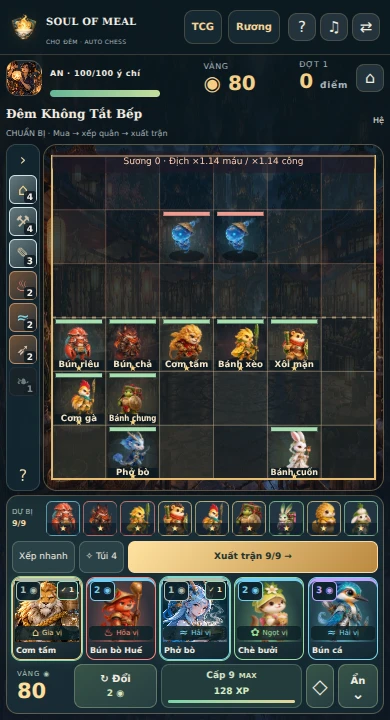
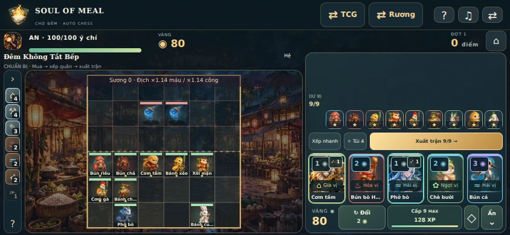
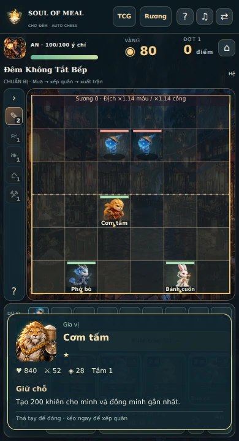
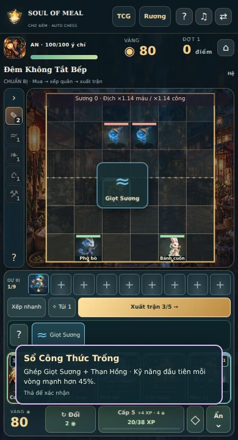
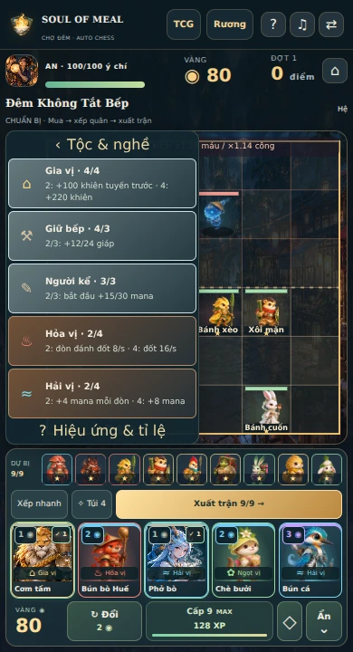
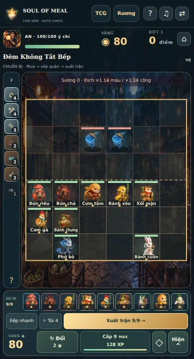
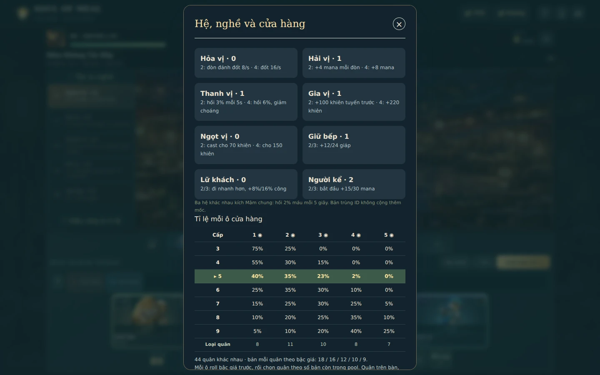

# Soul of Meal 3.4.0 · Chín chỗ giữ bàn

Triển khai yêu cầu trong [file thiết kế đã cung cấp](REQUEST.md). Bản này mở rộng bàn/dự bị và thao tác mobile, giữ nội dung, model và phím tắt của 3.3.1. Không thêm tài khoản hoặc backend.

## Yêu cầu và hành vi đã triển khai

| Yêu cầu | Hành vi trong game |
| --- | --- |
| Up 9, dự bị 9 ô | Cấp bàn từ 3 đến 9; tối đa 9 quân xuất trận và đúng 9 ghế dự bị. Kéo/đổi chỗ được cả ghế cuối. Save, kết quả trận và đội trong lịch sử nhận đủ 9 quân. |
| Mua không tự chọn | Mua ở shop xóa lựa chọn hiện tại. Bấm tiếp lên bàn không tự đổi chỗ quân vừa mua. |
| Ghép khi dự bị 9/9 | Cho mua bản đủ ghép 2 sao, kể cả ghép liên tiếp lên 3 sao. Trường hợp không ghép được vẫn báo đầy; không tự bán quân khác. Hợp nhất giữ UID/vị trí của quân đang trên sân, trả đồ thừa về kho. |
| HUD hệ bên trái | Thu gọn thành biểu tượng/số; bấm để trượt mở tên và hiệu ứng. Một quân cùng hệ chưa đạt mốc hiện tối; hệ mốc 2/4 hiện đồng/bạc, nghề mốc 2/3 cũng dùng hai bậc này. Có style vàng cho bậc thứ ba nếu bổ sung luật sau này; hiện không có buff mốc 6 giả. |
| Màu hệ | Hỏa vị đỏ, Hải vị xanh nước biển, Ngọt vị xanh lá trên shop, dự bị và quầng nền đơn vị trên bàn. Giữ màu riêng của Lâm vị/Gia vị. |
| Giá và vàng trong shop | Năm mức giá có nhãn số và màu bậc, ký hiệu hệ, dấu quân đã có/đủ ghép. Ví vàng nằm sát nút Đổi/Cấp, có thanh XP và mốc hiện tại/kế tiếp. |
| Mobile giữ để xem | Giữ 300 ms trên quân, đối thủ hoặc lá shop hiện thông tin nhanh; thả tự đóng. Giữ shop không mua. Tap quân không chọn/đổi chỗ. |
| Kéo để xếp/bán | Kéo quân giữa bàn/dự bị hoặc đổi chỗ; hai vùng thùng rác hiện ở cạnh màn hình khi kéo. Thả vào đó bán và hoàn vàng/đồ qua reducer. Hủy gesture không thay đổi đội. |
| Kéo trang bị và preview | Mở Túi, kéo đồ lên quân hoặc mảnh khác trong kho. Preview nêu tên/chỉ số di vật trước khi thả; thả sai giữ nguyên đồ. Có thể ghép với mảnh đã đeo, kể cả khi quân đủ hai ô đồ. |
| Mobile gọn và shop toggle | Shop nằm dưới ở màn dọc, bên phải ở màn ngang thấp. Dự bị luôn hiện; Ẩn/Hiện shop nhường thêm chỗ cho bàn. Thanh hệ/túi cuộn nội bộ khi cần. |
| Rung lên sao | Bật trong Âm thanh. Mặc định tắt; 2 sao rung 18 ms, 3 sao theo nhịp 20/40/30 ms, một lần cho mỗi sự kiện. Trình duyệt không có Vibration API hiện giải thích và khóa tùy chọn. |

PC giữ click chọn, kéo thả, chuột phải xem chi tiết và phím W/E/F/D. Enter vẫn dùng được trên quân/ghế. Phím tắt bị khóa khi đang kéo, xem nhanh, mở dialog hoặc đọc story. Mobile chuyển sang kéo thả để tránh swap ngoài ý muốn.

## Cấp bàn và tỉ lệ shop

Các cổng XP 3–7 và tỉ lệ trước đây giữ nguyên; thêm hai cấp cuối. Mỗi vòng nhận 2 XP; mua 4 XP tốn 4 vàng. Xác suất bên dưới là trước khi điều chỉnh theo pool hữu hạn: chỉ bậc đang có tỉ lệ lớn hơn 0 và còn quân mới được chọn.

| Cấp | XP tích lũy | 1 vàng | 2 vàng | 3 vàng | 4 vàng | 5 vàng |
| --- | ---: | ---: | ---: | ---: | ---: | ---: |
| 3 | 0 | 75% | 25% | 0% | 0% | 0% |
| 4 | 8 | 55% | 30% | 15% | 0% | 0% |
| 5 | 20 | 40% | 35% | 23% | 2% | 0% |
| 6 | 38 | 25% | 35% | 30% | 10% | 0% |
| 7 | 62 | 15% | 25% | 30% | 25% | 5% |
| 8 | 92 | 10% | 20% | 25% | 35% | 10% |
| 9 | 128 | 5% | 10% | 20% | 40% | 25% |

Bảng này áp dụng pool mới của luật 3/4; save luật 1/2 giữ bảng cũ ở cấp 3–7 và có hai hàng 8–9 mới. Bảng đầy đủ hiện ngay trong game. Pool vẫn 44 quân của 3.3.1, gồm đủ các bậc 1–5 vàng; không phát sinh atlas mới trong 3.4.

## Mảnh đồ và ghép di vật

Than Hồng +6 công; Giọt Sương +10 mana đầu trận; Sợi Tre +60 máu. Các chỉ số áp dụng khi tạo trận thật. Phiên mới có Than Hồng và Giọt Sương để thử ghép từ vòng đầu. Thưởng di vật có thể cho hai mảnh giống nhau, bên cạnh các di vật hoàn chỉnh. Luật 1/2 giữ các lựa chọn thưởng cũ.

| Hai mảnh | Kết quả |
| --- | --- |
| Than Hồng + Than Hồng | Chuông Chợ |
| Giọt Sương + Giọt Sương | Muôi Đồng |
| Sợi Tre + Sợi Tre | Giỏ Tre |
| Than Hồng + Giọt Sương | Sổ Công Thức Trống |
| Than Hồng + Sợi Tre | Đèn Dầu Giữ Chỗ |
| Giọt Sương + Sợi Tre | Túi Lá Thơm |

Mỗi quân tối đa hai đồ; không giữ hai di vật hoàn chỉnh trùng nhau. Ghép sao kết hợp mảnh đồ, trả đồ trùng/thừa về kho, không làm mất giá trị trang bị. Bán hoặc tháo đồ hoàn về kho. Craft/equip chỉ dùng ở giai đoạn chuẩn bị; không đổi chỉ số giữa trận.

## Save và hiệu ứng

Phiên mới ghi `rulesVersion: 4`. Save cũ giữ seed, pool, quân, vàng, XP, trang bị và phiên bản luật; không bắt chơi lại. Bàn 9 quân/dự bị 9 ô và thao tác mới dùng được trên phiên tiếp tục. Giới hạn schema của đội, kết quả sống sót và lịch sử đã cập nhật; mã chuyển MGC1 giữ định dạng cũ. Schema cũ thiếu `benchSlot` vẫn gán ghế theo thứ tự mà không đổi đội.

VFX lên sao và kích thước +7% mỗi sao từ 3.3.1 được giữ; tọa độ luồng hợp nhất từ dự bị được chuẩn hóa cho cả chín ô, không bay ra ngoài Canvas ở ghế 7–9. Hiệu ứng không trao thưởng hay thay đổi simulation. Reduced motion và preset thấp vẫn hoạt động.

## Kiểm chứng

- `pnpm typecheck` và `pnpm typecheck:dev`: đạt.
- `pnpm test`: 283 test/24 file đạt; có 17 ca mới về bàn/dự bị 9, pool, mua ghép khi đầy, craft/equip, VFX và save MGC1. Thống kê shop 350.000 lượt lấy mẫu trên 7 cấp qua ngưỡng kiểm tra.
- `pnpm validate:catalog`: 123 món, 35 tag, 9 event hợp lệ.
- Browser: các thao tác đi qua UI → reducer → save local → render. [Bằng chứng từng ca](browser-checks.json) bao gồm touch qua CDP, hold/release, kéo xếp/bán/ghép, preview invalid, haptic có/không hỗ trợ và chặn phím tắt trong dialog/story. Không có lỗi JS hoặc runtime asset local thiếu.
- Bản production: craft lưu đủ 18 quân và đồ đã ghép vào localStorage; reload đọc lại cấp 9/bàn/dự bị/trang bị. Kiểm tra mua khi đầy không mất vàng, kéo bán hoàn vàng, mua sau đó không chọn sẵn. Xuất trận/tạm dừng với 9 actor phe mình, khung giao chiến dọc/ngang đều vừa màn.
- Năm khung kiểm tra: 1440×900, 390×720, 844×390, 320×568, 568×320. Bàn 9 quân và 9 dự bị nằm trong viewport, các nút không đè nhau; không phải cuộn cả trang. Ẩn shop trên 390×720 tăng chiều cao bàn từ 345 lên 432 px.
- [Benchmark 18 phiên](balance-results.json): ba chiến thuật/ba seed cho campaign và survival. Campaign thắng 7/9, cả ba chiến thuật đều có phiên thắng; survival kết thúc ở đợt 7–13. Đây là smoke test bot, chưa phải số liệu cân bằng người chơi. Bot đã cải thiện xếp chín quân nên không so trực tiếp tỉ lệ thắng với benchmark cũ. Mức thử thách +30% của bản trước vẫn giữ.
- `pnpm release:verify`, build và kiểm tra dung lượng: đạt. Web 38.007.076 byte (38,01 MB), tổng JS gzip 499.816 byte, 296 file; không có dev/archive/source map lọt vào dist. Thấp hơn ngân sách dự án 45 MB / 650 KB tổng JS gzip. Asset runtime vẫn 245 file.

Giới hạn kiểm chứng: Chromium desktop và touch giả lập; chưa thử Safari/iPhone hay Android thật. Haptic đã kiểm tra lời gọi và pattern bằng stub API, không đo rung trên thiết bị thật. Safari iOS thường không cung cấp Web Vibration API; rung native nằm trong kế hoạch mobile. Font bên ngoài bị chặn trong harness, không nằm trong kiểm tra asset local. Game chạy local, không có backend mới để kiểm tra.

## Ảnh bản cập nhật

| Mobile dọc | Mobile ngang |
| --- | --- |
|  |  |

| Giữ để xem | Preview ghép trên quân |
| --- | --- |
|  |  |

