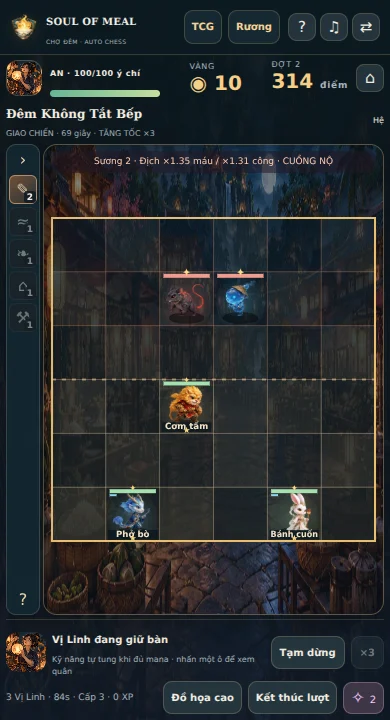
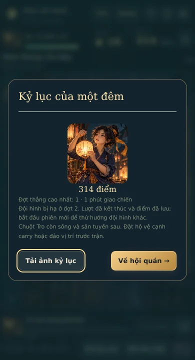

# Soul of Meal 3.4.1 · Trận kéo dài và chốt điểm khi thua

Yêu cầu: qua 55 giây không tự thua; tự chuyển tốc độ ×3 để phân thắng thua nhanh. Khi đội bị hạ, phiên kết thúc và điểm được ghi nhận, không tiếp tục gặp đợt quái mạnh hơn.

## Hành vi mới

| Trạng thái | Kết quả |
| --- | --- |
| Hai đội còn quân ở giây 55 | Trận tiếp tục. Clock tự chuyển ×3 so với tốc độ bình thường, kể cả trước đó chọn ×2; không thành ×6. |
| Qua giây 55 | HUD ghi TĂNG TỐC ×3, nút tốc độ cố định ×3. Pause, thoại và ẩn tab vẫn dừng simulation. |
| Hạ hết phe địch, dù đã qua 55 giây | Thắng, ăn mừng, nhận thưởng một lần; nút qua đợt tiếp theo hoạt động. |
| Đội mình bị hạ | Chuyển `lost` và lưu điểm/đội/seed/thời gian ngay, bất kể còn ý chí. Không tăng wave, không mở màn chiến dịch hoặc cho thưởng thắng. |
| Hai đội cùng bị hạ | Tính thua, không trao chiến thắng. |
| Đã kết thúc | Không thể next/battle/checkpoint lại để tiếp tục hoặc nhận điểm trùng. UI cho về hội quán và bắt đầu phiên mới. |

Áp dụng Campaign, Survival và Daily. Điểm ghi nhận là điểm tích lũy của các đợt đã thắng; thua không xóa điểm hoặc cộng điểm thắng giả. Giữ cách xếp hạng hiện có, bao gồm Daily giữ thành tích tốt nhất theo ngày. Tiến độ chương đã mở, bộ sưu tập, pool, trang bị và các chế độ khác giữ nguyên.

Bản cũ có hai lỗi/khác biệt: engine lẫn reducer đều xử thua ở tick 1100; schema không cho lưu tick/thời gian vượt 55 giây. Survival/Daily tăng wave sau cả kết quả thua, còn Campaign cho thử lại cùng phiên. Bản mới bỏ timeout ở cả engine/reducer/schema và chỉ cho tăng wave sau kết quả thắng.

Clock giữ simulation 20 tick/giây, sau mốc 55 dùng 3× thời gian thực (mục tiêu 60 tick/giây). Renderer đọc cùng clock nên chuyển động/đòn đánh cũng nhanh theo. Không nhân chỉ số tấn công/kỹ năng ×3. Cuồng nộ/sức ép theo thời gian có từ trước vẫn áp dụng. Checkpoint được ghi ngay lúc vào overtime để HUD hiện tốc độ mới kịp thời.

## Tương thích save

- Save đang giao chiến dài hơn 55 giây đọc, pause, resume và chuyển bằng MGC1 được. Không đổi định dạng MGC1 hoặc pool/rulesVersion.
- Save cũ còn ở màn kết quả thua thật: chuyển sang kết thúc, ghi điểm một lần, không trả thưởng lại và không tăng wave.
- Save cũ còn ở màn kết quả timeout 55 giây, hai đội vẫn sống: bỏ kết quả timeout, hoàn lại ý chí và gỡ khoản vàng/XP vừa trả theo luật cũ, giữ cùng snapshot/seed/quân/pool/đợt. Trận mở ở trạng thái pause để người chơi chủ động tiếp tục ở ×3.
- Phiên đã kết thúc hoặc đã qua màn kết quả đến giai đoạn chuẩn bị không bị sửa lại lịch sử. Chỉ xử lý kết quả cũ chưa xác nhận; cập nhật không đảo ngược các vòng người chơi đã thực hiện.

## Kiểm chứng

- Typecheck app/dev, **293 test/25 file**, catalog, release records, build và size check: đạt. Có 10 ca mới về overtime, thắng muộn, thua ở cả ba mode, chống chốt trùng, import/export và kết quả cũ.
- [11 ca browser production](browser-checks.json): nút ×2 chuyển ×3, đo clock thực, pause/reload, resume save overtime, khung dọc/ngang, sửa save timeout cũ, đòn đánh thật kết thúc ở cả ba mode, bảng thành tích/reload không trùng, thắng muộn vẫn qua đợt. Không có lỗi JS hoặc thiếu runtime asset local.
- [18 phiên mô phỏng](balance-results.json): tất cả kết thúc và có bản ghi. Bot Campaign thắng đến đợt 5–11 nhưng không hoàn thành 12 đợt (0/9 phiên); Survival thắng đến đợt 6–10. Đây là bot smoke test, không phải tỉ lệ thắng người chơi. Quy tắc thua kết thúc phiên khiến Campaign nghiêm hơn vì không còn thử lại trong cùng lượt; không suy ra cân bằng đã tối ưu từ kết quả này. Benchmark đã bỏ điều kiện cũ dựa trên việc retry sau thua, thay bằng kiểm tra kết thúc/ghi điểm.
- Web **38.008.396 byte**, tổng JS gzip **500.255 byte**, 296 file, không có dev/archive/map lọt vào dist. ZIP source và web tạo thành công. Không thêm asset runtime mới.

Kiểm tra browser dùng Chromium và bản Vite production local; chưa thử iPhone/Safari hoặc Android thật. Font bên ngoài bị chặn trong harness. Game không dùng backend mới. Hồ sơ và ảnh kiểm chứng nằm trong `dev/`, không phân phối trong app.

