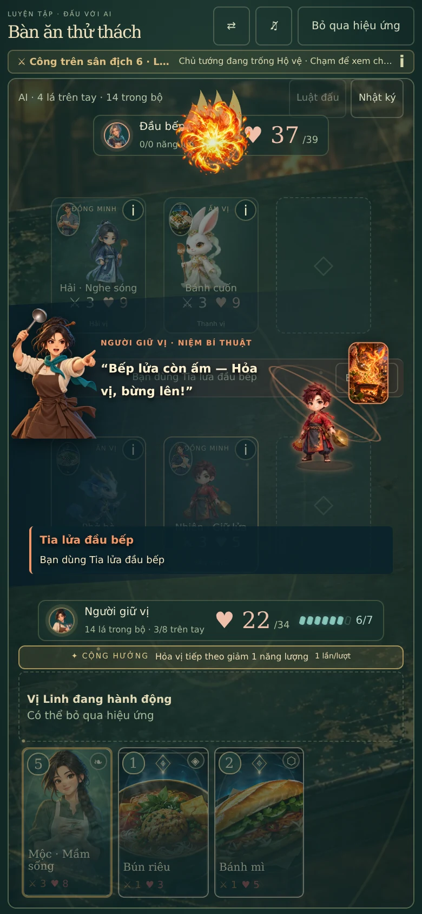
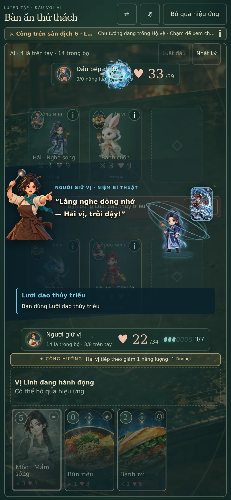
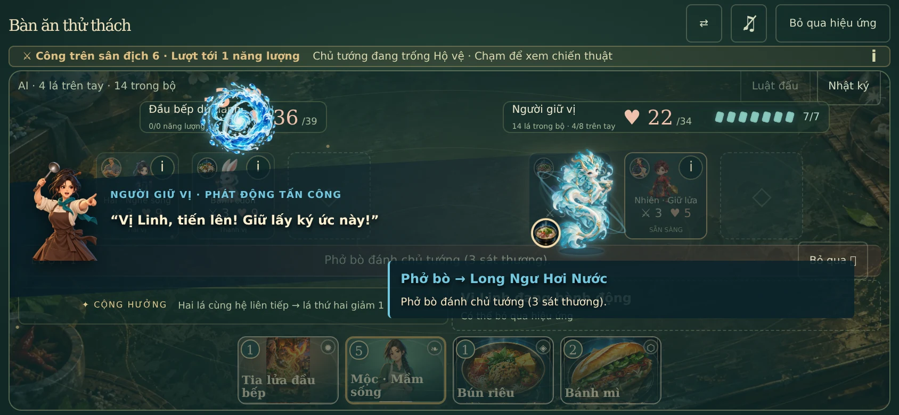
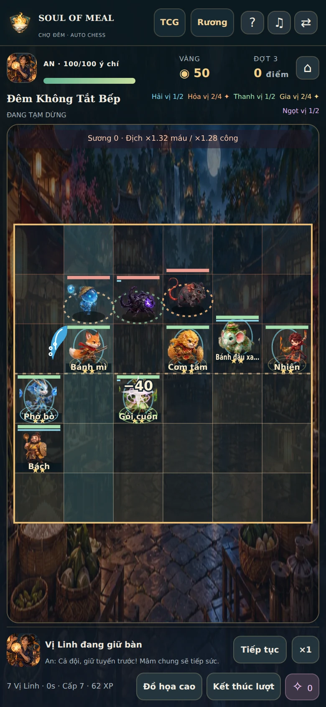

# Kiểm chứng Soul of Meal 3.3

Ngày 09/10/2026. Bản này thêm renderer VFX chung cho TCG/Auto chess, đồng bộ mốc tiếp xúc TCG, chính sách thương mại/quyền riêng tư và cấu trúc đóng gói sản phẩm.

## Kết quả

| Kiểm tra | Kết quả |
| --- | --- |
| TypeScript runtime | `pnpm typecheck` đạt |
| TypeScript tools/tests | `pnpm typecheck:dev` đạt |
| Test domain/game/storage/audio/presentation | **244/244**, 22 file, `pnpm test` |
| Catalog | 123 món, 35 tag, 9 sự kiện; `pnpm validate:catalog` đạt |
| Bản production | `pnpm build` đạt; 291 file, 32,975,834 byte |
| Hồ sơ nguồn/giấy phép | `pnpm release:verify` đạt; 240 asset ảnh/nhạc và 23 package trong graph dependency được ghi nhận |
| Artifact leak | `pnpm release:size`: 0 test/prompt/archive/audio cũ/sourcemap trong dist |
| ZIP nguồn bỏ `dev/` | 420 file; typecheck/build đạt; source, public asset, CSS và tổng byte output khớp bản full repo |
| Dev tools | Dev panel phân giải từ `dev/`; probe GET endpoint writer trả 405, không ghi tệp. Cấu hình production không đăng ký writer |
| Browser | 7 nhóm kiểm chứng đạt, 11 phép đo geometry, không JavaScript error hoặc HTTP asset missing |

23 package là graph khai báo runtime cùng phụ thuộc, không phải khẳng định tất cả được bundler đưa vào mọi route. Fingerprint/notice hỗ trợ review quyền; không phải chứng nhận mọi tài nguyên đã được xác minh pháp lý.

## VFX và gameplay thực

- Niệm phép theo đủ năm hệ: Canvas vẽ đường cong, ribbon, hình đầu đạn/leaf/crystal/star và sóng va chạm thực. Không còn DOM dot/beam cũ trong TCG.
- Trên fixture hợp lệ, thi triển tiêu hao đúng một thẻ và đúng năng lượng. Flight xảy ra trước impact; backing Canvas khớp DPR 2.
- Resize giữa một đòn giữ cùng Canvas/timeline; sát thương fixture đối với chủ tướng là 39 → 36. Reduced motion không tạo Canvas và cho cùng kết quả.
- Snapshot Auto chess được tạo bằng `createCombat`/`advanceCombat`, tạm dừng ở lúc quân niệm phép. Renderer có channel/đạn cong nhưng không tiến tick/HP khi pause.
- Trận Auto thực chạy tiến tick, phát sự kiện hit/shield/heal và dùng các alpha texture nguyên bản của dự án. Hồi phục/khiên đọc người nhận từ event; không bắn nhầm vào target địch của windup hỗ trợ.
- Test mới kiểm tra trajectory kết thúc đúng target (kể cả đảo chiều/cùng ô), phân loại skill, âm thanh/pose chết tại contact và snapshot không bị presentation sửa. Test âm thanh Rương kiểm tra không preload/download và dừng được timer/voice.
- Giữ nguyên cân bằng +30%, shop/pool, ghép sao, XP/drag và save schema từ 3.2.2; đây không phải một đợt tăng độ khó thứ hai.

## Màn hình và chính sách

TCG/Auto battle được đo ở **320×568, 390×844, 667×375, 844×390, 1440×900**. Board, grid, arena, hand/turn bar và controls nằm trong viewport; trang không scroll ở những fixture đó. Không suy rộng thành mọi tổ hợp browser/điện thoại đều đã được thử.

Ba route `/legal/terms`, `/legal/privacy`, `/legal/rights` có nội dung, navigation và link hỗ trợ; các bản `.html` trả HTML tiếng Việt độc lập không chứa JavaScript. Notices công khai chứa thông báo GSAP và font OFL. Từ cài đặt Rương mở được chính sách; bản production không hiện bảng nội dung DEV. TCG và hướng dẫn Auto cũng có liên kết cùng chính sách.

Sau kiểm chứng browser, chỉ làm rõ một đoạn văn quyền sử dụng về bằng chứng còn thiếu; tạo lại HTML/notices, typecheck/build/release verification và source-only build đều đạt. Không thay đổi logic game/VFX sau phép đo browser.

## Dung lượng và artifact

- Dist: **32.98 MB / 31.45 MiB**, nhỏ hơn baseline 3.2.2 khoảng 944 KB.
- JS tổng gzip **487,921 byte**; CSS gzip **69,804 byte**. Đây là tổng chunk, không phải entry request.
- ZIP nguồn sản phẩm khoảng 31.49 MB; ZIP web khoảng 31.58 MB. `dev/artifacts/` được Git ignore; tạo lại bằng `pnpm release:source` / `pnpm release:web`.
- Có bản build thử từ source ZIP không chứa `dev/`. Hash/tên JS chunk có thể khác theo đường dẫn checkout/module IDs; không tuyên bố toàn bộ output bit-for-bit giống nhau.

[Raw browser data](browser-results.json), [build size](build-size.json), [source-only build](source-only-build.json), [development config](development-config.json).

## Ảnh kiểm chứng

Ảnh TCG lấy trong lúc thi triển thực; Auto là snapshot cast có pause để nhìn rõ projectile, đã ẩn lớp pause trong ảnh. Ảnh không phải đo FPS.

## Giới hạn và bước native

Chromium headless, mobile viewport emulation, DPR 2; local HTTP không nén, font ngoài bị chặn để phép đo tái lập. Warm navigation không giảm transfer trên server này; không dùng số local để hứa hiệu quả cache CDN Vercel. Không đo FPS/memory trên iPhone thật hoặc WKWebView/Android native.

Chưa tạo native project, IPA/AAB, ký app, TestFlight/Play closed test hoặc nộp cửa hàng. [Kế hoạch mobile](MOBILE_PLAN.md) mô tả lifecycle/audio/storage/offline và ma trận thiết bị cần thực hiện. [Hồ sơ quyền](../../../rights/COMMERCIAL_RELEASE.md) nêu thông tin nhà phát hành và bằng chứng đầu vào cần chủ sở hữu hoàn thiện trước bán/release thương mại.
