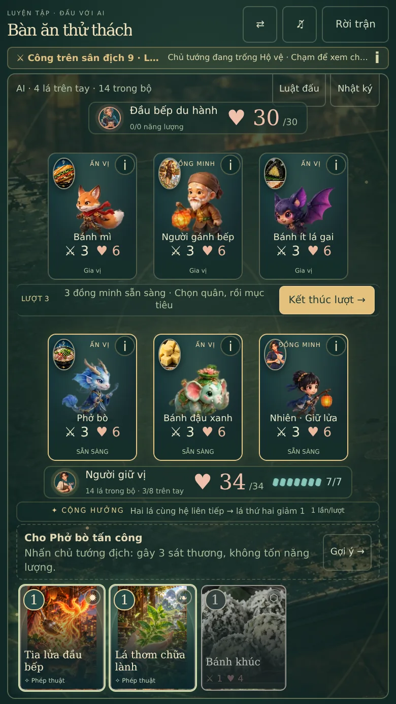
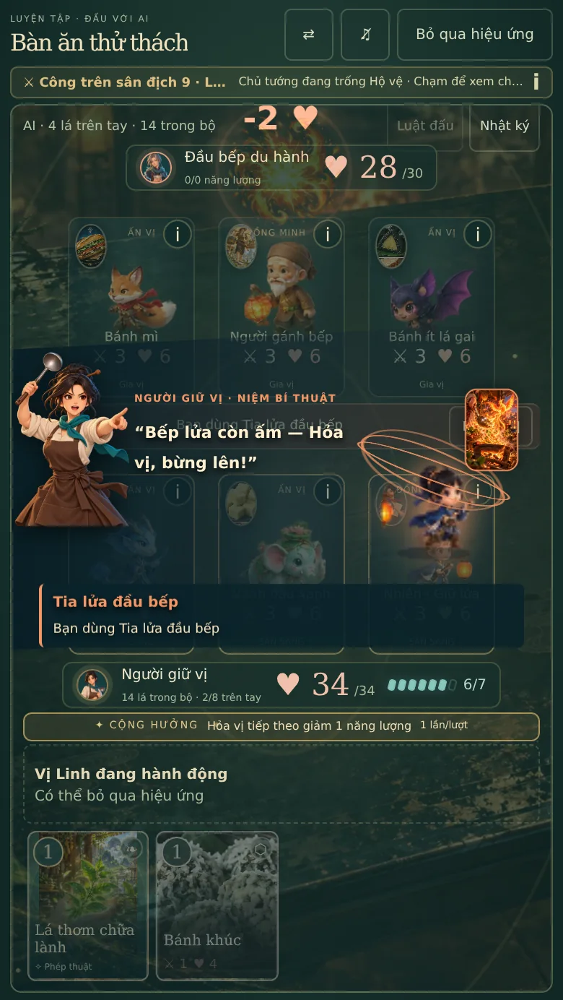
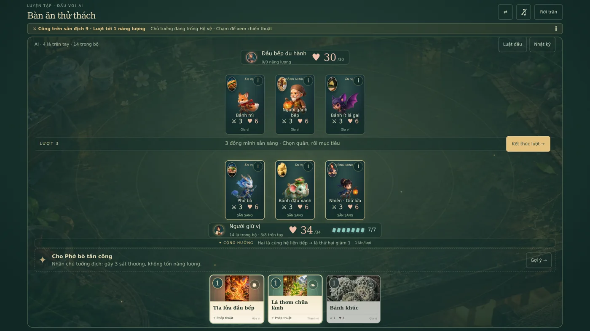
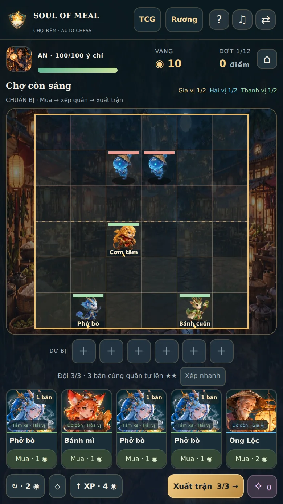

# TCG dùng chuyển động Auto chess · 3.2.1

Trong TCG trước đây, Vị Linh là tranh đứng yên với hiệu ứng phóng to/lao tới bằng CSS. Bản này dùng cùng các pose trong atlas của Auto chess cho quân trên sân, Vị Linh tấn công và nhân vật trong cảnh tung phép. Luật TCG vẫn theo lượt, tối đa ba quân mỗi phe.

## Hành vi

| Diễn biến | Hiển thị mới |
| --- | --- |
| Đứng trên sân | Thở nhẹ, giữ chân tại điểm neo, quay theo phe. |
| Triệu hồi | Hiện dần, vào tư thế xuất hiện/niệm phép rồi đứng chờ. |
| Tấn công | Đổi pose lấy đà/ra đòn; Vị Linh có chuyển động trong lúc lao tới mục tiêu. |
| Dùng bí thuật | Nhân vật cùng hệ niệm phép, kèm tranh lá phép thật và lời chỉ huy. |
| Chịu đòn | Đổi pose trúng đòn ở thời điểm va chạm, kể cả khi khiên hấp thụ hết sát thương. |
| Bị hạ | Giữ tư thế trước va chạm, ngã rồi tan dần; hai quân cùng ngã trong một đòn được trình diễn riêng. |
| Thắng | Các đồng minh còn sống chuyển sang tư thế ăn mừng. |

Các món có model Auto chess dùng đúng model đó. Món khác dùng Vị Linh cùng hệ; người giữ vị/lữ hành dùng model người đã có hoặc model cùng vai trò/hệ. Ảnh món hoặc chân dung gốc vẫn ở góc lá quân, cùng tên, công, máu và khiên. Không tạo model riêng mới cho tất cả các thẻ trong bản này.

Đây là sprite anime 2.5D từ asset hiện có. Hai atlas `movement.webp` và `new-movement.webp` được dùng chung, không thêm ảnh raster hoặc thư viện runtime. Auto chess tiếp tục dùng cả atlas quái `monsters.webp`.

## Luồng dữ liệu và tối ưu

UI chọn bài/mục tiêu → `actBattle` tính kết quả → Zustand lưu trận → `BattleFrame` trình diễn → `tcgUnitMotion` chọn hoạt ảnh → `CharacterSprite` vẽ Canvas. Hoạt ảnh không gọi reducer hoặc cấp lại sát thương/phần thưởng. Nút bỏ qua vẫn kết thúc trình diễn ngay.

- Dùng các vùng nguồn và điểm neo chân đã đo của 3.2. Fit theo toàn bộ pose, kể cả tư thế đánh rộng, để giữ đầu/chân trong ô.
- Một đồng hồ 30fps cho các sprite TCG, cập nhật Canvas trực tiếp qua refs; không cập nhật React state mỗi khung hình.
- Cache ảnh chung giữa hai chế độ; chuẩn bị hai atlas khi vào trận TCG. Đổi chế độ trong cùng ứng dụng không yêu cầu tải lại hai atlas đã có.
- Ngừng đồng hồ khi tab bị ẩn; gỡ callbacks, event listeners và ResizeObserver khi unmount. Đọc cutscene/mở đầu trận dùng pose đứng yên.
- Giảm chuyển động từ cài đặt hoặc hệ điều hành dùng model tĩnh. Có ảnh dự phòng trong khi atlas chưa tải được.
- Không đổi IDs thẻ/quân, schema lưu, MGC1, tài nguyên, giá gói, nhạc hoặc namespace.

## Kiểm chứng ngày 09-10-2026

- **232/232 kiểm thử**, 19 file; typecheck, build và validate catalog đạt.
- Sáu kiểm thử mới: mọi lá quân có row/pose hợp lệ; map món/NPC; triệu hồi chỉ quân mới; hai quân cùng chết giữ nhịp tấn công trước khi ngã; hit vào khiên; phép hạ quân và tính bất biến của các snapshot.
- **14 nhóm kiểm tra browser đạt**, không có lỗi JavaScript. [Dữ liệu kiểm chứng](browser-results.json).
- Các kích thước **320×568, 375×667, 390×692, 430×760, 1366×768, 667×375, 844×390**: Canvas nằm trong ô; điều khiển trong viewport; không tràn ngang hoặc cuộn toàn trang.
- Pixel Canvas được vẽ thật; thở thay đổi pixel. Tấn công đổi pose `0/5/6/7`, quân nhận đòn đổi `0/11`, không chỉ đổi tên CSS/data attributes.
- Đã chạy triệu hồi món mới, lao tới/tấn công, bí thuật có người niệm, hạ gục đồng thời, chuỗi AI, ăn mừng, bỏ qua và hai cách giảm chuyển động.
- Đổi TCG → Auto chess trong cùng SPA không yêu cầu lại hai atlas, Auto chess vẫn vẽ bàn bình thường. Tài nguyên kiểm tra 913 xu và 731 khóa được giữ nguyên.

Kiểm tra giao diện bằng Chromium headless mobile/touch, DPR 2; chưa thử Safari trên iPhone thật. Các fixture dựng trước trận để kiểm tra hình ảnh/hành động, không đo tỷ lệ thắng hoặc hiệu năng trên mọi thiết bị.

Checklist React đã được áp dụng: component vẽ tách riêng, refs cho frame, dependencies theo giá trị, cleanup, cache asset, Canvas trang trí có `aria-hidden`, nút quân giữ nhãn và thao tác bàn phím hiện có.

## Ảnh

## Phạm vi bản lưu trên Git

Bản này kế thừa commit 3.2 `4257f7db6091da9989c3abe03706634df98e1567`, gồm sửa bộ bài cuộn, crop thẻ, model và nhảy ăn mừng Auto chess. Bản thử nghiệm 3.3 chưa push bị mất khi môi trường khôi phục snapshot; các nâng cấp chiến thuật/cốt truyện 3.3 không nằm trong commit 3.2.1 này và cần tái dựng riêng.
