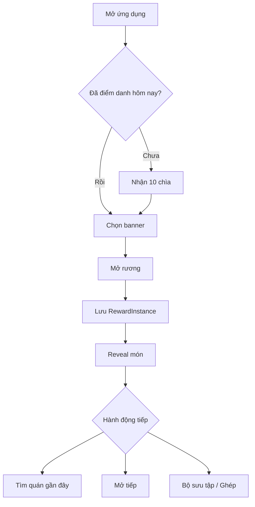
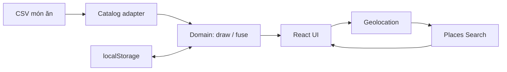

# RƯƠNG VỊ GIÁC (FoodChest)

## Product specification & implementation plan — v1.0

> Tagline đề xuất: **Mở rương, chốt món.**
>
> Loại sản phẩm: web app mobile-first, không đăng nhập ở MVP, dữ liệu cá nhân lưu tại trình duyệt.

---

## 1. Tóm tắt sản phẩm

Rương Vị Giác là web app giúp người dùng quyết định **ăn gì vào sáng, trưa hoặc tối** bằng trải nghiệm mở rương mang cảm giác hồi hộp như một hệ thống loot/reveal trong game.

Người dùng:

1. Điểm danh mỗi ngày để nhận 10 chìa khóa.
2. Chọn banner Bữa sáng, Bữa trưa hoặc Bữa tối.
3. Dùng 1 chìa khóa để mở rương và nhận ngẫu nhiên một món ăn.
4. Món nhận được tự động lưu vào Bộ sưu tập phần thưởng.
5. Chọn đúng 3 phần thưởng nhận trong cùng một ngày để ghép thành một món mới.
6. Bấm vào món ăn để tìm các quán phù hợp gần vị trí hiện tại, ưu tiên nơi có điểm đánh giá tốt và đủ nhiều lượt đánh giá.
7. Dùng Vòng quay tự do để chọn ngẫu nhiên từ danh sách do người dùng nhập; chức năng này không tiêu hao chìa khóa.

Tên sản phẩm có thể đổi. Một số lựa chọn khác: **Bếp Báu**, **Ăn Gì Đây?**, **MealChest**, **Rương Món Ngon**.

---

## 2. Các quyết định mặc định để có thể code ngay

Những yêu cầu chưa được mô tả chi tiết được chốt mặc định như sau:

| Nội dung | Quyết định v1 |
| --- | --- |
| Chìa khóa điểm danh | +10 chìa/ngày |
| Giá mở rương | 1 chìa/lần |
| Số lần điểm danh | 1 lần/ngày theo múi giờ cấu hình, mặc định `Asia/Ho_Chi_Minh` |
| Banner | 3 banner cố định: sáng, trưa, tối |
| Banner mặc định | Tự chọn theo giờ nhưng người dùng luôn có thể đổi |
| Kết quả trùng | Cho phép trùng; mỗi lần nhận là một `RewardInstance` riêng |
| Lưu kết quả | Lưu ngay trước khi chạy animation để reload giữa chừng không mất quà |
| Ghép món | Chọn đúng 3 phần thưởng còn khả dụng, có cùng `acquiredDate` |
| Đầu vào sau khi ghép | Bị đánh dấu `consumed`, không xóa khỏi lịch sử |
| Kết quả ghép | Người dùng chọn banner đích; món mới không trùng 3 món đầu vào nếu pool cho phép |
| Phí ghép | 0 chìa ở v1 |
| Vị trí | Chỉ xin quyền sau khi người dùng bấm “Tìm quán gần đây” |
| Lưu vị trí | Không lưu tọa độ chính xác vào localStorage |
| Vòng quay tự do | Không liên quan chìa khóa, không đưa kết quả vào kho món |
| Danh tính người dùng | Một browser profile trên một thiết bị được coi là một user |
| Nguồn món | CSV công khai + cache dữ liệu hợp lệ gần nhất + seed data tích hợp sẵn |

Tất cả giá trị như `dailyKeys`, `chestCost`, bán kính tìm kiếm và ngưỡng đánh giá phải đặt trong cấu hình, không hard-code rải rác.

---

## 3. Phạm vi

### 3.1. MVP bắt buộc

- Trang chủ với số chìa khóa, nút điểm danh và 3 banner món ăn.
- Mở rương, animation nhiều trạng thái và reveal món.
- Bộ sưu tập/lịch sử phần thưởng.
- Ghép 3 món trong cùng ngày thành 1 món mới.
- Popup chi tiết món và danh sách quán gần đây.
- Xin quyền định vị có chủ đích; hỗ trợ nhập vị trí thủ công khi bị từ chối.
- Đọc catalog món từ CSV online; fallback khi mạng hoặc dữ liệu lỗi.
- Trang cấu hình nguồn dữ liệu dành cho dev/admin cục bộ.
- Vòng quay ngẫu nhiên từ danh sách người dùng nhập.
- Lưu toàn bộ tiến trình cá nhân trong localStorage.
- Responsive mobile/desktop; hoạt động tốt trên Safari iOS và Chrome.

### 3.2. Nên có ngay sau MVP

- Xuất/nhập file backup JSON vì localStorage có thể bị người dùng xóa.
- Yêu thích món, ẩn món không thích, lọc ăn chay/cay/ngân sách.
- PWA: cài lên màn hình chính, dùng phần lõi khi offline.
- Nhiệm vụ tuần, streak điểm danh, độ hiếm món.
- Preset vòng quay và lịch sử kết quả.
- Tùy chọn âm thanh, rung nhẹ và giảm chuyển động.

### 3.3. Không làm trong MVP

- Đăng ký/đăng nhập.
- Đồng bộ giữa nhiều thiết bị.
- Chống gian lận chắc chắn cho điểm danh/chìa khóa.
- Thanh toán, mua chìa khóa hoặc giao dịch thật.
- Admin toàn hệ thống có phân quyền thực sự.
- Lưu dài hạn dữ liệu địa điểm trả về từ Google Places.

---

## 4. Điểm cần hiểu đúng trước khi triển khai

### 4.1. localStorage không tương đương tài khoản người dùng

Ở MVP, dữ liệu gắn với **origin + browser profile + thiết bị**, không gắn với một con người. Người dùng đổi máy, đổi trình duyệt, dùng ẩn danh, xóa dữ liệu trang hoặc đổi domain sẽ không thấy dữ liệu cũ. `localStorage` tồn tại qua các phiên duyệt bình thường nhưng có thể bị chặn hoặc bị xóa; dữ liệu trong phiên duyệt riêng tư bị xóa khi đóng phiên. Tham khảo [MDN localStorage](https://developer.mozilla.org/en-US/docs/Web/API/Window/localStorage).

Hệ quả:

- MVP phù hợp cho app cá nhân, demo hoặc app giải trí không có giá trị kinh tế.
- Cần nút Backup/Restore nếu lịch sử có ý nghĩa với người dùng.
- Nếu có bảng xếp hạng, mua chìa, referral hoặc quà thật thì phải chuyển số dư và nghiệp vụ sang backend.

### 4.2. “Admin” trong frontend-only không thể bảo mật

Một route `/admin` dùng PIN lưu ở frontend chỉ có tác dụng tránh người dùng phổ thông bấm nhầm; nó không phải bảo mật. Có hai cách hợp lý:

- **MVP:** URL catalog toàn cục lấy từ biến môi trường khi deploy; trang cấu hình chỉ tạo override trên chính trình duyệt hiện tại để test.
- **Production:** lưu cấu hình trong backend/remote config và có authentication thật.

### 4.3. Không sao chép tài sản League of Legends

Chỉ tham khảo **nhịp trải nghiệm**: đặt chìa khóa → rương tích năng lượng → rung/phát sáng → bùng sáng → hiện thẻ phần thưởng. Không dùng logo, tên Hextech, nhân vật, icon, âm thanh, ảnh chụp hoặc thiết kế rương của Riot. Nên tạo bộ nhận diện riêng: rương hình hộp đồ ăn/cloche, rune là dao-nĩa, họa tiết ngũ cốc/gia vị.

---

## 5. Đối tượng và user stories

### Persona chính

Người dùng 18–40 tuổi, thường mất thời gian chọn món, muốn một quyết định nhanh nhưng vui, chủ yếu sử dụng điện thoại.

### User stories cốt lõi

- Là người dùng, tôi muốn điểm danh mỗi ngày để có lượt mở rương.
- Tôi muốn chọn đúng bữa ăn để kết quả phù hợp thời điểm.
- Tôi muốn kết quả được lưu tự động để không mất khi đóng trang.
- Tôi muốn tái chế 3 món không thích thành một lựa chọn mới.
- Tôi muốn thấy quán gần mình có đánh giá tốt để đi ăn ngay.
- Tôi muốn vẫn tìm được quán khi không cấp GPS bằng cách nhập khu vực.
- Tôi muốn tự nhập danh sách bất kỳ và quay ngẫu nhiên một kết quả.
- Là người quản trị dữ liệu, tôi muốn cập nhật Google Sheet mà không phải sửa code.

---

## 6. Kiến trúc thông tin và màn hình

### 6.1. Điều hướng chính

1. **Rương** — trang chủ, điểm danh, banner và mở rương.
2. **Bộ sưu tập** — các món đã nhận, lọc và ghép món.
3. **Vòng quay** — danh sách tự nhập và random.
4. **Cài đặt** — âm thanh, khoảng cách, backup/restore, nguồn dữ liệu cục bộ.

Trên mobile dùng bottom navigation 4 tab. Desktop có thể dùng sidebar mỏng hoặc top navigation.

### 6.2. Trang Rương

Thứ tự ưu tiên trên mobile:

1. Header: logo, số chìa khóa, streak tùy chọn.
2. Thẻ điểm danh: trạng thái có thể nhận/đã nhận.
3. Ba tab/banner: Bữa sáng, Bữa trưa, Bữa tối.
4. Sân khấu rương ở giữa.
5. CTA chính: `Mở rương · 1 chìa`.
6. Link phụ: `Xem tỉ lệ` nếu sau này có độ hiếm.

### 6.3. Reveal modal

- Hiển thị ảnh món, tên, tag bữa ăn, mô tả ngắn.
- Nút chính: `Tìm quán gần đây`.
- Nút phụ: `Mở tiếp` và `Về bộ sưu tập`.
- Có nút `Bỏ qua animation` trong lúc animation chạy.
- Focus trap, đóng bằng Escape, trả focus về nút đã mở modal.

### 6.4. Bộ sưu tập

- Mặc định nhóm theo ngày mới nhất.
- Bộ lọc: tất cả/sáng/trưa/tối, còn dùng/đã ghép, yêu thích.
- Mỗi card hiển thị tên, meal slot, ngày nhận và nguồn `Rương`/`Ghép`.
- Click card mở chi tiết và tìm quán.
- Chế độ `Ghép món`: card đủ điều kiện có checkbox; card khác ngày bị khóa sau khi chọn món đầu tiên.

### 6.5. Màn hình ghép

1. Chọn đúng 3 card cùng ngày.
2. Chọn banner đích: sáng/trưa/tối.
3. Hiển thị xác nhận “3 món này sẽ được dùng để đổi lấy 1 món mới”.
4. Chạy animation hội tụ 3 card → 1 card.
5. Kết quả mới được thêm vào cùng ngày thao tác hiện tại; 3 card cũ chuyển sang `consumed`.

### 6.6. Popup tìm quán

- Phần đầu: món đang chọn và trạng thái vị trí.
- Bộ lọc nhanh: `Đang mở`, `≤ 3 km`, `4.0+`, mức giá nếu dữ liệu có.
- Tối đa 5 card quán: tên, rating, số lượt đánh giá, địa chỉ, khoảng cách ước tính, trạng thái mở cửa.
- CTA: `Mở trên Google Maps` và tùy chọn `Chỉ đường` nếu link hỗ trợ.
- Attribution `Google Maps` phải rõ ràng trong cùng container hiển thị dữ liệu.

### 6.7. Vòng quay

- Textarea nhận mỗi lựa chọn một dòng; hỗ trợ dán danh sách phân cách bởi dấu phẩy.
- Tùy chọn tự loại dòng trống và trùng lặp.
- Yêu cầu tối thiểu 2 mục, tối đa đề xuất 100 mục.
- Nút `Quay`; khóa thao tác trong animation.
- Kết quả phải được chọn trước khi animation bắt đầu, kim dừng đúng ô đã chọn.
- Tùy chọn `Xóa mục vừa trúng` để quay không lặp.

---

## 7. Luồng tổng thể



### Dòng dữ liệu



---

## 8. Quy tắc nghiệp vụ chi tiết

### BR-01 — Điểm danh

- `dailyRewardKeys = 10`.
- Chỉ claim một lần cho mỗi `dateKey` theo `APP_TIME_ZONE`.
- Khi claim thành công:
  - tăng số dư 10;
  - ghi `lastCheckInDate`;
  - tạo `KeyTransaction` có `reason = daily_checkin`.
- Reload hoặc mở tab khác không được cộng thêm.
- Việc đổi giờ máy vẫn có thể gian lận vì không có server; chấp nhận ở MVP.

### BR-02 — Chọn banner

Giờ gợi ý mặc định:

| Banner | Khung giờ đề xuất |
| --- | --- |
| Sáng | 05:00–10:29 |
| Trưa | 10:30–15:29 |
| Tối | 15:30–04:59 |

Khung giờ chỉ quyết định tab mặc định, không cấm người dùng chọn banner khác.

### BR-03 — Mở rương

Điều kiện:

- số dư ≥ `chestCost`;
- catalog đã sẵn sàng;
- banner có ít nhất một món active;
- không có một thao tác mở khác đang xử lý.

Thứ tự xử lý bắt buộc:

1. Validate điều kiện.
2. Snapshot pool hợp lệ.
3. Random món.
4. Tạo `RewardInstance` và `KeyTransaction`.
5. Commit **một state mới duy nhất** vào storage.
6. Chạy animation dựa trên kết quả đã commit.

Không trừ chìa rồi mới random/lưu ở hai lần ghi riêng biệt vì reload ở giữa có thể mất chìa mà không có quà.

### BR-04 — Thuật toán random món

- Lọc theo `active = true` và `mealSlots` chứa banner hiện tại.
- Loại các món bị người dùng ẩn.
- Nếu pool có ít nhất 5 món, tạm loại tối đa 3 `dishId` vừa trúng gần nhất trong banner để giảm cảm giác lặp.
- Random có trọng số theo `weight`, mặc định 100.
- Dùng `crypto.getRandomValues()` thay cho `Math.random()`.
- Nếu tổng weight không hợp lệ, fallback về xác suất bằng nhau.

Pseudocode:

```ts
function drawWeighted(items: Dish[]): Dish {
  const normalized = items.map(x => ({ ...x, weight: valid(x.weight) ? x.weight : 100 }));
  const total = normalized.reduce((sum, x) => sum + x.weight, 0);
  let cursor = secureRandom01() * total;

  for (const item of normalized) {
    cursor -= item.weight;
    if (cursor < 0) return item;
  }

  return normalized.at(-1)!;
}
```

### BR-05 — Lưu phần thưởng

- Mỗi lần mở sinh một UUID mới dù cùng `dishId`.
- Reward lưu snapshot tối thiểu của món để vẫn hiển thị được khi catalog đổi tên hoặc xóa món.
- Lịch sử không bị mất khi remote catalog lỗi.

### BR-06 — Ghép 3 món

Điều kiện:

- đúng 3 `RewardInstance`;
- cả 3 có `status = available`;
- cùng `acquiredDate`;
- tồn tại pool của banner đích;
- pool còn ít nhất một món khác 3 `dishId` đầu vào, nếu catalog đủ lớn.

Kết quả:

- một `FusionTransaction` mới;
- ba input chuyển thành `consumed` và giữ trong lịch sử;
- một output reward mới có `source = fusion`;
- không thay đổi số chìa khóa;
- toàn bộ thay đổi được commit trong một lần ghi state.

Nếu pool chỉ có các món vừa đưa vào ghép, chặn thao tác và báo quản trị bổ sung dữ liệu; không âm thầm trả lại cùng món.

### BR-07 — Tìm quán gần đây

- Không xin GPS khi vừa tải trang.
- Chỉ gọi `navigator.geolocation.getCurrentPosition` sau một click rõ ràng.
- Geolocation trên web cần secure context/HTTPS và luôn phụ thuộc quyền người dùng; cần xử lý `denied`, `timeout`, `unavailable`. Tham khảo [MDN Geolocation API](https://developer.mozilla.org/en-US/docs/Web/API/Geolocation_API).
- Nếu người dùng từ chối, hiển thị ô nhập quận/phường/địa chỉ và cho mở Google Maps search.
- Không persist latitude/longitude; chỉ giữ trong memory trong phiên hiện tại.

### BR-08 — Xếp hạng quán

Request đề xuất dùng Places API (New) qua Maps JavaScript API `Place.searchByText`:

```ts
const request = {
  textQuery: dish.searchQuery,
  fields: [
    'id', 'displayName', 'formattedAddress', 'location',
    'rating', 'userRatingCount', 'businessStatus',
    'priceLevel', 'googleMapsURI'
  ],
  locationBias: {
    center: userLocation,
    radius: settings.searchRadiusMeters,
  },
  language: 'vi-VN',
  region: 'vn',
  minRating: settings.minRating,
  maxResultCount: 10,
};
```

Google hỗ trợ text query, rating và location bias/restriction trong `searchByText`; chỉ nên yêu cầu đúng các field cần dùng để giảm xử lý và chi phí. Tham khảo [Text Search cho Maps JavaScript API](https://developers.google.com/maps/documentation/javascript/place-search) và [Place fields](https://developers.google.com/maps/documentation/javascript/reference/place).

Sau khi nhận tối đa 10 kết quả:

1. Bỏ nơi không còn hoạt động.
2. Bỏ nơi thiếu rating hoặc có `userRatingCount < minReviews`.
3. Tính khoảng cách Haversine từ người dùng.
4. Tính score nội bộ:

```text
ratingScore   = clamp((rating - 3) / 2, 0, 1)
volumeScore   = clamp(log10(userRatingCount + 1) / 3, 0, 1)
distanceScore = clamp(1 - distanceKm / radiusKm, 0, 1)
finalScore    = 0.55*ratingScore + 0.30*volumeScore + 0.15*distanceScore
```

5. Sort `finalScore DESC`, lấy 5 kết quả.

Giá trị mặc định:

- `searchRadiusMeters = 3000`;
- `minRating = 4.0`;
- `minReviews = 20`;
- không bắt buộc `isOpenNow`; để người dùng bật bằng filter.

Không lưu các response place trong localStorage. Chính sách Places hạn chế cache/lưu nội dung; `place_id` là ngoại lệ có thể lưu. Khi hiển thị dữ liệu Places ngoài bản đồ phải có attribution đúng quy định. Tham khảo [Places policies and attribution](https://developers.google.com/maps/documentation/places/web-service/policies).

### BR-09 — Vòng quay tự do

- Trim từng dòng.
- Loại dòng rỗng.
- Có checkbox “Loại mục trùng”.
- Kết quả được chọn bằng secure random trước animation.
- Animation chỉ là biểu diễn kết quả, không tự chọn lại khi kết thúc.
- Nếu người dùng đóng tab giữa chừng, không bắt buộc lưu kết quả ở MVP.

---

## 9. Mô hình dữ liệu TypeScript

```ts
export type MealSlot = 'breakfast' | 'lunch' | 'dinner';
export type RewardSource = 'chest' | 'fusion';
export type RewardStatus = 'available' | 'consumed';

export interface Dish {
  id: string;
  name: string;
  searchQuery: string;
  mealSlots: MealSlot[];
  category?: string;
  description?: string;
  imageUrl?: string;
  tags: string[];
  weight: number;
  active: boolean;
  minRating?: number;
  minReviews?: number;
}

export interface DishSnapshot {
  id: string;
  name: string;
  searchQuery: string;
  imageUrl?: string;
  category?: string;
}

export interface RewardInstance {
  id: string;
  dishId: string;
  dish: DishSnapshot;
  mealSlot: MealSlot;
  source: RewardSource;
  status: RewardStatus;
  acquiredAt: string;       // ISO timestamp
  acquiredDate: string;     // YYYY-MM-DD theo APP_TIME_ZONE
  consumedAt?: string;
  fusionId?: string;
  favorite: boolean;
}

export interface FusionTransaction {
  id: string;
  inputRewardIds: [string, string, string];
  outputRewardId: string;
  targetMealSlot: MealSlot;
  createdAt: string;
  createdDate: string;
}

export interface KeyTransaction {
  id: string;
  amount: number;
  balanceAfter: number;
  reason: 'daily_checkin' | 'chest_open' | 'migration' | 'admin_adjustment';
  createdAt: string;
  referenceId?: string;
}

export interface UserPreferences {
  soundEnabled: boolean;
  reducedMotion: boolean;
  hiddenDishIds: string[];
  searchRadiusMeters: number;
  minRating: number;
  minReviews: number;
}

export interface UserState {
  schemaVersion: 1;
  keys: number;
  lastCheckInDate?: string;
  rewards: RewardInstance[];
  fusions: FusionTransaction[];
  keyTransactions: KeyTransaction[];
  recentDishIdsByMeal: Record<MealSlot, string[]>;
  preferences: UserPreferences;
  createdAt: string;
  updatedAt: string;
}

export interface CatalogCache {
  schemaVersion: 1;
  sourceUrl?: string;
  fetchedAt: string;
  hash: string;
  dishes: Dish[];
}
```

### localStorage keys

| Key | Nội dung |
| --- | --- |
| `foodchest.user.v1` | số chìa, lịch sử, phần thưởng, settings cá nhân |
| `foodchest.catalog.v1` | catalog hợp lệ gần nhất |
| `foodchest.admin-override.v1` | URL catalog override trên máy hiện tại |
| `foodchest.wheel.v1` | preset vòng quay nếu bật tính năng lưu |

Phải có lớp `StorageRepository` và Zod schema validation. Không gọi `localStorage.setItem` trực tiếp từ component.

---

## 10. Catalog món ăn từ Google Sheets/CSV

### 10.1. Nguồn dữ liệu đề xuất

Ưu tiên một Google Sheet được **Publish to web** ở định dạng CSV. Google cho phép publish toàn bộ spreadsheet hoặc từng sheet; thay đổi trên sheet gốc có thể mất vài phút mới xuất hiện ở bản published. Dữ liệu published có thể công khai, vì vậy không đưa thông tin nhạy cảm vào sheet. Tham khảo [Google Docs Editors Help](https://support.google.com/docs/answer/183965?hl=en).

Ứng dụng chỉ nhận URL HTTPS trả về CSV. Không coi link màn hình xem/edit của Google Sheets hoặc Excel Online là CSV hợp lệ.

### 10.2. Schema CSV

| Cột | Bắt buộc | Ví dụ | Quy tắc |
| --- | --- | --- | --- |
| `id` | Có | `pho-bo` | duy nhất, không đổi, kebab-case |
| `name` | Có | `Phở bò` | 1–80 ký tự |
| `search_query` | Có | `phở bò` | query dùng tìm quán |
| `meal_slots` | Có | `breakfast\|lunch` | một hoặc nhiều giá trị phân cách `\|` |
| `category` | Không | `noodle` | mã nhóm |
| `description` | Không | `Nước dùng...` | tối đa 240 ký tự |
| `image_url` | Không | `https://...` | HTTPS; fallback nếu lỗi |
| `tags` | Không | `vietnamese\|hot` | phân cách `\|` |
| `weight` | Không | `100` | số nguyên 1–1000; mặc định 100 |
| `active` | Có | `true` | `true/false` |
| `min_rating` | Không | `4.0` | 0–5; override global |
| `min_reviews` | Không | `30` | số nguyên ≥ 0 |

### 10.3. Seed data mẫu

```csv
id,name,search_query,meal_slots,category,description,image_url,tags,weight,active,min_rating,min_reviews
pho-bo,Phở bò,phở bò,breakfast|lunch,noodle,Phở bò nóng với nước dùng thơm,,vietnamese|hot,100,true,4.0,30
pho-ga,Phở gà,phở gà,breakfast|lunch,noodle,Phở gà thanh nhẹ,,vietnamese|hot,100,true,4.0,20
bun-rieu,Bún riêu,bún riêu cua,breakfast|lunch,noodle,Bún riêu cua cà chua,,vietnamese|hot,100,true,4.0,20
bun-bo-hue,Bún bò Huế,bún bò Huế,breakfast|lunch|dinner,noodle,Bún bò vị đậm và cay nhẹ,,vietnamese|spicy,100,true,4.0,30
banh-mi,Bánh mì,bánh mì,breakfast|lunch,bread,Bánh mì kẹp nhanh gọn,,vietnamese|quick,100,true,4.0,20
xoi,Xôi mặn,xôi mặn,breakfast,rice,Xôi ăn sáng no lâu,,vietnamese|quick,100,true,4.0,15
banh-cuon,Bánh cuốn,bánh cuốn,breakfast,rice-roll,Bánh cuốn nóng mềm,,vietnamese,100,true,4.0,20
chao-suon,Cháo sườn,cháo sườn,breakfast|dinner,porridge,Cháo mịn ăn kèm quẩy,,vietnamese|hot,100,true,4.0,20
mien-ga,Miến gà,miến gà,breakfast|lunch|dinner,noodle,Miến gà nước hoặc trộn,,vietnamese,100,true,4.0,20
bun-moc,Bún mọc,bún mọc,breakfast|lunch,noodle,Bún mọc thanh vị,,vietnamese,100,true,4.0,20
bun-cha,Bún chả,bún chả,lunch|dinner,noodle,Bún chả nướng kiểu Hà Nội,,vietnamese|grilled,100,true,4.0,30
bun-dau,Bún đậu mắm tôm,bún đậu mắm tôm,lunch|dinner,combo,Mẹt bún đậu nhiều topping,,vietnamese,100,true,4.0,30
com-tam,Cơm tấm,cơm tấm sườn nướng,lunch|dinner,rice,Cơm tấm cùng sườn nướng,,vietnamese|grilled,100,true,4.0,30
com-ga,Cơm gà,cơm gà,lunch|dinner,rice,Cơm gà tiện cho bữa chính,,vietnamese,100,true,4.0,20
com-rang-dua-bo,Cơm rang dưa bò,cơm rang dưa bò,lunch|dinner,rice,Cơm rang nóng với dưa bò,,vietnamese,100,true,4.0,20
com-nieu,Cơm niêu,cơm niêu,lunch|dinner,rice,Cơm niêu cho bữa ăn đầy đặn,,vietnamese|group,80,true,4.0,30
banh-da-cua,Bánh đa cua,bánh đa cua,lunch|dinner,noodle,Bánh đa đỏ cùng riêu cua,,vietnamese,100,true,4.0,20
bun-ca,Bún cá,bún cá,lunch|dinner,noodle,Bún cá chiên hoặc cá rô,,vietnamese,100,true,4.0,20
mi-van-than,Mì vằn thắn,mì vằn thắn,breakfast|lunch|dinner,noodle,Mì với sủi cảo và xá xíu,,chinese|hot,90,true,4.0,20
mi-cay,Mì cay,mì cay,lunch|dinner,noodle,Mì cay nhiều cấp độ,,korean|spicy,80,true,4.0,30
ga-ran,Gà rán,gà rán,lunch|dinner,fast-food,Gà chiên giòn dễ ăn,,fried|quick,80,true,4.0,30
pizza,Pizza,pizza,lunch|dinner,western,Pizza phù hợp đi nhóm,,western|group,70,true,4.0,50
pasta,Mì Ý,mì Ý pasta,lunch|dinner,western,Pasta sốt kem hoặc cà chua,,western,70,true,4.0,30
sushi,Sushi,sushi,lunch|dinner,japanese,Cơm cuộn và hải sản Nhật,,japanese,70,true,4.0,50
tokbokki,Tokbokki,tokbokki,lunch|dinner,korean,Bánh gạo Hàn Quốc cay ngọt,,korean|spicy,80,true,4.0,20
lau-thai,Lẩu Thái,lẩu Thái,dinner,hotpot,Lẩu chua cay phù hợp đi nhóm,,thai|group|spicy,60,true,4.0,50
lau-rieu-cua,Lẩu riêu cua,lẩu riêu cua,dinner,hotpot,Lẩu riêu cua đậm vị,,vietnamese|group,60,true,4.0,40
nuong-bbq,Nướng BBQ,quán nướng BBQ,dinner,grilled,Đồ nướng cho buổi tối,,grilled|group,60,true,4.0,50
vit-quay,Vịt quay,vịt quay,lunch|dinner,roast,Vịt quay da giòn,,vietnamese|chinese,80,true,4.0,30
banh-xeo,Bánh xèo,bánh xèo,lunch|dinner,pancake,Bánh xèo giòn ăn cùng rau,,vietnamese,90,true,4.0,20
```

Nên có ít nhất 12 món active cho mỗi banner. Một món có thể thuộc nhiều meal slot.

### 10.4. Chiến lược tải và fallback

1. App render ngay bằng cache/seed, không chờ mạng mới hiện giao diện.
2. Fetch CSV ở background.
3. Parse bằng Papa Parse.
4. Validate toàn bộ row bằng Zod.
5. Chỉ thay catalog cache nếu dữ liệu hợp lệ và cả 3 banner đều có pool.
6. Nếu lỗi, giữ last-known-good và hiển thị toast không gây gián đoạn.

Màn admin preview phải hiển thị:

- số dòng hợp lệ;
- lỗi theo dòng/cột;
- số món theo từng banner;
- ID trùng;
- ảnh/URL không hợp lệ;
- nút `Dùng nguồn này` chỉ bật khi pass validation.

---

## 11. Kiến trúc kỹ thuật đề xuất

### 11.1. Stack MVP

- React + TypeScript + Vite.
- React Router cho 4 route chính.
- Zustand `persist` cho state; repository riêng để validate/migrate.
- Zod cho state và CSV schema.
- Papa Parse cho CSV.
- TanStack Query cho remote catalog và Places request state.
- Motion hoặc Web Animations API cho chest/reveal/wheel.
- Vitest + React Testing Library.
- Playwright cho các luồng chính.
- Deploy static lên Vercel/Cloudflare Pages; bắt buộc HTTPS để xin vị trí.

Không cần backend cho MVP nếu gọi Places qua Maps JavaScript API. API key phía client không phải secret; phải khóa key theo HTTP referrer/domain và chỉ cho phép đúng API cần dùng. Google khuyến nghị đặt cả application restriction và API restriction để tránh sử dụng trái phép và phát sinh phí. Tham khảo [Google Maps Platform security guidance](https://developers.google.com/maps/api-security-best-practices).

### 11.2. Khi nào phải thêm backend

Thêm backend khi có một trong các yêu cầu:

- tài khoản và đồng bộ đa thiết bị;
- chống chỉnh localStorage/chỉnh giờ;
- admin chung cho toàn hệ thống;
- chìa khóa có giá trị hoặc thanh toán;
- analytics theo user;
- rate limit riêng và proxy API;
- leaderboard/nhiệm vụ cộng đồng.

Với kỹ năng hiện có, có thể nâng cấp bằng ASP.NET Core API + PostgreSQL/Redis hoặc Supabase, nhưng chưa cần cho MVP.

### 11.3. Cấu trúc thư mục

```text
src/
  app/
    App.tsx
    router.tsx
    providers.tsx
  domain/
    models.ts
    checkIn.ts
    drawReward.ts
    fuseRewards.ts
    spinWheel.ts
    dateKey.ts
  features/
    check-in/
    chest/
    catalog/
    collection/
    fusion/
    places/
    wheel/
    settings/
  infrastructure/
    storage/
      localStorageRepository.ts
      migrations.ts
    catalog/
      csvCatalogAdapter.ts
      seedCatalog.ts
    places/
      googlePlacesAdapter.ts
  components/
  assets/
  styles/
  test/
```

Domain functions phải là pure functions khi có thể. UI không tự tính balance, chọn random hay xác nhận điều kiện ghép.

### 11.4. Biến môi trường

```env
VITE_APP_TIME_ZONE=Asia/Ho_Chi_Minh
VITE_CATALOG_URL=https://...published.csv
VITE_GOOGLE_MAPS_API_KEY=...
VITE_DAILY_KEYS=10
VITE_CHEST_COST=1
```

Không commit `.env.local`. Việc key Maps xuất hiện trong bundle là bình thường đối với Maps JavaScript API; bảo vệ bằng referrer restriction, API restriction, quota và cảnh báo ngân sách.

### 11.5. Khởi tạo dự án

```bash
npm create vite@latest food-chest -- --template react-ts
cd food-chest
npm install
npm install react-router-dom zustand zod papaparse @tanstack/react-query motion
npm install -D @types/papaparse vitest @testing-library/react @testing-library/jest-dom playwright
npm run dev
```

---

## 12. Thiết kế trải nghiệm mở rương

### 12.1. Visual direction

- Nền xanh đen sâu, gradient nhẹ và hạt bụi chuyển động chậm.
- Accent cyan cho năng lượng; vàng hổ phách cho chìa khóa và CTA.
- Rương nguyên bản: hộp thức ăn ma thuật với biểu tượng dao-nĩa.
- Card món dùng ảnh lớn, tên dễ đọc; không để hiệu ứng làm giảm khả năng đọc.
- Phong cách game fantasy hiện đại nhưng không dùng asset/naming đặc trưng của LoL.

### 12.2. State machine

```text
idle
  -> validating
  -> committed
  -> inserting_key
  -> charging
  -> shaking
  -> burst
  -> revealed
  -> idle

validating -> error -> idle
```

Thời lượng đề xuất toàn chuỗi 2.2–3.0 giây; lần đầu đủ “đã”, các lần sau cho phép skip. Nếu `prefers-reduced-motion`, rút còn fade 250–400 ms.

### 12.3. Âm thanh và haptic

- Tắt mặc định hoặc chỉ bật sau một gesture của user.
- Không autoplay âm thanh khi load.
- Có mute rõ ràng.
- `navigator.vibrate` chỉ dùng nếu hỗ trợ và người dùng bật.

### 12.4. Chống lỗi thao tác

- Disable CTA ngay lần click đầu.
- Animation không quyết định kết quả; chỉ hiển thị reward đã lưu.
- Nếu asset animation lỗi, bỏ qua và hiện card kết quả.
- Nếu tab bị reload, Bộ sưu tập vẫn có reward.

---

## 13. Xử lý lỗi và edge cases

| Tình huống | Hành vi mong đợi |
| --- | --- |
| Hết chìa | CTA disabled, nhắc điểm danh hoặc quay lại ngày sau |
| Double-click mở rương | Chỉ một transaction thành công |
| Reload giữa animation | Không mất quà; reward đã nằm trong collection |
| CSV lỗi mạng | Dùng cache hợp lệ gần nhất, sau đó seed |
| CSV thiếu pool một banner | Không áp dụng catalog mới |
| CSV có ID trùng | Reject catalog, nêu rõ dòng lỗi |
| Ảnh món lỗi | Dùng placeholder theo category |
| GPS bị từ chối | Cho nhập khu vực hoặc mở Maps search |
| GPS timeout | Nút thử lại + nhập thủ công |
| Places hết quota/lỗi | Thông báo ngắn, không ảnh hưởng reward; cho mở Maps search |
| Không có quán đạt ngưỡng | Hiện “Chưa tìm thấy”; cho nới bán kính hoặc ngưỡng |
| Không đủ 3 reward cùng ngày | Giải thích còn thiếu bao nhiêu |
| Chọn reward khác ngày | Disable và nêu lý do |
| Hai tab cùng mở | Đồng bộ qua `storage` event; reload state trước mutation |
| localStorage corrupt | Backup raw state, reset về state mặc định và báo người dùng |
| Schema version cũ | Chạy migration tuần tự trước khi render app |
| Người dùng xóa site data | Dữ liệu mất; hướng dẫn restore từ backup nếu có |

---

## 14. Privacy, security, API cost và compliance

### Privacy

- Giải thích vị trí dùng duy nhất để tìm quán gần đó.
- Không xin vị trí khi chưa có hành động của user.
- Không persist tọa độ, không đưa vào analytics.
- Có link Privacy Policy trước khi dùng Places ở production.

### Security

- Validate và escape toàn bộ chuỗi từ CSV; React render text, không dùng `dangerouslySetInnerHTML`.
- Chỉ nhận `https:` cho `image_url` và catalog URL.
- Đặt CSP phù hợp cho domain Google Maps và image CDN.
- Restrict Maps key theo domain + API; đặt quota/ngân sách cảnh báo.
- Không coi mã PIN frontend là authentication.

### Cost control

- Chỉ tải Places library khi mở popup tìm quán.
- Chỉ search sau click, không prefetch theo mọi card.
- `maxResultCount = 10`, hiển thị 5.
- Chỉ request field thực sự dùng; rating và số lượt đánh giá có thể thuộc SKU cao hơn.
- Cache trong memory rất ngắn cho cùng món + vị trí trong một phiên nếu chính sách cho phép; không persist Place content.

### Google attribution

- Hiển thị `Google Maps` ngay trong khu vực kết quả.
- Không che, sửa hoặc trộn attribution với nguồn khác.
- Không lưu Place content ngoài ngoại lệ được phép; place ID có thể lưu.

---

## 15. Acceptance criteria

### AC-01 Điểm danh

- Lần đầu bấm trong ngày tăng đúng 10 chìa.
- Reload/bấm lại không tăng thêm.
- Sang `dateKey` mới có thể điểm danh lại.
- Có transaction tương ứng và balance không âm.

### AC-02 Mở rương

- Mỗi lần thành công trừ đúng 1 chìa và tạo đúng 1 reward.
- Reward thuộc banner đang chọn.
- Không đủ chìa thì không có mutation.
- Double-click không tạo hai reward.
- Reload giữa animation không mất reward.

### AC-03 Bộ sưu tập

- Reward còn sau khi reload/đóng mở trình duyệt bình thường.
- Lọc đúng meal slot/status/date.
- Reward cũ vẫn hiển thị nếu món bị tắt/xóa khỏi catalog.

### AC-04 Ghép

- Chỉ cho chọn đúng 3 reward available cùng ngày.
- Thành công đánh dấu 3 input consumed và tạo 1 output.
- Output thuộc banner đích và khác ba input khi có lựa chọn khác.
- Không thay đổi balance chìa.

### AC-05 Tìm quán

- Chỉ hiện permission prompt sau click.
- Khi được cấp quyền, hiển thị tối đa 5 kết quả đáp ứng filter.
- Mỗi kết quả có rating, review count, địa chỉ và link Maps khi dữ liệu có.
- Từ chối GPS vẫn có đường nhập vị trí/mở Maps search.
- Vị trí không xuất hiện trong localStorage.

### AC-06 CSV

- Catalog hợp lệ thay thế cache cũ.
- Catalog lỗi không phá app.
- ID trùng, meal slot sai và URL sai được báo rõ.
- Không áp dụng nguồn khiến một banner không có món.

### AC-07 Vòng quay

- Tối thiểu 2 mục mới cho quay.
- Kết quả luôn nằm trong input đã chuẩn hóa.
- Kim dừng đúng kết quả đã chọn.
- Tùy chọn remove-winner hoạt động.

### AC-08 UX/accessibility

- Thao tác chính dùng được bằng bàn phím.
- Modal giữ focus và đóng bằng Escape.
- UI không phụ thuộc màu sắc duy nhất để truyền tải trạng thái.
- Tôn trọng `prefers-reduced-motion`.
- Mobile 360 px không tràn ngang.

---

## 16. Test plan

### Unit tests ưu tiên cao

- `getDateKey` với múi giờ cấu hình.
- `claimDailyReward` cùng ngày/ngày mới.
- `drawWeighted` với pool rỗng, weight lỗi, cooldown.
- `openChest` đảm bảo balance và reward thay đổi đồng thời.
- `validateFusionSelection` đủ 3/cùng ngày/status.
- `fuseRewards` tạo đúng transaction và output.
- CSV parser: header, ID trùng, slots, boolean, URL.
- Wheel normalization và secure index mapping.
- Haversine/ranking quán.
- State migrations.

### Integration tests

- Check-in → mở rương → reload → reward còn nguyên.
- Nhận 3 món cùng ngày → ghép → reload.
- Remote catalog lỗi → app dùng last-known-good.
- Permission location denied → manual fallback.
- Places adapter trả lỗi → UI không crash.

### E2E Playwright

1. First visit và điểm danh.
2. Mở rương ở cả ba banner.
3. Ghép món.
4. Mock geolocation + Places response.
5. Nhập danh sách và quay.
6. Backup/reset/restore nếu làm P1.

---

## 17. Roadmap triển khai thực tế

Ước lượng cho một developer đã quen React/TypeScript: **7–10 ngày làm việc cho MVP chức năng**, thêm 3–5 ngày nếu cần animation và visual polish cao.

| Giai đoạn | Thời lượng | Deliverable |
| --- | ---: | --- |
| 0. Chốt UI direction | 0.5 ngày | màu, typography, chest concept, wireframe |
| 1. Bootstrap + domain | 1 ngày | project, models, check-in, draw, tests |
| 2. Persistence + catalog | 1–1.5 ngày | migrations, CSV adapter, seed/fallback |
| 3. Home + chest | 1.5–2 ngày | banners, balance, animation, reveal |
| 4. Collection + fusion | 1.5 ngày | inventory, filters, 3-to-1 flow |
| 5. Places + location | 1–1.5 ngày | permission UX, search, ranking, attribution |
| 6. Random wheel | 0.5–1 ngày | input, spin, result, remove-winner |
| 7. QA + deploy | 1 ngày | mobile QA, E2E, CSP/key restriction, HTTPS deploy |

### Thứ tự commit đề xuất

1. `chore: bootstrap react typescript app`
2. `feat: add domain models and daily check-in`
3. `feat: add weighted reward draw and transactions`
4. `feat: add versioned local storage repository`
5. `feat: load and validate remote food catalog`
6. `feat: build meal banners and chest reveal flow`
7. `feat: add reward collection and fusion`
8. `feat: add nearby restaurant discovery`
9. `feat: add custom random wheel`
10. `test: cover critical user journeys`
11. `chore: harden deployment and api restrictions`

---

## 18. Backlog theo độ ưu tiên

### P0 — phải hoàn thành

- Domain model + migrations.
- Check-in và key ledger.
- Catalog seed + CSV adapter.
- Ba banner và weighted draw.
- Chest state machine + result modal.
- Reward collection.
- Fusion 3-to-1.
- Geolocation + Places search + fallback.
- Random wheel.
- Critical tests và deploy HTTPS.

### P1 — hoàn thiện trải nghiệm

- Backup/restore JSON.
- Favorites/hidden dishes.
- Sound/haptic/reduced motion.
- PWA/offline shell.
- Admin catalog preview.
- Empty/error/loading states đẹp.
- Analytics không chứa location.

### P2 — gamification

- Streak và mốc thưởng 7/30 ngày.
- Rarity + animation theo tier.
- Seasonal banners.
- Nhiệm vụ “thử món mới”.
- Share result card dạng ảnh.

### P3 — production multi-user

- Auth.
- Backend authoritative ledger.
- Sync đa thiết bị.
- Admin/RBAC.
- Feature flags, audit log, monitoring.

---

## 19. Definition of Done cho MVP

MVP được coi là xong khi:

- toàn bộ P0 hoạt động trên mobile và desktop;
- các AC từ 01 đến 08 pass;
- không có lỗi console ở happy path;
- reload giữa mở rương/ghép không làm mất hoặc nhân đôi dữ liệu;
- catalog remote hỏng không khiến app trắng;
- API key đã được restriction và có quota/budget alert;
- có Privacy Policy/Terms tối thiểu nếu public Places data;
- attribution hiển thị đúng;
- asset/branding là nguyên bản, không dùng tài sản LoL;
- project có README gồm setup env, nguồn CSV, cách deploy và cách test.

---

## 20. Các quyết định có thể thay đổi nhưng không chặn code

1. **1 hay 10 lượt mở/ngày?** Spec hiện dùng 1 chìa/lần, tức tối đa 10 lượt từ phần thưởng ngày. Nếu muốn khan hiếm hơn, đổi `chestCost = 10` mà không đổi domain model.
2. **Ghép output theo banner nào?** Spec cho người dùng chọn banner đích. Có thể đổi sang cùng banner với đa số input.
3. **Có cho reward fusion ghép tiếp không?** Spec cho phép nếu còn `available` và cùng ngày; 3→1 nên không tạo vòng lặp vô hạn.
4. **Rating tối thiểu?** Mặc định 4.0 và 20 đánh giá; đặt thành config.
5. **Có hiển thị bản đồ không?** MVP chỉ cần list để nhẹ và rẻ hơn. Map view là P1.
6. **Admin toàn hệ thống?** Không có trong frontend-only. Nếu đây là yêu cầu thật, đưa vào phase backend.

---

## 21. Bước bắt đầu ngay hôm nay

1. Tạo project theo mục 11.5.
2. Copy seed CSV mục 10.3 sang Google Sheet và Publish to web dạng CSV.
3. Implement `models.ts`, `dateKey.ts`, `checkIn.ts`, `drawReward.ts` trước UI.
4. Viết unit test cho check-in/open chest/fusion.
5. Tạo storage repository có schema version.
6. Làm giao diện chức năng đơn giản trước, sau đó mới ghép animation.
7. Tạo Google Cloud project, bật Maps JavaScript API + Places API (New), restriction key theo domain test/prod.
8. Mock Places adapter cho đến khi UI quán hoàn chỉnh, rồi mới bật billing/API thật.
9. Deploy bản staging HTTPS sớm để test permission vị trí trên iPhone.
10. Sau khi logic ổn định mới đầu tư asset rương, âm thanh và particle.

---

## 22. Nguồn kỹ thuật chính

- [MDN — localStorage](https://developer.mozilla.org/en-US/docs/Web/API/Window/localStorage)
- [MDN — Geolocation API](https://developer.mozilla.org/en-US/docs/Web/API/Geolocation_API)
- [Google Maps — Text Search (New), JavaScript](https://developers.google.com/maps/documentation/javascript/place-search)
- [Google Maps — Places Text Search web service](https://developers.google.com/maps/documentation/places/web-service/text-search)
- [Google Maps — Places policies and attribution](https://developers.google.com/maps/documentation/places/web-service/policies)
- [Google Maps — API security best practices](https://developers.google.com/maps/api-security-best-practices)
- [Google Docs Editors — Publish Sheets to the web](https://support.google.com/docs/answer/183965?hl=en)


