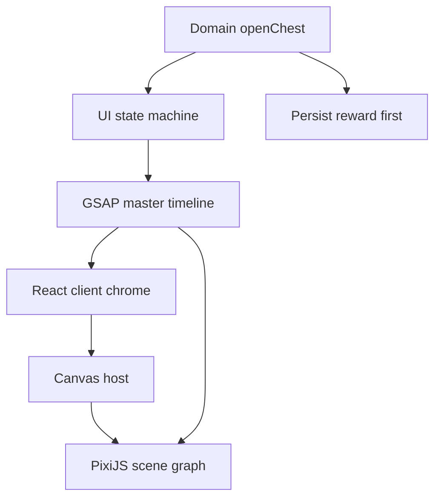
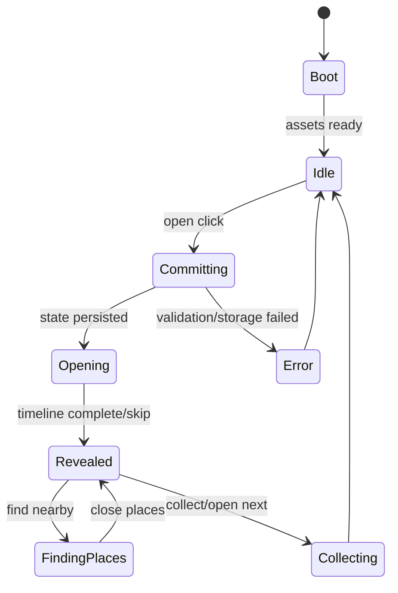

# RƯƠNG VỊ GIÁC — UI & MOTION SPEC V2

## Mục tiêu: tái tạo trải nghiệm mở rương kiểu League of Legends với asset nguyên bản

> Tài liệu này bổ sung cho `FoodChest_Product_Spec_v1.md`.
>
> V1 là nguồn sự thật cho nghiệp vụ. V2 là nguồn sự thật cho UI, motion, VFX, sound, responsive và animation implementation.
>
> **Bản cập nhật V2.1:** bổ sung visual art direction, asset manifest, quy chuẩn ảnh món ăn và mapping minh họa đủ 30/30 món seed.

---

## 1. Mục tiêu thiết kế

Mục tiêu là làm người dùng có cảm giác đang sử dụng một **game client loot/crafting cao cấp** ngay trong 3–5 giây đầu:

- giao diện xanh đen, viền kim loại vàng đồng;
- panel inventory nằm bên trái;
- sân khấu ritual/reveal chiếm vùng trung tâm;
- chìa khóa bay vào rương, lõi năng lượng tích điện;
- rương rung, mở nắp, bùng sáng và đẩy phần thưởng ra trước;
- phần thưởng có khung, aura, particles và âm thanh theo độ hiếm;
- các panel phụ tối đi để ánh nhìn tập trung tuyệt đối vào phần thưởng.

Không dùng trực tiếp logo, tên Hextech, font, ảnh, icon, âm thanh, nhân vật hoặc asset thuộc Riot. Mục tiêu là **pixel-faithful về bố cục, độ sâu, nhịp và phản hồi**, nhưng bộ nhận diện và asset phải là của Rương Vị Giác.

### 1.1. Định nghĩa “giống LoL” trong dự án này

| Thành phần | Mức độ mục tiêu | Ghi chú |
| --- | ---: | --- |
| Bố cục desktop loot client | 90–95% cảm giác | cùng tỷ lệ panel/stage, không sao chép icon |
| Nhịp mở rương | 95% cảm giác | anticipation → impact → reveal |
| Màu sắc và ánh sáng | 90% cảm giác | xanh đen, cyan, vàng cổ |
| Hover/click feedback | 100% nhất quán | mọi tương tác đều có phản hồi |
| Asset Riot | 0% | bắt buộc tự thiết kế |
| Mobile | Giữ tinh thần | không ép desktop layout lên màn hình hẹp |

### 1.2. Nguyên tắc cảm xúc

1. **Tĩnh trước, mạnh sau:** idle rất chậm; lúc mở rương mới tăng tốc.
2. **Anticipation trước impact:** luôn có 250–400 ms “nín thở” trước flash.
3. **Một điểm sáng duy nhất:** không để panel trái/phải tranh độ sáng với rương.
4. **Kết quả đã quyết định trước:** animation không được can thiệp nghiệp vụ.
5. **Âm thanh dẫn chuyển động:** key insert, charge, rumble, impact và shimmer phải trùng timeline.
6. **Mọi hiệu ứng có fallback:** lỗi asset hoặc FPS thấp vẫn hiện kết quả chính xác.

---

## 2. Quyết định công nghệ

### 2.1. Stack bắt buộc cho bản high-fidelity

| Lớp | Công nghệ | Trách nhiệm |
| --- | --- | --- |
| App/UI | React + TypeScript | navigation, panels, text, buttons, modal |
| Layout | CSS Grid/Flex | client chrome, responsive, safe areas |
| Ritual stage | PixiJS v8 | sprites, particles, blend modes, shockwave, glow |
| Choreography | GSAP Timeline | timeline chính xác, label, pause/seek/skip |
| State | Zustand + finite-state reducer | screen state và domain state |
| Audio | Web Audio hoặc `@pixi/sound` | preload, volume, sprite cues |
| Data | Theo Product Spec V1 | catalog, localStorage, Places |
| Testing | Vitest + Playwright | domain, visual state, E2E |

PixiJS phù hợp cho renderer 2D WebGL/WebGPU, sprite atlas, blend mode và particle. Tài liệu hiệu năng chính thức khuyến nghị dùng spritesheet, giới hạn filter/mask, sắp xếp draw order hợp lý và dùng texture nhỏ hơn trên thiết bị cũ. Xem [PixiJS Performance Tips](https://pixijs.com/8.x/guides/concepts/performance-tips).

GSAP Timeline được chọn vì hỗ trợ sequencing, label, nested timeline, callback và `seek/progress`, phù hợp để khóa animation theo mốc thời gian và tạo chế độ debug. Xem [GSAP Timeline](https://gsap.com/docs/v3/GSAP/Timeline/).

### 2.2. Không dùng công nghệ nào làm renderer chính

| Lựa chọn | Lý do không chọn làm chính |
| --- | --- |
| CSS animation thuần | khó quản lý particle, shockwave, filter và timeline nhiều lớp |
| Lottie | tốt cho animation đóng gói, kém linh hoạt khi cần tương tác/biến thể rarity |
| Three.js | thừa cho scene 2.5D; tăng chi phí asset và performance |
| Video full-screen | khó responsive, khó thay reward động, khó đồng bộ state/accessibility |
| GIF | nặng, màu/alpha kém, không điều khiển timeline tốt |

Lottie/Rive vẫn có thể dùng cho icon nhỏ hoặc loading, nhưng không dùng cho master chest sequence.

### 2.3. Kiến trúc render



Nguyên tắc: PixiJS không re-render qua React mỗi frame. React mount một `CanvasHost`; `LootSceneController` quản lý scene imperative và chỉ nhận command mức cao.

---

## 3. Bố cục desktop kiểu game client

### 3.1. Design viewport

- Frame thiết kế chuẩn: `1600 × 900`, tỷ lệ 16:9.
- Kiểm thử bắt buộc thêm: `1440 × 810`, `1366 × 768`, `1920 × 1080`.
- Chiều cao tối thiểu desktop: 700 px.
- Canvas stage phủ toàn bộ viewport phía sau UI chrome.

### 3.2. Grid chính

```css
.client-shell {
  display: grid;
  grid-template-columns: 58px 360px minmax(520px, 1fr) 292px;
  grid-template-rows: 66px minmax(0, 1fr) 68px;
  min-height: 100dvh;
}
```

| Vùng | Kích thước | Nội dung FoodChest |
| --- | ---: | --- |
| Top bar | 66 px | logo, Rương, Bộ sưu tập, Ghép, Vòng quay |
| Icon rail | 58 px | shortcut theo phong cách client |
| Inventory panel | 360 px | tìm kiếm, filter, grid reward/chìa |
| Main stage | co giãn | rương, nhân vật món/reward, ritual ring |
| Right rail | 292 px | điểm danh, lịch sử hôm nay, trạng thái |
| Currency bar | 68 px | chìa khóa, số lượt, setting âm thanh |

### 3.3. Mapping từ ảnh LoL sang FoodChest

| Vùng tham chiếu | Chuyển đổi sang FoodChest |
| --- | --- |
| Danh sách nguyên liệu trái | chìa khóa, phần thưởng món, filter sáng/trưa/tối |
| Champion/skin trung tâm | rương và card món vừa mở |
| Button thêm vào báu vật | `Thêm vào thực đơn hôm nay` hoặc `Tìm quán gần đây` |
| Currency phía dưới | số chìa, streak, số reward có thể ghép |
| Friends panel phải | điểm danh và lịch sử hoạt động hôm nay |

### 3.4. Main stage safe zone

- Tâm ritual: `50% viewport width`, `52% viewport height` sau khi trừ header.
- Chest idle width desktop: 310–360 px.
- Reward hero width: 380–460 px.
- Text title nằm dưới object, không render trong Canvas để giữ chữ sắc và accessible.
- Không đặt CTA thấp hơn 64 px tính từ currency bar.

---

## 4. Responsive strategy

### Desktop fidelity mode — `≥ 1280 px`

- Hiển thị đủ icon rail, inventory, stage và right rail.
- Animation chạy đủ particles, bloom và parallax.
- Đây là viewport dùng để đánh giá “giống LoL”.

### Compact desktop/tablet — `900–1279 px`

- Ẩn right rail thành drawer.
- Inventory co còn 300 px hoặc mở bằng overlay.
- Main stage vẫn giữ tỷ lệ 16:9 trong phần còn lại.
- Giảm particle 30%.

### Mobile cinematic mode — `< 900 px`

- Không cố giữ layout 4 cột.
- Header cao 52 px; bottom nav cao 64 px + safe-area.
- Chest stage full-width; inventory và lịch sử là bottom sheet.
- Khi mở rương, scene chuyển full-screen và ẩn navigation.
- Reward card chiếm 72–82% chiều rộng màn hình.
- Popup quán là full-height bottom sheet.
- Giảm blur, filter và texture resolution.

### Mobile rất nhỏ — `< 390 px`

- Title tối đa 2 dòng.
- CTA full width.
- Không render decorative text nhỏ trong canvas.
- Particle cap 32.

Desktop có thể gần pixel-perfect; mobile chỉ giữ cinematic hierarchy và motion rhythm.

---

## 5. Design tokens

### 5.1. Color

```css
:root {
  --ink-950: #030A10;
  --ink-900: #06131D;
  --ink-850: #0A1E2B;
  --ink-800: #0D2837;

  --cyan-500: #19BCD3;
  --cyan-400: #35D6E6;
  --cyan-200: #A8F3F7;

  --gold-700: #755428;
  --gold-500: #C39243;
  --gold-300: #E6C680;
  --ivory-100: #F1E8D7;

  --violet-500: #8455D8;
  --danger-500: #CF4E55;
  --success-500: #4DB487;
}
```

Không dùng màu cyan/gold ở mọi nơi. Trong idle screen, cyan saturation chỉ 35–55%; khi reveal mới tăng lên 100%.

### 5.2. Typography

| Vai trò | Font đề xuất | Style |
| --- | --- | --- |
| Hero/reward title | Spectral hoặc Noto Serif | uppercase, 600, tracking `0.04em` |
| Navigation | Be Vietnam Pro | uppercase, 600, tracking `0.08em` |
| Body | Be Vietnam Pro | 400/500 |
| Number/currency | Be Vietnam Pro | 600, tabular numbers |

Không sử dụng font độc quyền của LoL. Font phải hiển thị đủ dấu tiếng Việt.

### 5.3. Border và material

- Panel background: `rgba(4, 15, 23, 0.88)`.
- Outer border: 1 px gradient vàng đồng rất tối.
- Inner highlight: 1 px `rgba(237, 210, 147, 0.14)`.
- Góc chủ yếu vuông/chamfer 4–8 px; tránh rounded card kiểu SaaS.
- CTA dùng bevel 2 lớp, không dùng pill button.
- Divider có diamond/rune nhỏ ở giữa.

### 5.4. Depth

| Layer | Blur/contrast | Motion |
| --- | --- | --- |
| Background room | blur 4–8 px, saturation thấp | parallax 1–2 px |
| Ritual ring | nét rõ trung bình | quay rất chậm |
| Chest | sắc nét nhất | breathing 1–2% |
| Foreground particles | blur 1–3 px | đi nhanh hơn background |
| DOM UI | hoàn toàn sắc nét | transition riêng |

---

## 6. Scene graph và layer order

```text
LootScene
├─ 00_Background
│  ├─ bg-room
│  ├─ bg-vignette
│  └─ bg-dust-far
├─ 10_Ritual
│  ├─ outer-ring
│  ├─ inner-ring
│  ├─ glyphs
│  └─ floor-glow
├─ 20_Chest
│  ├─ chest-shadow
│  ├─ chest-base
│  ├─ chest-lid
│  ├─ chest-trim
│  ├─ chest-lock
│  ├─ chest-core
│  ├─ chest-cracks
│  └─ inner-light
├─ 30_Key
│  ├─ key-trail
│  ├─ key-sprite
│  └─ key-glow
├─ 40_VFX
│  ├─ energy-arcs
│  ├─ front-particles
│  ├─ light-rays
│  ├─ shockwave
│  └─ screen-flash
└─ 50_Reward
   ├─ reward-aura
   ├─ reward-frame
   ├─ reward-image
   ├─ reward-shine
   └─ reward-particles
```

Text, CTA, rating và tên món là DOM overlay ở trên Canvas. Không rasterize chữ tiếng Việt vào Pixi trừ bitmap number bắt buộc.

---

## 7. Asset production brief

### 7.1. Asset bắt buộc

| Asset | Số lượng | Kích thước source | Ghi chú |
| --- | ---: | ---: | --- |
| Background loot room | 3 | 2560×1440 | sáng/trưa/tối hoặc một nền đổi color grade |
| Chest base | 1 | 1600×1600 alpha | pivot giữa đáy |
| Chest lid | 1 | 1600×1600 alpha | pivot đúng bản lề |
| Lock/core | 2–3 state | 512×512 | off, charged, open |
| Key | 1 | 768×384 alpha | có normal/glow |
| Ritual rings | 3 | 1024×1024 alpha | tách tốc độ quay |
| Energy cracks | 2 | 1024×1024 alpha | screen/add blend |
| Particle atlas | 1 | 2048×2048 | spark, dust, shard, smoke |
| Shockwave | 1 | 1024×1024 | ring mềm, screen blend |
| Reward frames | 4 | 1024×1280 | common/rare/epic/legendary |
| Generic food fallback | 3 | 1024×1024 | theo meal slot |

### 7.2. Naming convention

```text
assets/loot/
  bg/loot-room-breakfast@2x.webp
  chest/chest-base@2x.webp
  chest/chest-lid@2x.webp
  chest/chest-core-idle@2x.webp
  chest/chest-core-charged@2x.webp
  key/key-base@2x.webp
  ritual/ring-outer@2x.webp
  ritual/ring-inner@2x.webp
  vfx/particles.json
  vfx/particles.webp
  reward/frame-common@2x.webp
  reward/frame-legendary@2x.webp
```

### 7.3. Export rules

- Static background: AVIF/WebP với fallback khi cần.
- Transparent sprites: WebP alpha hoặc PNG atlas sau khi kiểm thử Safari.
- Dùng spritesheet cho particle để giảm texture switches.
- Không nhúng base64 asset vào JS bundle.
- Mỗi asset phải có `1x` và `0.5x` cho thiết bị yếu; hero/chest có `2x`.
- Pivot/anchor được ghi trong metadata, không căn thủ công bằng magic number rải rác.

### 7.4. SFX list

| ID | Thời lượng | Moment |
| --- | ---: | --- |
| `ui-hover` | 80–120 ms | hover item/button |
| `ui-press` | 100–160 ms | nhấn CTA |
| `key-lift` | 250–400 ms | chìa rời inventory |
| `key-insert` | 180–260 ms | chìa vào ổ |
| `key-turn` | 250–350 ms | xoay chìa |
| `charge-loop` | 900–1300 ms | tích năng lượng |
| `chest-rumble` | 350–500 ms | rung trước mở |
| `chest-open` | 300–500 ms | nắp bung |
| `shockwave-hit` | 100–200 ms | impact |
| `reward-rise` | 500–800 ms | silhouette đi lên |
| `reward-reveal` | 400–700 ms | hiện món |
| `legendary-tail` | 1200–1800 ms | đuôi âm hiếm |
| `collect` | 150–250 ms | xác nhận reward |

Chuẩn hóa loudness, tránh mỗi file một mức âm lượng. `shockwave-hit` phải mạnh nhưng không peak/clipping.

---

## 8. UI state machine



### State contract

| State | Input cho phép | UI |
| --- | --- | --- |
| `Boot` | không | loading rune |
| `Idle` | chọn banner, mở rương | tất cả panel active |
| `Committing` | không | CTA loading ≤ 150 ms |
| `Opening` | chỉ skip/mute | panel dim, canvas focus |
| `Revealed` | find place, collect, open next | reward hero + CTA |
| `FindingPlaces` | close/filter | bottom sheet/modal |
| `Error` | retry/close | toast/modal nhỏ |

Không chuyển sang `Opening` nếu domain state chưa persist thành công.

---

## 9. Master chest-opening timeline

### 9.1. Tổng thời lượng

- Lần mở đầy đủ: **4.20 giây**.
- Fast mode sau lần mở thứ ba: **2.10 giây**.
- Reduced motion: **350–500 ms**, chỉ dim → fade reward.
- Cho skip từ mốc 850 ms; skip nhảy tới label `rewardStable`.

### 9.2. Timeline normal mode

| Mốc | Phase | Visual/motion | Audio | Callback |
| ---: | --- | --- | --- | --- |
| 0–120 ms | Press | CTA scale `1 → .96 → 1`; viền sáng | `ui-press` | lock input |
| 80–320 ms | Focus | left/right panel opacity `1 → .35`; bg blur +2 px | low whoosh | show skip after delay |
| 180–620 ms | Key lift | key rời currency bar, scale `.55 → .85`, rotate `-12° → 8°` | `key-lift` | — |
| 420–880 ms | Key flight | key bay theo cubic curve tới lock; trail 3 ghost sprites | rising whoosh | — |
| 820–1040 ms | Insert | key snap vào ổ, chest scale `1 → .985` | `key-insert` | haptic light |
| 1020–1320 ms | Turn | key rotate `0 → 92°`, core cyan tăng sáng | `key-turn` | — |
| 1180–1880 ms | Charge | rings quay nhanh dần; crack xuất hiện; core bloom `0.2 → 2.8` | `charge-loop` | spawn energy arcs |
| 1640–1980 ms | Rumble | chest shake tăng biên độ; camera zoom `1 → 1.035` | `chest-rumble` | — |
| 1980–2240 ms | Anticipation | rung dừng đột ngột; particles hút vào core; âm lượng tụt | near silence | rarity branch |
| 2240–2460 ms | Unlock | lock tách; lid rotate `0 → -64°`; inner light bật | `chest-open` | — |
| 2380–2630 ms | Impact | flash `.0 → .92 → .0`; shockwave scale `.25 → 2.1` | `shockwave-hit` | haptic medium |
| 2500–3100 ms | Reward rise | reward silhouette đi từ `y +110`, scale `.72 → 1.04`; chest lùi | `reward-rise` | mount DOM text hidden |
| 3000–3480 ms | Reveal | silhouette → ảnh; frame draw; aura burst | `reward-reveal` | announce reward |
| 3320–3820 ms | Settle | card scale `1.04 → 1`; particles rơi chậm; bg focus lại | rarity tail | — |
| 3600–4050 ms | Copy/CTA | title, subtitle, CTA stagger `y 16 → 0` | subtle chime | enable actions |
| 4050–4200 ms | Stable | animation chuyển idle reward loop | ambience | `rewardStable` |

### 9.3. Motion curves

| Chuyển động | Ease |
| --- | --- |
| CTA press | `power2.out` |
| Key lift | `back.out(1.4)` |
| Key flight | custom cubic Bézier / `power2.inOut` |
| Key snap | `power3.in` |
| Charge | `power2.in` |
| Lid opening | `back.out(1.7)` |
| Shockwave | `expo.out` |
| Reward rise | `power4.out` |
| Reward settle | `sine.inOut` |
| Text stagger | `power3.out` |

### 9.4. Key flight geometry

Điểm bắt đầu lấy từ DOM currency icon bằng `getBoundingClientRect`, convert sang canvas coordinate.

```ts
type CubicPath = {
  p0: Point; // icon key hiện tại
  p1: Point; // bay lên và vào trong
  p2: Point; // vượt nhẹ qua tâm
  p3: Point; // keyhole
};
```

Đề xuất control point:

- `p1 = p0 + { x: 80, y: -180 }`;
- `p2 = p3 + { x: -140, y: -90 }`;
- key scale tăng giữa đường rồi giảm khi cắm vào ổ;
- rotation bám tangent nhưng giới hạn ±18° trước phase turn.

### 9.5. Chest shake curve

Không dùng random mỗi frame. Dùng keyframe deterministic để test được:

```ts
const shakeX = [0, -2, 3, -4, 5, -7, 7, -5, 4, -2, 0];
const shakeY = [0,  1,-1,  2,-2,  2,-3,  2,-1,  1, 0];
```

Biên độ scale theo device tier: desktop `1.0`, mobile `0.65`, reduced motion `0`.

### 9.6. Timeline skeleton

```ts
export function buildChestOpenTimeline(scene: LootScene, reward: RewardVisual) {
  const tl = gsap.timeline({ paused: true });

  tl.addLabel('press', 0)
    .add(scene.focusStage(), 0.08)
    .add(scene.keyLift(), 0.18)
    .add(scene.keyFlight(), 0.42)
    .add(scene.keyInsert(), 0.82)
    .add(scene.keyTurn(), 1.02)
    .add(scene.charge(), 1.18)
    .add(scene.rumble(), 1.64)
    .addLabel('anticipation', 1.98)
    .add(scene.unlock(), 2.24)
    .add(scene.impact(), 2.38)
    .add(scene.rewardRise(reward), 2.50)
    .add(scene.rewardReveal(reward), 3.00)
    .add(scene.revealCopy(), 3.60)
    .addLabel('rewardStable', 4.05);

  return tl;
}
```

Mỗi function trả về một nested timeline; không tạo hàng chục `setTimeout` độc lập.

---

## 10. Rarity branches

Độ hiếm là visual metadata, không bắt buộc thay nghiệp vụ v1. Nếu chưa có rarity, mọi món dùng `common`.

| Tier | Màu | Anticipation | Particles | Extra |
| --- | --- | ---: | ---: | --- |
| Common | cyan | 260 ms | 48 desktop / 24 mobile | 1 shockwave |
| Rare | cobalt | 340 ms | 72 / 36 | double ring |
| Epic | violet | 460 ms | 96 / 44 | glyph orbit + light rays |
| Legendary | amber/gold | 700 ms | 140 / 56 | fake-out pause + second impact |

### Legendary extension

Normal timeline tại 1980 ms được kéo thêm 440 ms:

1. Core chuyển cyan → trắng → vàng.
2. Tắt gần hết âm thanh trong 180 ms.
3. Ring dừng, đảo chiều 90°.
4. Thêm sub-bass impact.
5. Reward frame xuất hiện sau ảnh món 120 ms để tạo cảm giác “khóa tier”.

Không dùng flash liên tục. Chỉ một flash chính và một glow pulse chậm để tránh khó chịu.

---

## 11. Idle animation

Idle phải tạo cảm giác sống nhưng không gây mệt:

- Chest breathing: scale `1 → 1.012 → 1`, 2.8 giây, `sine.inOut`.
- Core pulse: alpha `.45 → .72 → .45`, 2.2 giây.
- Outer ring quay 360° trong 42 giây.
- Inner ring quay ngược 360° trong 28 giây.
- Dust particles: 12–24 sprite, tốc độ rất thấp.
- Background parallax theo pointer tối đa 3 px; mobile dùng device orientation = off mặc định.
- CTA glow pulse chỉ chạy khi đủ chìa.

Khi tab không visible, pause Pixi ticker và GSAP idle timeline.

---

## 12. Hover, focus và micro-interactions

### Inventory card

- Hover 140 ms: translateY `0 → -2 px`, border gold alpha `.25 → .8`.
- Image zoom `1 → 1.035` trong 220 ms.
- Tooltip trễ 350 ms; không hiện ngay gây nhiễu.
- Selected: cyan inner stroke + corner rune.
- Consumed: grayscale 70%, opacity .46, diagonal glyph; không xóa card.

### CTA button

- Hover: bevel sáng từ trái sang phải trong 240 ms.
- Active: scale `.98`, y `+1 px`, shadow giảm.
- Disabled: saturation 25%, cursor not-allowed; không pulse.
- Keyboard focus: outline cyan 2 px bên ngoài, không chỉ đổi màu.

### Banner switch

- Text/tab chuyển 180 ms.
- Background crossfade 420 ms.
- Chest giữ vị trí; chỉ đổi color grade và ambient particles.
- Không chạy lại animation boot.

### Currency update

- Trừ chìa: số cũ translateY -8/fade, số mới từ +8 đi lên.
- Icon key phát một glow nhỏ tại thời điểm key sprite rời thanh currency.
- Không cập nhật số giữa animation; balance UI đổi ở phase `Focus` để trùng transaction đã commit.

---

## 13. Reward reveal composition

### 13.1. Card geometry

- Desktop: tỷ lệ card `4:5`, width 410 px.
- Mobile: width `min(82vw, 390px)`.
- Ảnh món crop cover trong mask riêng, không bake vào frame.
- Frame có 3 lớp: shadow, metal border, inner light.
- Aura nằm sau frame, shine nằm trên ảnh nhưng dưới title.

### 13.2. Copy hierarchy

1. Eyebrow: `BỮA TRƯA · PHẦN THƯỞNG`.
2. Title: tên món, tối đa 2 dòng.
3. Subtitle: mô tả tối đa 90 ký tự.
4. Primary CTA: `TÌM QUÁN GẦN ĐÂY`.
5. Secondary: `MỞ TIẾP` / `VỀ BỘ SƯU TẬP`.

### 13.3. DOM reveal

- Eyebrow: fade/translate từ 3320 ms.
- Title: 3400 ms.
- Subtitle: 3500 ms.
- CTA: 3600 ms.
- Stagger 70–90 ms.
- `aria-live="polite"` đọc tên món tại 3300 ms, không đọc toàn bộ animation.

---

## 14. Fusion animation — 3 món thành 1 món

### 14.1. Layout

- Ba card input đặt trên vòng tròn bán kính 210 px ở góc `-90°`, `30°`, `150°`.
- Core fusion ở tâm.
- Output reward xuất hiện đúng vị trí card reveal của chest.

### 14.2. Timeline 3.60 giây

| Mốc | Phase | Motion/VFX |
| ---: | --- | --- |
| 0–280 ms | Lock | disable input, dim UI |
| 180–620 ms | Arrange | 3 card bay vào tam giác, scale `.8` |
| 520–1180 ms | Orbit | cards quay 120°, glyph trail xuất hiện |
| 980–1480 ms | Compress | bán kính `210 → 72`, tốc độ tăng |
| 1320–1740 ms | Dissolve | card vỡ thành food-shaped shards/particles |
| 1600–2050 ms | Vortex | shards hút vào core, core scale `.4 → 1.4` |
| 2020–2240 ms | Silence | dừng nhanh, màn hình tối thêm 10% |
| 2240–2480 ms | Impact | flash + shockwave; commit đã xảy ra trước timeline |
| 2400–3020 ms | Output rise | reward mới xuất hiện |
| 2920–3380 ms | Reveal | title/frame/CTA |
| 3380–3600 ms | Stable | chuyển reward idle |

Input card đã consumed vẫn còn trong history; animation chỉ thể hiện việc chuyển đổi, không xóa dữ liệu.

---

## 15. Random wheel animation

Vòng quay không có mẫu tương ứng trực tiếp trong client LoL, nhưng phải dùng cùng material, typography và audio language.

### Rule kỹ thuật

- Chọn winner trước animation.
- Tính `targetAngle` từ index winner.
- Thêm 6–9 vòng quay đầy đủ.
- Thời lượng 4.2–5.2 giây tùy random seed.
- Ease deceleration: `power4.out` hoặc custom curve, không linear.
- Tick sound phát khi vượt segment boundary, giảm tần suất gần cuối.
- Kim bật bằng spring nhỏ; không đổi winner khi wheel dừng.

```ts
const segment = 360 / items.length;
const winnerCenter = winnerIndex * segment + segment / 2;
const rounds = secureRandomInt(6, 9);
const target = rounds * 360 + (360 - winnerCenter);
```

Danh sách trên 24 mục vẫn được quay đúng dữ liệu nhưng label trên wheel có thể ẩn bớt; panel bên cạnh luôn hiển thị đầy đủ.

---

## 16. React/Pixi integration contract

### Component tree

```text
LootPage
├─ ClientChrome
│  ├─ TopNavigation
│  ├─ IconRail
│  ├─ InventoryPanel
│  ├─ ActivityRail
│  └─ CurrencyBar
├─ LootCanvasHost
├─ RewardCopyOverlay
├─ OpeningControls
│  ├─ SkipButton
│  └─ MuteButton
└─ NearbyPlacesSheet
```

### Scene controller interface

```ts
export interface LootSceneController {
  preload(bundle: LootAssetBundle): Promise<void>;
  setMealTheme(slot: MealSlot): Promise<void>;
  playChestOpen(reward: RewardVisual, mode: MotionMode): Promise<void>;
  playFusion(input: RewardVisual[], output: RewardVisual): Promise<void>;
  showReward(reward: RewardVisual): void;
  skipToReward(): void;
  setMuted(muted: boolean): void;
  pause(): void;
  resume(): void;
  resize(viewport: Viewport): void;
  destroy(): void;
}
```

### Correct transaction flow

```ts
async function handleOpenChest() {
  setScreenState('committing');

  const result = openChestUseCase.execute(store.getState());
  storageRepository.commit(result.nextState); // reward + key ledger cùng lúc
  store.setState(result.nextState);

  setScreenState('opening');

  try {
    await lootScene.playChestOpen(toRewardVisual(result.reward), motionMode);
  } finally {
    setScreenState('revealed');
  }
}
```

Không deduct key trong callback `key-turn`; callback animation không phải transaction boundary.

---

## 17. Preload và loading experience

### Bundle groups

| Bundle | Tải lúc nào | Nội dung |
| --- | --- | --- |
| `shell` | app boot | logo, UI icons, fonts |
| `loot-core` | vào tab Rương | background, chest, key, common VFX |
| `loot-rare` | idle sau boot | rare/epic/legendary frames/VFX |
| `fusion` | hover/click tab Ghép | fusion-specific particles |
| `food-image` | theo reward | ảnh món hiện tại và fallback |

### Loading rune

- Không dùng spinner mặc định.
- Dùng 4 glyph xếp vòng, rotate 900 ms.
- Có progress text nếu quá 800 ms.
- Nếu `loot-core` lỗi một phần, chuyển sang DOM fallback thay vì chặn app.

---

## 18. Performance budgets

### Target

| Chỉ số | Desktop | Mobile |
| --- | ---: | ---: |
| Frame rate opening | 60 FPS target | ≥45 FPS target, ≥30 floor |
| Main-thread long task | không quá 100 ms trong opening | không quá 150 ms |
| Initial shell | ≤ 1.5 MB gzip | ≤ 1.2 MB gzip |
| `loot-core` lazy bundle | ≤ 6 MB compressed | ≤ 4 MB low-res |
| Particle count normal | 120 max | 48 max |
| Texture resolution | DPR cap 2 | DPR cap 1.5 |

### Device tiers

```ts
type DeviceTier = 'high' | 'medium' | 'low';

const quality = {
  high:   { particles: 120, bloom: true,  blur: true,  resolutionCap: 2 },
  medium: { particles: 64,  bloom: true,  blur: false, resolutionCap: 1.5 },
  low:    { particles: 24,  bloom: false, blur: false, resolutionCap: 1 },
};
```

Tier không chỉ dựa vào user agent. Có thể dùng device memory khi tồn tại, viewport/DPR và một benchmark ngắn lúc preload.

### Optimization checklist

- Particle dùng spritesheet/particle container.
- Group sprite theo texture và blend mode.
- Hạn chế filter; đặt `filterArea` cụ thể.
- Không thay Pixi Text mỗi frame.
- Destroy texture/bundle không còn dùng một cách có kiểm soát.
- Pause ticker khi document hidden.
- Không animate CSS `box-shadow` lớn trên nhiều node cùng lúc.
- Dùng transform/opacity cho DOM motion.

---

## 19. Reduced motion và accessibility

Ứng dụng phải tôn trọng `prefers-reduced-motion`. MDN mô tả media feature này để phát hiện người dùng yêu cầu giảm chuyển động không thiết yếu: [MDN prefers-reduced-motion](https://developer.mozilla.org/en-US/docs/Web/CSS/Reference/At-rules/@media/prefers-reduced-motion).

### Reduced motion sequence

1. Dim background 120 ms.
2. Crossfade chest → reward 220 ms.
3. Title/CTA fade 120 ms.
4. Không shake, zoom, parallax, orbit hoặc flash mạnh.

### Accessibility rules

- Nút thật trong DOM; không bắt người dùng click vật thể canvas duy nhất.
- Canvas là decorative khi đã có control tương đương.
- Reward result được thông báo bằng `aria-live="polite"`.
- Có Skip và Mute nhìn thấy được.
- Focus không bị mất khi animation kết thúc.
- Không dùng quá 3 flash/giây; flash chính chỉ một lần.
- Contrast body text tối thiểu 4.5:1.
- Không truyền trạng thái chỉ bằng màu; thêm icon/text.

---

## 20. Fallback modes

### WebGL unavailable

- Hiển thị chest DOM image.
- Chạy CSS scale/fade 600–900 ms.
- Reward vẫn đầy đủ và đúng transaction.

### Asset load failure

- Chest/reward dùng fallback image theo meal slot.
- Bỏ VFX lỗi, không retry vô hạn.
- Log asset ID bị lỗi ở development/monitoring.

### FPS degradation

- Nếu rolling average < 40 FPS trong 500 ms:
  - ngừng foreground blur;
  - giảm particle 50%;
  - disable energy arcs;
  - giữ key/chest/reward motion.
- Không đổi độ dài master timeline đột ngột; chỉ giảm lớp phụ.

---

## 21. Debug và tooling cho motion developer

### Motion debug panel — chỉ development

- Play/Pause.
- Timeline scrubber 0–4.2 s.
- Jump labels: press, insert, charge, anticipation, impact, reveal, stable.
- Speed: `0.25×`, `0.5×`, `1×`, `2×`.
- Rarity dropdown.
- Device tier dropdown.
- Toggle layer visibility.
- Show sprite bounds/anchors/FPS/draw calls.
- Fixed reward seed.

URL gợi ý: `/?motionDebug=1`.

GSAP hỗ trợ `seek`, `progress` và thay đổi `timeScale`, nên timeline có thể kiểm tra từng frame mà không thay code production.

---

## 22. Visual QA và acceptance criteria

### UI layout

- Ở 1600×900, sai số major panel không quá ±4 px so với frame Figma đã duyệt.
- Chest luôn nằm trong stage safe zone.
- Không có text overlap ở tên món 1–2 dòng.
- Không có horizontal scroll ở 360 px.

### Motion

- Các label timeline sai số không quá ±50 ms.
- Audio impact lệch visual impact không quá ±50 ms.
- Skip luôn kết thúc ở cùng reward đã persist.
- Double click không tạo timeline thứ hai.
- Tab background không chạy lại boot animation.
- Reduced motion không còn shake/zoom/strong flash.

### Performance

- Desktop reference đạt 60 FPS phần lớn opening.
- Mobile reference không xuống dưới 30 FPS.
- Không có memory tăng liên tục sau 20 lần mở rương.
- Unmount/remount scene không nhân đôi ticker/listener/audio.

### Accessibility

- Toàn bộ luồng mở rương dùng được bằng keyboard.
- Screen reader nhận được reward name và CTA.
- Focus về primary CTA khi reveal xong.
- Mute/Skip có accessible name.

### Browser matrix

- Chrome/Edge desktop mới nhất.
- Safari macOS.
- Safari iOS trên ít nhất một thiết bị DPR cao.
- Chrome Android tầm trung.

---

## 23. Visual regression strategy

Tạo deterministic story `ChestOpeningDebug` với reward cố định. Dùng timeline `seek()` rồi chụp các checkpoint:

| Snapshot | Time |
| --- | ---: |
| Idle | 0 ms |
| Key flight | 650 ms |
| Key inserted | 1040 ms |
| Charge peak | 1850 ms |
| Anticipation | 2100 ms |
| Impact | 2440 ms |
| Reward rise | 2850 ms |
| Reveal | 3300 ms |
| Stable | 4100 ms |

Playwright phải mock clock, asset load và reward; không chụp particle random chưa seed vì ảnh sẽ flake.

---

## 24. Backlog triển khai

### Phase UI-0 — Visual foundation, 1–2 ngày

- Chốt Figma desktop 1600×900 và mobile 390×844.
- Design tokens, font và bevel components.
- Client shell + responsive grid.
- Placeholder chest/reward.

### Phase UI-1 — Pixi scene prototype, 2 ngày

- Canvas host và resize.
- Layer tree.
- Chest base/lid/core anchors.
- Idle loop.
- Debug panel tối thiểu.

### Phase UI-2 — Opening timeline, 2–3 ngày

- Key flight.
- Insert/charge/rumble.
- Lid/flash/shockwave.
- Reward reveal.
- Audio/haptic sync.
- Skip/reduced motion.

### Phase UI-3 — Inventory/result polish, 2 ngày

- Inventory panel states.
- Reward frame/copy/CTA.
- Banner transition.
- Currency animation.

### Phase UI-4 — Fusion + wheel, 2–3 ngày

- 3-card fusion timeline.
- Wheel renderer/ticks/result.
- Common design language.

### Phase UI-5 — Mobile/performance/QA, 2–3 ngày

- Device tiers.
- Low-res atlas.
- WebGL/CSS fallback.
- Visual regression.
- Cross-browser fixes.

Ước lượng high-fidelity: **11–15 ngày dev**, chưa tính 3–6 ngày sản xuất asset/âm thanh nếu làm từ đầu. CSS-only có thể nhanh hơn nhưng không đạt mục tiêu giống game client.

---

## 25. Definition of Done

V2 được coi là hoàn thành khi:

- desktop có đủ client chrome, inventory panel, center ritual và activity rail;
- opening timeline normal/fast/reduced chạy đúng state machine;
- key, chest, light, particles, reward và audio đồng bộ;
- reward đã persist trước khi animation bắt đầu;
- skip/reload/error không làm mất hoặc nhân đôi phần thưởng;
- fusion timeline hoàn chỉnh;
- mobile chuyển sang cinematic mode hợp lý;
- asset là nguyên bản;
- 9 checkpoint visual regression ổn định;
- đạt performance floor và không leak sau 20 lần mở;
- keyboard, screen reader, reduced motion và mute đều pass.

---

## 26. Thứ tự bắt đầu ngay

1. Thiết kế một chest nguyên bản tách tối thiểu `base`, `lid`, `lock`, `core`, `inner-light`.
2. Dựng `ClientShell` desktop bằng placeholder trước.
3. Mount Pixi canvas và xác nhận anchor/resize đúng.
4. Làm debug scrubber trước khi làm animation chi tiết.
5. Implement key flight → insert → lid open không VFX.
6. Sau khi timing đúng mới thêm charge, particle, shockwave và sound.
7. Kết nối use case `openChest` và persist trước animation.
8. Tạo reduced-motion flow cùng lúc, không để cuối dự án.
9. Capture 9 visual checkpoint.
10. Sau desktop mới chuyển sang mobile cinematic mode.

---

## 27. Bộ visual đi kèm spec

Bộ visual đã tạo kèm tài liệu gồm 5 bảng:

| Visual | Nội dung | Vai trò |
| --- | --- | --- |
| Loot Client Concept | Màn hình desktop 16:9 có inventory, ritual stage, rương, activity rail và currency | Khóa bố cục, ánh sáng và hierarchy |
| Asset Concept Board | Rương đóng/mở, base/lid, lock/core, chìa khóa, ritual ring, rarity frame và particle | Khóa ngôn ngữ hình khối và vật liệu |
| Food Atlas A | 10 món sáng, từ `pho-bo` đến `bun-moc` | Khóa style và nhận diện món 01–10 |
| Food Atlas B | 10 món chính, từ `bun-cha` đến `mi-cay` | Khóa style và nhận diện món 11–20 |
| Food Atlas C | 10 món còn lại, từ `ga-ran` đến `banh-xeo` | Khóa style và nhận diện món 21–30 |

### 27.1. Cách dùng đúng

- Loot Client Concept là **art-direction**, không phải ảnh nền để đặt button HTML lên trên.
- Asset Concept Board là **shape/material reference**; production artist cần xuất từng layer riêng và giữ đúng pivot.
- Ba food atlas cung cấp minh họa cho từng món và có thể crop để prototype. Bản production nên xuất lại từng món thành file độc lập để có độ phân giải, alpha và safe area đồng đều.
- Cảm giác cần bám sát loot client tham chiếu ở bố cục, nhịp, chiều sâu và phản hồi. Không sao chép logo, biểu tượng, rune, nhân vật, font, âm thanh hoặc asset độc quyền của Riot.

### 27.2. Tên file art-direction đề xuất

```text
art-direction/
  foodchest-loot-client-concept.png
  foodchest-asset-board.png
  food-atlas-a-breakfast.png
  food-atlas-b-main.png
  food-atlas-c-dinner.png
```

---

## 28. Asset manifest cho production

### 28.1. Cấu trúc thư mục

```text
public/assets/
  backgrounds/
    loot-hall-desktop.avif
    loot-hall-mobile.avif
    atmospheric-haze.webp
  chrome/
    top-nav.webp
    inventory-panel.webp
    activity-rail.webp
    divider-gold.webp
  chest/
    chest-base.webp
    chest-lid.webp
    chest-lock.webp
    chest-core.webp
    chest-inner-light.webp
    chest-shadow.webp
  key/
    taste-key.webp
    key-trail.webp
  ritual/
    ritual-ring-outer.webp
    ritual-ring-inner.webp
    rune-mark-01.webp
    rune-mark-02.webp
    shockwave.webp
  rarity/
    frame-common.webp
    frame-rare.webp
    frame-epic.webp
    aura-common.webp
    aura-rare.webp
    aura-epic.webp
  particles/
    spark-soft.webp
    spark-sharp.webp
    dust.webp
    smoke.webp
    light-ray.webp
  food/
    full/
    card/
    thumb/
    fallback-food.webp
  audio/
    ui-hover.ogg
    ui-click.ogg
    key-flight.ogg
    key-insert.ogg
    chest-charge.ogg
    chest-impact.ogg
    rarity-common.ogg
    rarity-rare.ogg
    rarity-epic.ogg
  manifests/
    assets.json
    food-assets.json
```

### 28.2. Hợp đồng asset chính

| Nhóm | Source master | Runtime desktop | Runtime mobile | Alpha | Pivot/ghi chú |
| --- | --- | --- | --- | --- | --- |
| Background | 3200×1800 PSD/PNG | AVIF 1600×900 | AVIF 900×1600 | Không | ảnh tối, không chứa UI text |
| Chest base | 2048×2048 | WebP 1024×1024 | WebP 768×768 | Có | tâm dưới `0.5, 0.82` |
| Chest lid | 2048×2048 | WebP 1024×1024 | WebP 768×768 | Có | hinge `0.5, 0.88` |
| Lock/core | 1024×1024 | WebP 512×512 | WebP 384×384 | Có | tâm `0.5, 0.5` |
| Key | 1024×512 | WebP 512×256 | WebP 384×192 | Có | mũi chìa `0.88, 0.52` |
| Ring/shockwave | 2048×2048 | WebP 1024×1024 | WebP 768×768 | Có | tâm tuyệt đối `0.5, 0.5` |
| Particle sprites | 512×512 | atlas 256–512 | atlas 128–256 | Có | premultiplied alpha |
| Food full | 1536×1536 | WebP 1024×1024 | WebP 768×768 | Có hoặc nền chuẩn | vật thể trong safe area 86% |
| Food card | 1152×1440 | WebP 768×960 | WebP 576×720 | Theo mask | crop 4:5, không cắt món |
| Food thumb | 512×512 | WebP 256×256 | WebP 192×192 | Không bắt buộc | đọc rõ ở 64 CSS px |

### 28.3. Quy tắc kỹ thuật

- `assets.json` phải chứa `id`, `src`, `src2x`, `width`, `height`, `type`, `preloadGroup` và `fallback`.
- Dùng `AVIF` cho background, `WebP` cho asset có alpha; PNG chỉ giữ ở source hoặc fallback đặc biệt.
- Không upscale asset runtime. DPR 2 dùng file `src2x`, DPR 1 dùng file thường.
- Chest và key phải tách layer; không export toàn bộ animation thành một video hoặc GIF.
- Texture có viền alpha tối thiểu 8 px để tránh bleeding khi scale/rotate.
- Tổng preload bắt buộc cho opening scene: mục tiêu dưới 3.5 MB desktop và 2.0 MB mobile.
- Audio có cả `.ogg` và `.m4a` nếu browser matrix yêu cầu; peak chuẩn hóa khoảng `-3 dBFS`.

Ví dụ `assets.json`:

```json
{
  "chest.base": {
    "src": "/assets/chest/chest-base.webp",
    "src2x": "/assets/chest/chest-base@2x.webp",
    "width": 1024,
    "height": 1024,
    "type": "image",
    "preloadGroup": "loot-core",
    "fallback": "/assets/chest/chest-base.png"
  }
}
```

---

## 29. Danh sách asset màn hình và animation

| ID | Asset/layer | State sử dụng | Yêu cầu hình ảnh |
| --- | --- | --- | --- |
| `bg.lootHall` | Phông sảnh tối | toàn màn hình | navy gần đen, vignette, tâm sáng nhẹ |
| `chrome.inventory` | Panel kho đồ | idle/result | kính khói, bevel vàng mảnh, grid rõ |
| `chrome.activity` | Rail hoạt động | idle/result | tối hơn panel trái 10–15% |
| `chest.base` | Thân rương | mọi state | kim loại tối, silhouette chắc, nguyên bản |
| `chest.lid` | Nắp rương | closed/opening/open | tách hinge để rotate 3D giả lập |
| `chest.lock` | Ổ khóa | idle/insert | rãnh nhận chìa rõ ở 120 CSS px |
| `chest.core` | Lõi năng lượng | charge/impact | cyan sáng, có mask để pulse |
| `chest.innerLight` | Ánh sáng trong rương | opening/reveal | additive, không chứa chi tiết cứng |
| `key.main` | Chìa khóa | inventory/keyFlight | đầu chìa là biểu tượng vị giác nguyên bản |
| `key.trail` | Vệt chuyển động | keyFlight | mềm, taper, không gắn vào ảnh chìa |
| `ritual.outer` | Vòng nghi thức ngoài | idle/charge | quay chậm theo chiều kim đồng hồ |
| `ritual.inner` | Vòng nghi thức trong | charge | quay ngược, có 6–8 mốc sáng |
| `vfx.shockwave` | Sóng xung kích | impact | scale 0.2→1.7, alpha 0.9→0 |
| `vfx.rays` | Tia sáng | opening/reveal | clip trong stage, rarity đổi màu |
| `rarity.frame.*` | Khung món | reveal/inventory | silhouette chung, màu/chi tiết theo rarity |
| `food.*` | Món ăn | reward/card/modal | 30 file riêng, tuân theo mục 30–32 |

### 29.1. Token màu cho asset

| Token | Giá trị | Dùng cho |
| --- | --- | --- |
| `ink-950` | `#020B14` | background sâu |
| `navy-900` | `#071A2A` | panel và stage |
| `cyan-500` | `#19C7E8` | năng lượng lõi |
| `cyan-200` | `#A8F3FF` | highlight/flash |
| `gold-600` | `#A9782F` | kim loại tối |
| `gold-300` | `#E8C777` | bevel/edge light |
| `ember-500` | `#F48A3C` | impact ấm/epic accent |

---

## 30. Hệ thống minh họa món ăn

### 30.1. Art direction chung

Mỗi món là một **reward icon cao cấp**, không phải ảnh menu nhà hàng thông thường:

- semi-realistic painterly 2.5D, nhìn từ trên chéo khoảng 30–35°;
- món nằm giữa, chiếm 72–86% khung; silhouette đọc được ở thumbnail;
- ánh chính ấm từ trên trái, cyan rim nhẹ từ sau/phải, viền vàng tiết chế;
- màu món ăn phải ngon và đúng thực tế; không phủ cyan lên thực phẩm;
- bát/đĩa trung tính, không logo; nền navy đồng nhất hoặc alpha sạch;
- không text, giá tiền, badge, watermark, người hoặc tay;
- không dùng biểu tượng, rune hoặc khung độc quyền của game khác;
- một style/camera/scale xuyên suốt cả 30 món.

### 30.2. Master prompt cho ảnh đơn production

```text
Create one original premium fantasy-game food reward illustration of [DISH].
Appetizing semi-realistic painterly 2.5D, centered 3/4 top-down view,
consistent camera and scale, warm key light, subtle cyan rim light,
restrained antique-gold accent, deep navy or transparent background,
single bowl/plate inside an 86% safe area, crisp readable silhouette,
production-ready square icon. No text, labels, numbers, logo, watermark,
people, hands, branded motifs, existing game characters or symbols.
```

Phần `[DISH]` phải dùng cue riêng ở bảng dưới; không chỉ truyền tên món vì model dễ tạo món gần giống nhưng sai nguyên liệu.

### 30.3. Rarity không được vẽ dính vào món

Ảnh món luôn trung tính và dùng chung. Rarity đến từ layer ngoài:

| Rarity | Frame | Aura | Particle |
| --- | --- | --- | --- |
| Common | vàng đồng mờ | cyan rất nhẹ | 6–10 dust motes |
| Rare | bạc-cyan | cyan ring rõ | 12–18 sparks |
| Epic | vàng sáng + tím rất nhẹ | gold/cyan halo | 20–30 sparks + ray |

Nhờ vậy cùng một món có thể đổi rarity hoặc banner mà không phải sinh lại ảnh.

---

## 31. Mapping 30 món → file ảnh và atlas

Quy ước atlas: `A1–A5` là hàng trên Atlas A, `A6–A10` là hàng dưới; tương tự B và C. Thứ tự này là row-major và là nguồn sự thật khi crop prototype.

| # | Food ID | Tên hiển thị | File canonical | Ô | Cue bắt buộc để nhận diện |
| ---: | --- | --- | --- | --- | --- |
| 01 | `pho-bo` | Phở bò | `pho-bo.webp` | A1 | bánh phở dẹt, bò lát, hành và rau thơm |
| 02 | `pho-ga` | Phở gà | `pho-ga.webp` | A2 | bánh phở dẹt, gà xé/lát, hành, chanh |
| 03 | `bun-rieu` | Bún riêu | `bun-rieu.webp` | A3 | nước cà chua đỏ, riêu cua, đậu phụ |
| 04 | `bun-bo-hue` | Bún bò Huế | `bun-bo-hue.webp` | A4 | bún sợi to, bò, giò heo, dầu sả đỏ |
| 05 | `banh-mi` | Bánh mì | `banh-mi.webp` | A5 | baguette Việt, pate/thịt, đồ chua, ngò |
| 06 | `xoi` | Xôi mặn | `xoi.webp` | A6 | nếp vàng, gà xé, chả, hành phi |
| 07 | `banh-cuon` | Bánh cuốn | `banh-cuon.webp` | A7 | cuốn trắng mỏng, nhân thịt, chả, hành phi |
| 08 | `chao-suon` | Cháo sườn | `chao-suon.webp` | A8 | cháo mịn, sườn, hành, quẩy |
| 09 | `mien-ga` | Miến gà | `mien-ga.webp` | A9 | miến trong, gà lát, nấm và rau thơm |
| 10 | `bun-moc` | Bún mọc | `bun-moc.webp` | A10 | bún trắng, mọc viên, nấm hương |
| 11 | `bun-cha` | Bún chả | `bun-cha.webp` | B1 | thịt nướng/viên, bún, rau, bát nước chấm |
| 12 | `bun-dau` | Bún đậu mắm tôm | `bun-dau.webp` | B2 | bún lá, đậu rán, rau, mắm tôm tím |
| 13 | `com-tam` | Cơm tấm | `com-tam.webp` | B3 | sườn nướng, trứng ốp, đồ chua, mỡ hành |
| 14 | `com-ga` | Cơm gà | `com-ga.webp` | B4 | cơm vàng, gà thái, dưa leo và rau |
| 15 | `com-rang-dua-bo` | Cơm rang dưa bò | `com-rang-dua-bo.webp` | B5 | cơm rang, bò lát, dưa cải chua |
| 16 | `com-nieu` | Cơm niêu | `com-nieu.webp` | B6 | niêu đất, lớp cơm cháy, món ăn kèm nhỏ |
| 17 | `banh-da-cua` | Bánh đa cua | `banh-da-cua.webp` | B7 | bánh đa nâu đỏ bản rộng, cua, rau xanh |
| 18 | `bun-ca` | Bún cá | `bun-ca.webp` | B8 | cá chiên, cà chua, thì là, bún trắng |
| 19 | `mi-van-than` | Mì vằn thắn | `mi-van-than.webp` | B9 | mì vàng, hoành thánh, xá xíu, cải thìa |
| 20 | `mi-cay` | Mì cay | `mi-cay.webp` | B10 | nước đỏ cay, tôm/mực, xúc xích, nấm |
| 21 | `ga-ran` | Gà rán | `ga-ran.webp` | C1 | miếng gà vỏ giòn vàng, giỏ nhỏ, sốt chấm |
| 22 | `pizza` | Pizza | `pizza.webp` | C2 | bánh tròn nguyên chiếc, phô mai và topping |
| 23 | `pasta` | Pasta | `pasta.webp` | C3 | spaghetti sốt cà, basil và parmesan |
| 24 | `sushi` | Sushi | `sushi.webp` | C4 | assortment nigiri + maki, khay Nhật |
| 25 | `tokbokki` | Tokbokki | `tokbokki.webp` | C5 | bánh gạo, sốt gochujang đỏ, chả cá, mè |
| 26 | `lau-thai` | Lẩu Thái | `lau-thai.webp` | C6 | nồi lẩu chua cay đỏ, tôm/mực/nấm |
| 27 | `lau-rieu-cua` | Lẩu riêu cua | `lau-rieu-cua.webp` | C7 | riêu cua, cà chua, đậu, bò và rau |
| 28 | `nuong-bbq` | Nướng BBQ | `nuong-bbq.webp` | C8 | vỉ nướng, thịt ướp và rau nhiều màu |
| 29 | `vit-quay` | Vịt quay | `vit-quay.webp` | C9 | da nâu bóng giòn, vịt thái, dưa leo, sốt |
| 30 | `banh-xeo` | Bánh xèo | `banh-xeo.webp` | C10 | vỏ vàng giòn, tôm/thịt/giá, rau và nước chấm |

### 31.1. Liên kết với dữ liệu món

Mỗi record catalog phải tham chiếu ảnh bằng ID, không nhúng URL tùy ý vào component:

```json
{
  "id": "pho-bo",
  "name": "Phở bò",
  "imageAssetId": "food.pho-bo",
  "imageAlt": "Tô phở bò với bánh phở, bò lát và rau thơm"
}
```

`food-assets.json`:

```json
{
  "food.pho-bo": {
    "full": "/assets/food/full/pho-bo.webp",
    "card": "/assets/food/card/pho-bo.webp",
    "thumb": "/assets/food/thumb/pho-bo.webp",
    "fallback": "/assets/food/fallback-food.webp"
  }
}
```

---

## 32. Quy trình export ảnh món

### 32.1. Từ atlas sang prototype

1. Crop từng atlas theo grid 5×2 đúng mapping ở mục 31.
2. Bỏ đường phân cách/khung ngoài nếu nó không thuộc card runtime.
3. Căn lại món vào safe area 86%, không kéo méo ảnh.
4. Export source PNG/WebP chất lượng cao và kiểm tra ở 256 px.
5. Nếu crop có chi tiết thừa hoặc món sai cue, sinh lại **một ảnh đơn** bằng master prompt; không vá bằng cách kéo giãn/cắt ghép món khác.

Atlas dùng để khóa style và có prototype nhanh. Production pass nên tạo ảnh đơn 1536×1536 để đạt sự đồng đều tốt nhất.

### 32.2. Biến thể bắt buộc cho mỗi món

| Variant | Kích thước | Mục đích | Encode gợi ý |
| --- | ---: | --- | --- |
| `full` | 1024×1024 | reveal/modal | WebP quality 86–90 |
| `card` | 768×960 | card 4:5 | WebP quality 84–88 |
| `thumb` | 256×256 | inventory/history | WebP quality 78–84 |

Ảnh HTML cần khai báo `width/height`, `loading="lazy"` ngoài ảnh reward hiện tại, `decoding="async"` và alt text theo dữ liệu. Reward sắp reveal phải preload trước khi timeline chạy.

### 32.3. Trạng thái tải ảnh

| State | UI |
| --- | --- |
| Loading | skeleton navy + shimmer cyan rất nhẹ |
| Loaded | fade 160 ms, scale 0.98→1 |
| Error | `fallback-food.webp`, vẫn hiện tên món |
| Offline cached | dùng Cache Storage/Service Worker nếu PWA |

---

## 33. QA và tiêu chí nghiệm thu asset

### 33.1. Chest/UI asset

- Rương, chìa khóa và rune là thiết kế nguyên bản; reverse image search nội bộ không cho thấy bản sao gần như trực tiếp.
- Base/lid/lock/core có alpha sạch và pivot đúng; mở nắp không lộ viền bẩn.
- Không có text raster hóa trong background hoặc chrome.
- Hiệu ứng flash vẫn giữ đủ contrast cho CTA và không gây nhấp nháy quá ngưỡng accessibility.
- Ở tier low, tắt filter/particle nhưng silhouette rương và reward vẫn đọc rõ.

### 33.2. Bộ 30 món

- Có đúng 30 ID, không thiếu, không trùng filename.
- Mỗi ảnh nhận diện đúng cue bắt buộc trong bảng mục 31.
- Cùng góc camera, kích thước bát/đĩa và hướng sáng.
- Không cắt mất món trong `full`, `card` hoặc `thumb`.
- Không có text, logo, watermark, tay/người hoặc chi tiết AI lỗi rõ ràng.
- Phở bò/phở gà, lẩu Thái/lẩu riêu cua và các món mì/bún phải phân biệt được khi xem ở 128 px.
- Màu món tự nhiên; cyan/gold chỉ là rim/accent, không nhuộm thực phẩm.
- File dưới ngân sách: `full ≤ 220 KB`, `card ≤ 170 KB`, `thumb ≤ 60 KB` ở chất lượng chấp nhận được.
- Alt text là mô tả món, không ghi rarity hoặc nội dung trang trí.

### 33.3. Visual regression bổ sung

Ngoài 9 checkpoint ở mục 23, thêm các snapshot:

| Snapshot | Viewport | Nội dung |
| --- | --- | --- |
| Inventory 30 items | 1600×900 | grid đủ ảnh, skeleton/error fixture |
| Reward common | 1600×900 | ảnh món + common frame |
| Reward rare | 1600×900 | cùng món + rare layer |
| Reward epic | 1600×900 | cùng món + epic layer |
| Reward mobile | 390×844 | món không bị CTA che |
| Food detail modal | 390×844 và 1600×900 | ảnh, tên, quán gần đây |

---

## 34. Nguồn tham khảo kỹ thuật

- [Riot Support — Hextech Crafting FAQ](https://support.riotgames.com/en-us/league-of-legends/rewards/hextech-crafting-faq)
- [Riot Games — Hextech Chests Dev Update](https://www.leagueoflegends.com/en-us/news/dev/dev-hextech-chests-getting-champs-more/)
- [PixiJS v8 — Performance Tips](https://pixijs.com/8.x/guides/concepts/performance-tips)
- [GSAP — Timeline](https://gsap.com/docs/v3/GSAP/Timeline/)
- [MDN — prefers-reduced-motion](https://developer.mozilla.org/en-US/docs/Web/CSS/Reference/At-rules/@media/prefers-reduced-motion)
- [MDN — requestAnimationFrame](https://developer.mozilla.org/en-US/docs/Web/API/Window/requestAnimationFrame)

---

## 35. Timeline cinematic triển khai

Sequence runtime dùng nhịp reveal tham khảo từ video [League of Legends – Hextech Chest Opening (2x)](https://www.youtube.com/watch?v=Tg0vTmufv8M), nhưng rương, rune, màu sắc và asset của MealGacha vẫn là thiết kế nguyên bản.

| Beat | State | Thời lượng | Chuyển động chính |
| --- | --- | ---: | --- |
| 1 | `key-flight` | 620 ms | chìa bay theo ease-out và bắt sáng |
| 2 | `inserting` | 260 ms | tia lửa khóa, dừng đúng tâm lõi |
| 3 | `locking` | 420 ms | chìa xoay, rương nén nhẹ, haptic ngắn |
| 4 | `charging` | 660 ms | cột sáng tăng dần, rune tăng tốc |
| 5 | `pulse` | 460 ms | pre-flash + sóng xung kích thứ nhất |
| 6 | `anticipation` | 640 ms | giảm sáng, letterbox, khoảng lặng có chủ đích |
| 7 | `impact` | 180 ms | white flash, lens flare, double shockwave, camera shake |
| 8 | `opening` | 560 ms | nắp mở, ánh sáng tràn khỏi rương |
| 9 | `reward-rise` | 760 ms | sigil nâng lên; hết beat mới mount modal món ăn |

Reward được persist ngay khi người dùng mở rương nhưng bị loại khỏi toàn bộ selector hiển thị bởi `pendingRevealRewardId`. `completeRewardReveal()` chỉ chạy khi timeline kết thúc hoặc người dùng chủ động bỏ qua; vì vậy ảnh và tên món không thể lộ trước nhịp reveal.

### 35.1. Audio track tùy chỉnh

URL `*.mp3.waveform.json` của Motion Array chỉ là dữ liệu biên độ để vẽ waveform, không phải tệp âm thanh có thể phát. Sau khi tải tệp MP3/OGG bằng tài khoản có quyền sử dụng, đặt file trong `public/assets/audio/` và cấu hình:

```dotenv
VITE_CHEST_OPENING_AUDIO_URL=/assets/audio/chest-opening.mp3
```

Track được khởi chạy trực tiếp trong gesture mở rương để đáp ứng autoplay policy. Các sound cue Web Audio vẫn chạy ở 18% gain làm lớp transient và tự trở lại 100% nếu không cấu hình track. Dừng/skip/unmount luôn hủy track đang phát.
